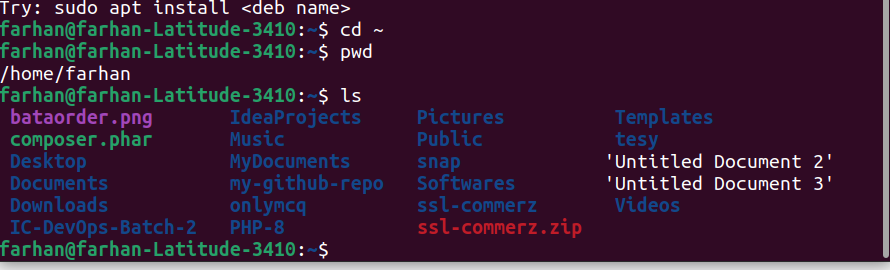
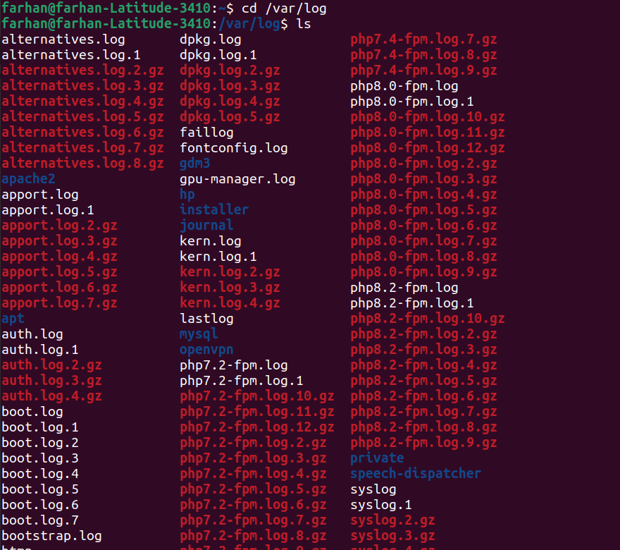
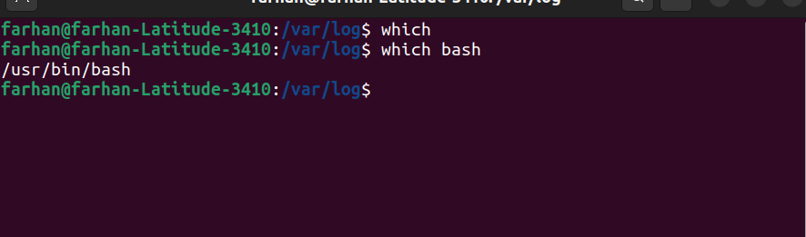
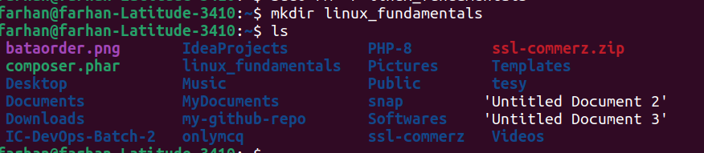
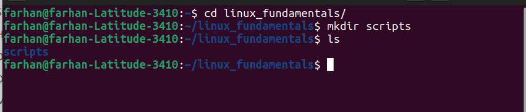
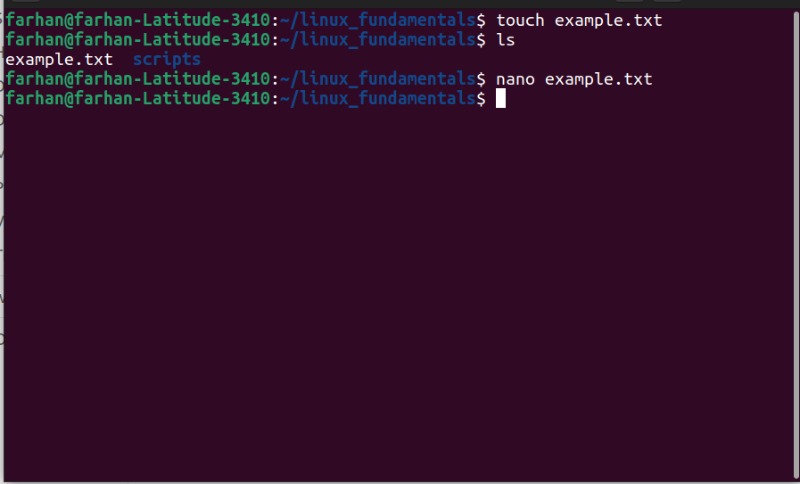
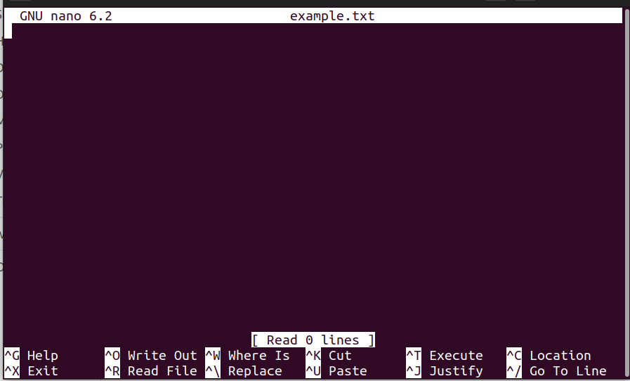
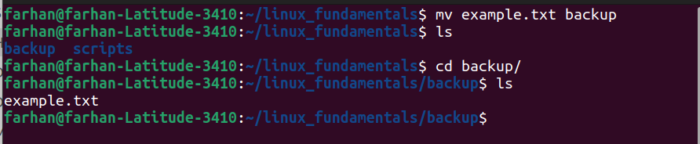
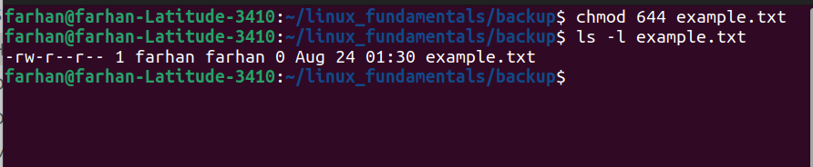

 <h3 align="center">Linux Command</h3>

  <p align="center">
    IC-DevOps-Batch-2
    <br>
    <a href="https://reponame/issues/new?template=bug.md">Linux Assignment</a>
    
  </p>

# Table of contents

## File System Navigation
- [List the contents of the home directory](#home-list)
- [Change the current directory to `/var/log` and list its contents](#var-log)
- [Find and display the path to the `bash` executable using the `which` command.](#which-cmnd)
- [Find current shell](#current-shell)

 ## File and Directory Operations

- [Create a directory named `linux_fundamentals` in your home directory](#linux-fundamentals)
- [Inside `linux-fundamentals`, create a subdirectory named `scripts`.](#subdir-scripts)
- [Create an empty file named `example.txt` inside the `linux_fundamentals` directory.](#empty-file)
- [Copy `example.txt` to the `scripts` directory.](#copy-file)
- [Move `example.txt` from linux_fundamentals to `linux_fundamentals/backup`](#move-backup)

## File System Permission
- [Change the permissions of example.txt to read and write for the owner, and `read-only` for the group and others.](#file-permission)
- [Verify the permission changes using ls -l](#verify-permission)


<h3 id="home-list" style="font-size:20px"> List the contents of the home directory</h3>

```
ls
```

```text
To list the contents of your home directory, you can use the ls command in the terminal. Here’s how you can do it
```


<h3 id="var-log" style="font-size:20px">Change the current directory to `/var/log` and list its contents.</h3>

```
cd /var/log
```

```text
This command changes your current directory to /var/log
```



<h3 id="which-cmnd">Find and display the path to the `bash` executable using the `which` command.</h3>

```
which bash
```

```text
This command is used to locate a command’s executable file in the directories listed in the PATH environment variable.
bash: This is the name of the shell executable you are looking for.
```


<h3 id="current-shell">Find current shell</h3>

```
echo $SHELL
```

```text
The echo command can display the value of the SHELL environment variable, which shows the default shell. However, this might not always reflect the currently running shell if it has been changed during the session.
```


<h3 id="linux-fundamentals">Create a directory named `linux_fundamentals` in your home directory</h3>

```
mkdir linux_fundamentals
```

```text
mkdir linux_fundamentals: Creates a new directory named linux_fundamentals in the current directory (which is your home directory).
```




<h3 id="subdir-scripts">Inside `linux-fundamentals`, create a subdirectory named `scripts`</h3>

```
mkdir scripts
```

```text
mkdir scripts: Creates a new subdirectory named scripts within the linux_fundamentals directory.
```



<h3 id="#empty-file">Create an empty file named `example.txt` inside the `linux_fundamentals` directory</h3>

```
touch example.txt
```

```text
touch example.txt: Creates an empty file named example.txt. If the file already exists, it updates the file's timestamp.
```



<h3 id="empty-file">Create an empty file named `example.txt` inside the `linux_fundamentals` directory</h3>

```
touch example.txt
```

```text
touch example.txt: Creates an empty file named example.txt. If the file already exists, it updates the file's timestamp.
```


<h3 id="copy-file">Copy `example.txt` to the `scripts` directory.</h3>

```
cp example.txt scripts/
```

```text
cp example.txt scripts/: Copies the file example.txt from the current directory to the scripts subdirectory.
```


<h3 id="move-backup">Move `example.txt` from linux_fundamentals to `linux_fundamentals/backup`.
</h3>

```
mv example.txt backup/
```

```text
mv example.txt backup/: Moves the file example.txt to the backup subdirectory
```



<h3 id="file-permission">Change the permissions of example.txt to read and write for the owner, and `read-only` for the group and others.
</h3>

```
cd ~/linux_fundamentals/backup
chmod 644 example.txt
```

```text
cd ~/linux_fundamentals/backup: Changes the current directory to backup, where example.txt is located.
chmod 644 example.txt: Changes the file permissions of example.txt.
```


<h3 id="verify-permission">Verify the permission changes using ls -l
</h3>

```
cd ~/linux_fundamentals/backup
ls -l example.txt
```

```text
cd ~/linux_fundamentals/backup: Changes the directory to backup, where example.txt is located.
ls -l example.txt: Lists detailed information about example.txt, including permissions.
```
