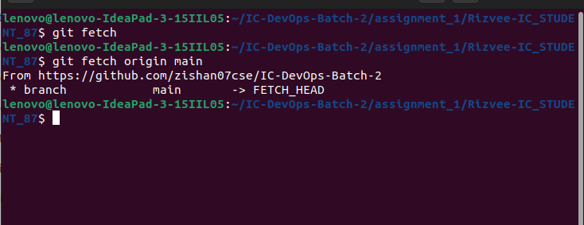

1.Git init:


  <h3 align="center">Git Command</h3>

  <p align="center">
    IC-DevOps-Batch-2
    <br>
    <a href="https://reponame/issues/new?template=bug.md">Git  Assignment</a>
    
  </p>
</p>

## Table of contents

- [Git Clone](#git-clone)
- [Git Initialize](#git-initialize)
- [Git Status](#git-status)
- [Git Add](#git-add)
- [Git Commit](#git-commit)
- [Git Branch](#git-branch)
- [Git New Branch](#git-new-branch)
- [Git Merge Branch](#git-merge-branch)
- [Git Delete Branch](#git-delete-branch)
- [Git Pull](#git-pull)
- [Git Fetch](#git-fetch)
- [Git Push](#git-push)
- [Git Pull Request](#git-pull-request)
- [Git Merge Conflict](#git-merge-conflict)
- [Git Fork](#git-fork)
- [Git Reset](#git-reset)
- [Git Reflog](#git-reflog)
- [Git Revert](#git-revert)
- [Git Cherry Pick](#git-cherry-pick)
- [Git Log](#git-log)
- [Git Stash](#git-stash)
- [Git Stash Apply](#git-stash-apply)
- [Git Log Summary](#git-log-summary)
- [Git Diff](#git-diff)

## Git Commands

<!-- ### Git Clone
```
git clone ssh://git@github.com/[username]/[repository-name].git
``` -->


### Git Clone


```
git clone ssh://git@github.com/[username]/[repository-name].git
```

```text
git clone is primarily used to point to an existing repo and make a clone or copy of that repo at in a new directory, at another location. The original repository can be located on the local filesystem or on remote machine accessible supported protocols. The git clone command copies an existing Git repository..
```


### Git Initialize


```
git init
```

```text
The git init command creates a new Git repository. It can be used to convert an existing, unversioned project to a Git repository or initialize a new, empty repository.
```


### Git Status


```
git status
```

```text
The git init command creates a new Git repository. It can be used to convert an existing, unversioned project to a Git repository or initialize a new, empty repository.
```


### Git Add


```
git add <file1>
```

```text
The git add command adds a change in the working directory to the staging area. It tells Git that you want to include updates to a particular file in the next commit.
```


### Git Commit


```text
git commit -m "[commit message]"
```

```
The git commit command captures a snapshot of the project's currently staged changes. Committed snapshots can be thought of as “safe” versions of a project—Git will never change them unless you explicitly ask it to.

```


### Git Branch


```text
git branch
```

```
In Git, a branch is essentially a lightweight, movable pointer to one of these commits. The default branch name in Git is main, but you can create, delete, and work with branches to manage different versions or features of your project.

```


### Git Create New Branch


```text
git checkout -b [branch name]
```

```
The git branch command can be used to create a new branch. When you want to start a new feature, you create a new branch off main using git branch new_branch . Once created you can then use git checkout new_branch to switch to that branch.

```


### Git New Branch


```text
git checkout -b [branch name]
```

```
The git branch command can be used to create a new branch. When you want to start a new feature, you create a new branch off main using git branch new_branch . Once created you can then use git checkout new_branch to switch to that branch.
```


### Git Merge Branch


```text
git merge [source branch] [target branch]
```

```
Merging Branches. Once you've completed work on your branch, it is time to merge it into the main branch. Merging takes your branch changes and implements them into the main branch. Depending on the commit history, Git performs merges two ways: fast-forward and three-way merge.
```


### Git Delete Branch


```text
git branch --delete <branchname> 
```

```
Delete a branch from the repository.
```


### Git Pull


```text
git pull origin <branchname>
```

```
In a pull request, you propose that changes you've made on a head branch should be merged into a base branch. By default, any pull request can be merged at any time, unless the head branch is in conflict with the base branch.
```


### Git Fetch


```text
git fetch origin <branchname>
```

```
In review, git fetch is a primary command used to download contents from a remote repository. git fetch is used in conjunction with git remote , git branch , git checkout , and git reset to update a local repository to the state of a remote.
```



### Git Push


```text
git push origin <branchname>
```

```
The git push command is used to upload local repository content to a remote repository. Pushing is how you transfer commits from your local repository to a remote repo. It's the counterpart to git fetch, but whereas fetching imports commits to local branches, pushing exports commits to remote branches.
```


### Git Pull Request


```text
git pull request
```

```
A pull request is a proposal to merge a set of changes from one branch into another. In a pull request, collaborators can review and discuss the proposed set of changes before they integrate the changes into the main codebase. Pull requests display the differences, or diffs, between the content in the source branch and the content in the target branch.

```


### Git Merge Conflict


```text
$ cat merge.txt
totally different content to merge later
```

```
Conflicts generally arise when two people have changed the same lines in a file, or if one developer deleted a file while another developer was modifying it. In these cases, Git cannot automatically determine what is correct. Conflicts only affect the developer conducting the merge, the rest of the team is unaware of the conflict. Git will mark the file as being conflicted and halt the merging process. It is then the developers' responsibility to resolve the conflict.
```


### Git Fork


```text
git fork
```

```
Forking is a safe way to contribute. It allows us to make a rough copy of the project. We can freely experiment on the project. After the final version of the project, we can create a pull request for merging.
```


### Git Reset


```text
git reset --soft HEAD
```

```
The git reset command is used to undo the changes in your working directory and get back to a specific commit while discarding all the commits made after that one. 

For instance, imagine you made ten commits. Using git reset on the first commit will remove all nine commits, taking you back to the first commit stage.
```


### Git Reflog


```text
git reflog
```

```
This command manages the information recorded in the reflogs.

Reference logs, or "reflogs", record when the tips of branches and other references were updated in the local repository. Reflogs are useful in various Git commands, to specify the old value of a reference. For example, HEAD@{2} means "where HEAD used to be two moves ago", master@{one.week.ago} means "where master used to point to one week ago in this local repository", and so on.
```


## Git Revert


```text
git revert Head --no-edit
```

```
revert is the command we use when we want to take a previous commit and add it as a new commit, keeping the log intact.

```


## Git Cherry  Pick


```text
git cherry-pick
```

```
git cherry-pick is a powerful command that enables arbitrary Git commits to be picked by reference and appended to the current working HEAD. Cherry picking is the act of picking a commit from a branch and applying it to another. git cherry-pick can be useful for undoing changes. For example, say a commit is accidently made to the wrong branch. You can switch to the correct branch and cherry-pick the commit to where it should belong.
```


### Git Stash


```text
git stash
```

```
git stash temporarily shelves (or stashes) changes you've made to your working copy so you can work on something else, and then come back and re-apply them later on.
```


### Git Stash Apply


```text
git stash apply
```

```
git stash apply takes the files in a stash and places them back into the development workspace but doesn't delete the stash from history.
```


### Git Log


```text
git log
```

```
The git log command displays all of the commits in a repository's history. By default, the command displays each commit's: Secure Hash Algorithm (SHA)
```


### Git Log Summary


```text
 git log --summary
```

```
To get a detailed summary description of your Git log, you can use various git log options to include information like commit hash, author, date, and message. Here are some commands and their descriptions to help you achieve a comprehensive summary
```


### Git Diff


```text
 git diff 
```

```
git diff is a multi-use Git command that when executed runs a diff function on Git data sources. These data sources can be commits, branches, files and more. This document will discuss common invocations of git diff and diffing work flow patterns.
```


