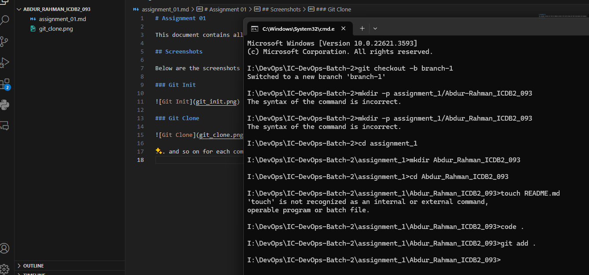

# Assignment 01

This document contains all the Git commands covered in the course along with their descriptions and examples.

## Screenshots

Below are the screenshots of running the commands on my local machine.

### Git Add

### Git Clone

... and so on for each command.
