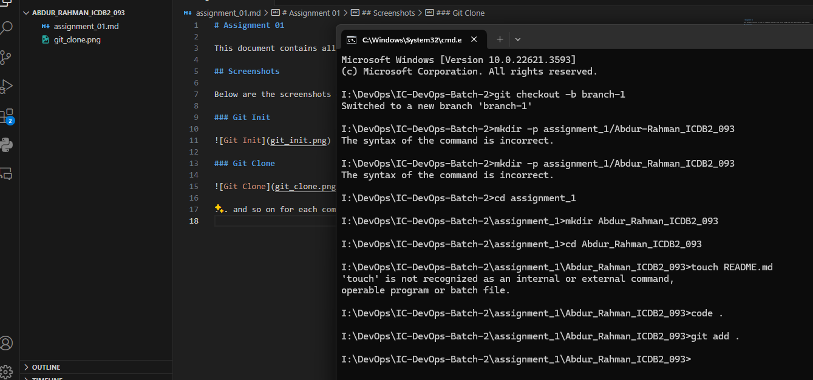

# README

## 📝Scribe sheet of all the git commands in course

### ✒ MD ABDUR RAHMAN

   

### Command: git init

Initializes a new Git repository in the current directory

**Usage:**

git init

This command basically reinitializing an existing one or create a new repository
   

### Command: git add .

Stages all changes in the current directory for the action of next commit

**Usage:**

git add .

This command bascially do stages all modified, newly created or deleted files in the current directory for the action of next commit
  

### Command: git add 'filename'

Stages a specific file for the action of next commit

**Usage:**

git add filename

This command is useful for selectively staging changes. [`Note:` Should have replace the `filename` with something `eg: assignment_1.txt`]
  

### Command: git commit -m 'message'

Records the staged changes with a descriptive message

**Usage:**

git commit -m 'message'

This command creates a new commit with the staged changes. [`Note:` Should have replace the `message` with something `eg: My first git commit`]
   

### Command: git status

Displays the state of the working directory

**Usage:**

git status

This command shows that which changes have been staged, which haven’t, and which files aren’t being tracked by Git
   

### Command: git branch

This command shows manages branches in the repository.
   

### Command: git log

Displays a log of commits in the repository.

**Usage:**

This command shows the commit history, including commit hashes, authors, dates, and messages.

### Command: git checkout branch

Switches to a specified branch.

**Usage:**

git checkout branch_name

This command changes the current working branch to the specified branch.
