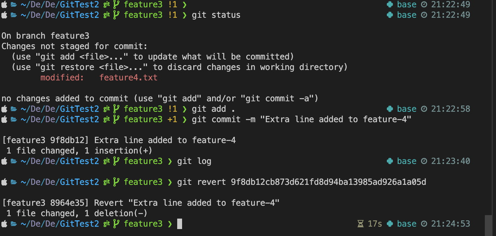

<p align="center">
    
  <h3 align="center">Version Control CheetSheet</h3>
  <p align="center">
  Some Commands in Git 
    <br>
   
  </p>
</p>


## Table of contents
- [Git Init](#git-init)
- [Git Add](#git-add)
- [Git Commit](#git-commit)
- [Git Push](#git-push)
- [Git Status](#git-status)
- [Git Rm](#git-rm)
- [Git Stash](#git-stash)
- [Git Log](#git-log)
- [Git Show](#git-show)
- [Git Diff](#git-diff)
- [Git Branch](#git-branch)
- [Git Checkout](#git-checkout)
- [Git Merge](#git-merge)
- [Git Rebase](#git-rebase)
- [Git Fetch](#git-fetch)
- [Git Pull](#git-pull)
- [Git Reset](#git-reset)
- [Git Amend](#git-amend)
- [Git Revert](#git-revert)
- [Git Cherry Pick](#git-cherry-pick)


- [Creators](#creators)


# Git Commands

## Initialazation, Staging and Commiting

### Git Init
Initializes a new Git repository.
**Example**
``` 
git init
```


**Description :** 
Initializes a new Git repository. This command creates a new subdirectory named .git that contains all the necessary repository files.

### Git Add
Adds file contents to the staging area.
**Example**
```
git add <file1> (add one file)

git add . (all all file changes from current directory and subDirectories)
```
**Description :** 
```
This git command is used to add a specific file, or multiple files to local git repository
```


### Git Commit
The `git commit` command is used to record changes to the repository.
**Example**
```
git commit -m "commit message header" -m "Small description"
```
**Description :** 
```
Captures a snapshot of the project’s currently staged changes. Commits are snapshots that save the state of the project at that point in time.

```


### Git Push
The `git push` command is used to upload local repository content to a remote repository.
**Example**
```
git push <remote> <branch-name>
Ex: git push origin main
```
**Description :** 
```
- `git push`: This is the command to push your local commits to a remote repository.
- `origin`: This is the default name Git gives to the server from which you cloned your repository. It represents the remote repository.
- `main`: This is the name of the branch you want to push your commits to on the remote repository.
```


### Git Status
The `git status` command displays the state of the working directory and the staging area.
**Example**

```
git status
```
**Description :** 
```
It lets you see which changes have been staged, which haven't staged yet , and which files aren't being tracked by Git.
```


### Git Rm
The `git rm` command is used to remove files from the staging area and the working directory.
**Example**
```
git rm --cached<file>
Ex: git rm --cached file1.txt
```
**Description :** 

```
--cached: Removes the file only from the index (staging area) while keeping it in your working directory.

-f: Forces the removal of the file even if it has changes that are staged or it is currently being tracked.
```


### Git Stash
The `git stash` command is used to temporarily store all the modified tracked files and staged changes.
**Example**
```
git stash -m "name"
Ex: git stash -m "Work in progress"
```
**Description :** 

```
- git stash temporarily shelves (or stashes) changes you've made to your working directory so you can work on something else, and then come back and re-apply them later on.
- The stashed changes are saved onto a stack, from which they can be re-applied (or dropped) later.
Commonly used options include:
- git stash pop: Re-applies the stashed changes and removes them from the stash stack.
- git stash apply: Re-applies the stashed changes without removing them from the stash stack.
- git stash list: Lists all stashed changesets.
- git stash drop: Removes a single stashed state from the stash list.
- git stash clear: Removes all the stashed states.
```


## Inspection and Comparison

### Git Log
The `git log` command is used to display the commit logs.
**Example**
```
git log
Ex: git log --stat
```
**Description :** 
```
Displays the commit history of the current branch, listing the most recent commits at the top.Each entry in the log includes the commit ID, author, date, and the commit message.
Commonly used options include:
--oneline: Shows each commit on a single line, which is useful for a compact view of the commit history.
--graph: Displays the commit logs with an ASCII graph of the branch and merge history beside the log output.
--stat: Shows the number of files altered and the number of lines that were added or deleted.
```


### Git Show
The `git show` command is used to display various types of objects in Git, including commits, tags, and more.
**Example**
```
git show <commit hash>
```
**Description :** 
```
Displays detailed information about a specific object, typically a commit.The default option for git show when no specific flags or parameters are provided is to display the commit information for the HEAD commit.
```


## Git Diff
The `git diff` command is used to view the difference between the working directory, staging area, and the most recent commit. It shows changes line by line, highlighting additions, deletions, and modifications.
**Example**
```
   git diff <commit hash>
```
**Description :**
```
- `git diff` is a command for reviewing changes made to files in a repository.
- With additional arguments, such as commit hashes or file paths, git diff can compare different versions of files or commits.
```


## Branch handling 
### Git Branch
The `git branch` command is used to manage branches within a Git repository.
**Example**
```
git branch
Ex: git branch feature1
```
**Description :** 
```
git branch lists all the local branches in your repository when used without additional parameters.To create a new branch, specify the branch name after the command: git branch <branch-name>.
Commonly used options include:
-d <branch-name>: Deletes a branch. Use -D to force deletion.
-m <old-branch-name> <new-branch-name>: Renames a branch. Use -M to force renaming even if the new branch name already exists.
-a: Lists both local and remote branches.
-r: Lists remote branches.
--list: Can be combined with patterns to filter the list of branches shown.
```


### Git Checkout
The `git checkout` command is used to switch branches or restore working tree files.
**Example**
```
git checkout <branch-name>
Ex: git checkout feature1
```
**Description :** 
```
git checkout is primarily used to switch between different branches in a Git repository.
It can also be used to restore files in the working directory to their last committed state, effectively undoing changes.
Commonly used options include:
-b <branch-name>: Creates a new branch and switches to it simultaneously.
-- <file>: Restores the specified file to its state at the last commit, discarding any uncommitted changes.
```


### Git Merge
The `git merge` command is used to combine multiple development histories into one. This command merges changes from one or more branches into the current branch.
**Example**
```
git merge <branch-name>
Ex: git merge main
```
**Description :** 
```
git merge integrates the changes from one branch into another. Typically, this is used to merge feature branches back into the main branch, such as master or main. When merging, Git attempts to automatically combine the changes. If there are conflicts, Git will pause the merge and ask you to resolve the conflicts manually.
Commonly used options include:
--no-ff: Creates a merge commit even if the merge resolves as a fast-forward, preserving information about the historical existence of a feature branch in the merge commit.
--squash: Combines all changes from the feature branch into a single commit in the current branch. This commit needs to be completed with a separate git commit.
```


### Git Rebase
The `git rebase` command is used to reapply commits on top of another base tip, typically to clean up a commit history or integrate changes from one branch into another without creating a merge commit.
**Example**

```
   - git rebase main
   - git rebase origin/main (from remote main from feature3 branch)
```
**Description :**
```
- Here Base Branch: main
    This is the branch you specified as the base for the rebase operation. It acts as the new starting point for the feature2 branch after the rebase.
- Rebased Branch: feature2
    This is the branch you were on when you initiated the rebase command. The commits from feature2 are replayed on top of the latest commit from main.
- `git rebase` is useful for creating a new commit with the same changes as the last commit without modifying the commit history.
```


### Git Fetch
The `git fetch` command is used to download objects and refs from a remote repository.
**Example**
```
git fetch 
Ex: git fetch origin main
```
**Description :** 
```
git fetch is used to update your local copy of a remote repository without merging any changes into your local branches.
It pulls down data from the remote that you do not have yet, updating your remote-tracking branches.
Commonly used options include:

<remote>: Specifies which remote repository to fetch from.
<branch>: Fetches a specific branch from the remote repository.
--all: Fetches all remotes.
--tags: Fetches any tags as well as other refs from the remote repository.
```


### Git Pull
The `git pull` command is used to fetch from and integrate with another repository or a local branch.
**Example**
```
git pull
Ex: git pull origin main
```
**Description :** 
```
git pull is essentially a combination of git fetch followed by git merge. This command fetches updates from a remote repository and then immediately attempts to merge them into the current branch.
Commonly used options include:

origin: Specifies the remote repository from which to fetch updates.
main: Specifies the branch from which to pull updates.
--rebase: Instead of using git merge to integrate the remote branch with the local one, it uses git rebase.
--no-commit: Fetches the updates but does not automatically commit them, allowing the user to review the changes before committing.
```


## Git Undo changes

### Git Reset
The `git reset` command is used to reset the current HEAD to the specified state, affecting the index (staging area), the working directory, and the commit history based on the provided options.

**Example**
```
git reset --hard HEAD~1
```
**Description :** 
```
git reset is a powerful command that is used to undo local changes to the state of a Git repo. It can be used to unstage files, alter commit history, or permanently delete changes, depending on the options used.
--soft: This flag resets HEAD to another commit, but it does not alter the index or working directory. All changes will be kept staged.
--hard: Resets the index and working directory. Any changes to tracked files in the working directory since the commit are discarded.

```


### Git Amend
The `git commit --amend` command is used to modify the most recent commit. It is particularly useful for making corrections to the last commit without creating a new commit.

**Example**
```
git commit --amend -m "Updated commit message"

```
**Description :** 

This command allows you to change the last commit's message without altering its snapshot. If you have staged changes at the time you run the command, it will also include those changes in the amended commit.


### Git Revert
The `git revert` command is used to create a new commit that undoes the changes made by previous commits. It is a safe way to undo changes, as it doesn't alter the commit history.

**Example**
```
git revert <commit-hash>
Ex: git revert 1a2b3c4d
```
**Description :** 
```
This command will generate a new commit that reverses the changes made in the specified commit. It is particularly useful in shared repositories because it preserves the history and provides a transparent way to correct mistakes.
```



### Git Cherry Pick
The `git cherry-pick` command is used to apply the changes introduced by some existing commits from another branch onto the current branch. This is useful for selectively integrating specific changes without merging a whole branch.

**Example**
```
git cherry-pick <commit-hash>
Ex: git cherry-pick 27239db
```
**Description :** 
```
- <commit-hash>: The hash of the commit you wish to cherry-pick. This is the commit from which you want to bring over the changes to your current working branch.
- The cherry-pick operation will attempt to apply the changes from the specified commit. If there are conflicts, Git will stop so you can resolve them before completing the cherry-pick.
```


## Creators

- <https://github.com/sajibnet90>

## Thanks

