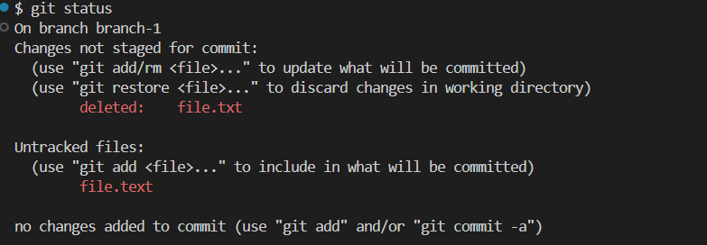
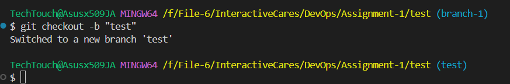
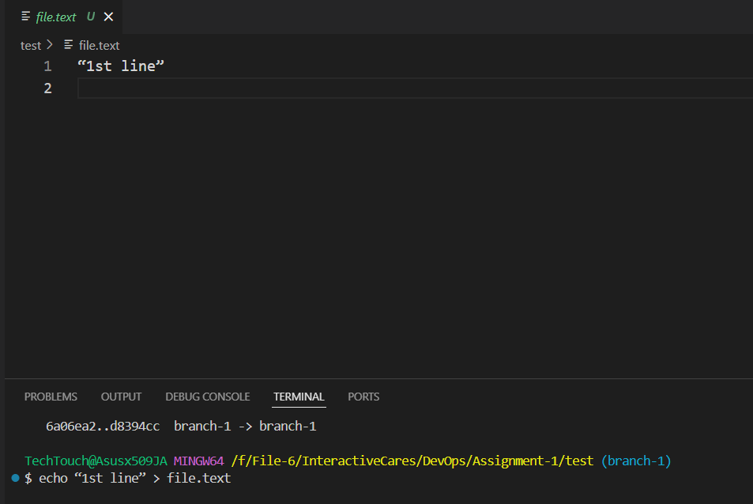
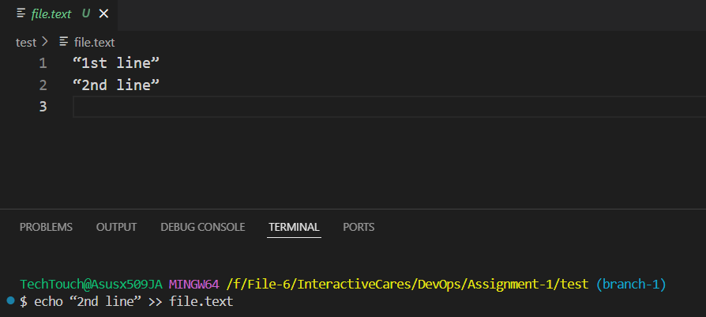
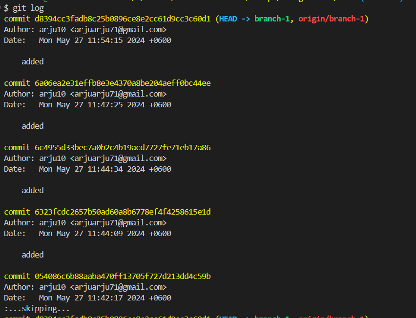

# Git Commands Scribe Sheet

## Basic Git Commands

### 1. `git init`
**Description**: Initializes a new Git repository.
#### **Example**:
```bash
git init
```

### 2. `git clone <repository-url>`
**Description**: Clones a repository into a new directory.
#### **Example**:
```bash
git clone https://github.com/example/example-repo.git
```

### 3. `git add <file>`
**Description**: Adds file contents to the staging area.
#### **Example**:
```bash
git add README.md
```
### 4. `git commit -m "<message>"`
**Description**: Records changes to the repository with a message.
#### **Example**:
```bash
git commit -m "Initial commit"
```
### 5. `git push`
**Description**:  Updates remote refs along with associated objects.
#### **Example**:
```bash
git push origin main
```
### 6. `git pull`
**Description**: Fetches from and integrates with another repository or a local branch.
#### **Example**:
```bash
git pull origin main
```
### 7. `git status`
**Description**: Shows the working tree status
#### **Example**:
```bash
git status
```

### 8. `git checkout -b <branch>`
**Description**: Create a new branch and switch to it
#### **Example**:
```bash
git checkout -b branch-1
```


### 9. `echo “1st line” > fileName.extension `
**Description**:1.	It will create a file named file.text in your local machine and there will create a line named name “1st line” in file.txt file
#### **Example**:
```bash
echo “1st line” > file.text 
```


### 10. `echo “2nd line” > fileName.extension `
**Description**:1.	2.	>> It will append the 2nd line in the text.file  file. Basically >> uses for append line.
#### **Example**: 
```bash
echo “2nd line” >> file.text 
```


**Note**: >> It will append the line one after one line and > It will append the line in the first line, and previous line will be deleted

### 11. `git log`
**Description**: This will show our git commit histories
#### **Example**:
```bash
git log
```


### 12. `git reset –-soft HEAD~1`
**Description**: It basically works as undo. If this command is run then, the last commit will be deleted from the git commit history but it can be reset later and in the commit history, there will be no last commit. But The changes will remain in the file.  It won’t delete the changes. Staged will be there.
#### **Example**:
```bash
git reset –-soft HEAD~1
```
**Note**:  git add . by using this there is create a staged. Staged means connection between github and git. Without staging, git commit won’t be applied.

### 13. `git reset –-hard HEAD~1`
**Description**: 	If this command is run then, the last commit will be permanently deleted from the commit history and also the changes will be deleted from the file.
#### **Example**:
```bash
git reset –-hard HEAD~1

```
### 14. `git reset –-hard origin/main1`
**Description**: Hard reset to match the remote main branch. It will delete all commits and also files changes will be deleted.
#### **Example**:
```bash
git reset –-hard origin/main1
```

**Note**: Rebase and merge both rewrite commit history but merging creates an extra commit, which can be confusing later. Therefore, rebasing is often preferred for a cleaner history.
