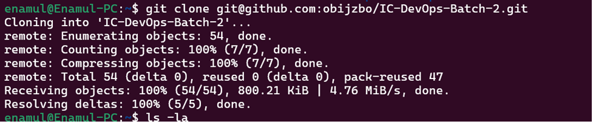
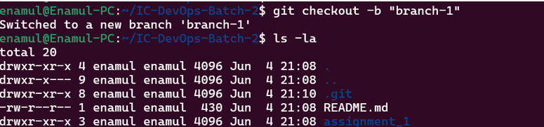

# This markdown extension file is for assignment_1.

#### Command 'git init'

>_git init_

Using this command we can create a git repository in local machine.

#### Command 'touch testfile.txt'

>_touch testfile.txt_

Using this command we can create a text file.

#### Command 'git add .'

>_git add ._

The git add command adds a change in the working directory to the staging area.

#### Command 'git commit -m " <add the description>" '

>_git commit -m " <add the description>"_

Using this command we can add the description of changes we make.

#### Command 'git log'

>_git log_

Usimg ths command we can check the log.

#### Command 'git status'

>_git status_

Usimg ths command we can check the current status.

#### Command 'git clone git@github.com:obijzbo/IC-DevOps-Batch-2.git'

>_git clone git@github.com:obijzbo/IC-DevOps-Batch-2.git_

Usimg ths command we can clone a remote repository in the local.

#### Command 'git checkut -b "branch-1"'

>_git checkut -b "branch-1"_

Usimg ths command we can create a branch in local.

