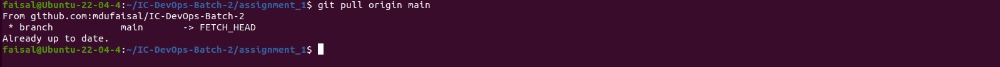

Working with Local Repositories


```bash

git init

```

The command is used to initialize a local folder/directory to bring it under the management of git. 
Every local repository must be initialized.


git status & git add

```bash

git status

```

The git status command is used to show the status of the git repository. This command displays the state of the working area and the staging area. All the tracked and untracked changes can be seen from here.

Working area: This where you work on the local files and the files are not tracked by git yet.
Staging area: This is where all files must go before any commit. In this area, all changes are tracked by git.


```bash

git add

```
The command used to move file(s) from working area to staging area.

```bash

git add README.md

```


```bash

git commit

```

```bash

## Configure the git user who will be the author of the commit/upcoming commits.

git config user.email md.u.faisal@gmail.com
git config user.name mdufaisal
git remote -v

```


```bash

## Add the file in the staging area.
git add README.md

## Commit the file.
git commit -m "Create README.md file"

```


.gitignore

It is a hidden file where the files that need to be ignored are defined. In the repository, we can ignore files from being tracked by git, so that our working area is clean and with only the necessary files that are needed to be staged and committed. We have to create the file manually. In the following example we will ignore the .gitignore file.

```bash

touch .gitignore
git status
echo .gitignore > .gitignore

```


git branch

```bash

## Create a new branch
git branch branch-1

## list branches
git branch -l

## Show current branch
git branch --show-current

## Delete branch
git branch -d branch-1

## Create and Switch to the new branch 
git checkout -b branch-1

```


git merge

This command is used to merge changes from one branch into another. Till now we were working on branch-1 and all the changes we made are in branch-1. Let’s merge branch-1 with main branch so that main branch has the work we have done so far.

```bash

## Switch to the branch we want to merge with
git checkout main

## merge branch-1 to the current (main) branch
git merge branch-1


```


git log


```bash

## Print all commit logs in the current branch
git log

```


```bash

## Print all commit logs in the current branch with the filenames
git log –name-only

```


```bash

## Print logs with the "short sha" and "short description"

git log --oneline

```


It’s an alias for: git log --pretty=oneline --abbrev-commit

```bash

## Print last commit

git log -n 1

```


Working with remote Repositories

git remote

Git remote command is used to manage remote repositories. We can clone a remote repository that adds the remote repository automatically within the local repository. However, we can manage remote repositories manually by git remote command.

```bash

git remote add origin git@github.com:mdufaisal/IC-DevOps-Batch-2.git
git remote remove origin
git remote -v

```


git fetch & git rebase

Git fetch command is used to fetch any changes made in the main branch of the remote repository; it does not apply the changes to the current branch until git rebase is executed.

```bash

git fetch origin main
git rebase

```


git pull

git pull does what git fetch & git rebase do together.


Pulling remote changes to the Local repo

```bash

git pull origin main

```



git reset and git revert

git reset

git reset command undo the specific commit. git reset without any option will undo a commit and remove it from the staging area and the commit history will be removed as well.


```bash

echo "This is line 1 of the testfile" > testfile.txt
git add testfile.txt
git commit -m "Add line 1 to the testfile"
echo "This is line 2 of the testfile" >> testfile.txt
git add testfile.txt
git commit -m "Add line 2 to the testfile"
echo "This is line 3 of the testfile" >> testfile.txt
git add testfile.txt
git commit -m "Add line 3 to the testfile"
cat testfile.txt

```


```bash

git reset HEAD~1
git log -n3
git reset HEAD~2
git log -n3

```


git reset --soft

git reset --soft will undo a commit but will not remove it from the staging area.


```bash

git add testfile.txt
git commit -m "Add contents to the testfile"
git log -n1
git reset --soft HEAD~1
git status

```


git reset --hard

git reset --hard will undo a commit by removing all the associated changes made by the commit.


```bash

git add testfile.txt
git commit -m "Add contents to the testfile.txt file"
cat testfile.txt
git reset --hard HEAD~1
cat testfile.txt

```


git revert 

git revert inverts the changes introduced by the original commit by creating a new commit with the underlying inverse content. This is a safe way to revoke a commit because it prevents you from losing your history.

```bash

touch testfile.txt
git add testfile.txt
git commit -m "Create testfile.txt"
echo "This is a testfile" > testfile.txt
git add testfile.txt
git commit -m "Add some texts to the testfile.txt"
git status
cat testfile.txt

```


```bash

git log -n1
git revert 32a84d3709a46b5b167f73f5ae0cb574b261345a
cat testfile.txt
git log

```


git stash

git stash command is used to preserve the changes without committing them.

```bash

echo "Add some more contents to be stashed." >> testfile.txt
git status
git stash
git stash list
git stash show stash@{0}
git stash pop stash@{0}

```


git reflog

The git reflog command is used for Git to record updates made to the tip of branches. It allows returning commits even to the ones that are not referenced by any branch or any tag. After rewriting history, the reflog includes information about the previous state of branches and makes it possible to go back to that state if needed

```bash

git reflog

```


```bash

git reflog show HEAD
git reflog show branch-1

```


```bash

git diff main@{0} main@{1.day.ago}

```


git cherry-pick

git cherry-pick in git means choosing a commit from one branch and applying it to another branch.


```bash

echo "Adding more contents to the testfile.txt" >> testfile.txt
git add testfile.txt
git commit -m "Update testfile.txt in branch-1"
git branch --show-current
git log -n1

```


```bash

git checkout branch-2
git log -n1
git cherry-pick 3ee5827c58a17fb5d28440946cd775e417a12c46
git log -n1
git branch --show-current
ls -l
cat testfile.txt

```


