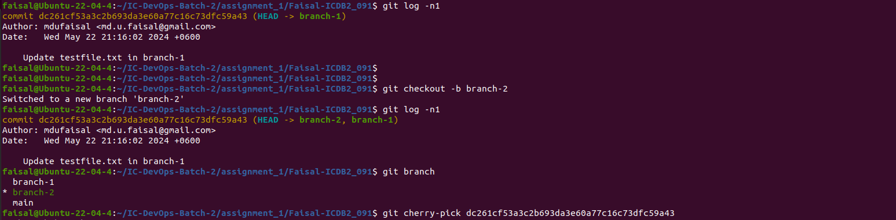

Working with Local Repositories


```bash

git init

```

The command is used to initialize a local folder/directory to bring it under the management of git. 
Every local repository must be initialized.


git status & git add

```bash

git status

```

The git status command is used to show the status of the git repository. This command displays the state of the working area and the staging area. All the tracked and untracked changes can be seen from here.

Working area: This where you work on the local files and the files are not tracked by git yet.

Staging area: This is where all files must go before any commit. In this area, all changes are tracked by git.


```bash

git add

```
The command used to move file(s) from working area to staging area.

```bash

git add README.md

```


## Git config command allows to set preferences such as your name and email for commit attribution, default text editor for commit messages, and other operational parameters.

```bash

# To configure email address
git config user.email md.u.faisal@gmail.com
git config user.email

# To configure user name
git config user.name mdufaisal
git config user.name

```


```bash

git commit

```
git commit command is used to keep track of our progress and changes as we work. Git considers each commit change point or "save point". 
It is a point in the project you can go back to if you find a bug, or want to make a change. When we commit, we should always include a message.
The commit command performs a commit, and the -m "message" adds a message.

```bash

## To add the file in the staging area.
git add README.md

## To commit the file.
git commit -m "Create README.md file"

```


.gitignore

It is a hidden file where the files that need to be ignored are defined. In the repository, we can ignore files from being tracked by git, so that our working area is clean and with only the necessary files that are needed to be staged and committed. We have to create the file manually. In the following example we will ignore the .gitignore file.

```bash

touch .gitignore
git status
echo .gitignore > .gitignore

```


git branch

git branch command is used to manage (create, list, delete) brances in a git repository.

```bash

## To create a new branch
git branch branch-1

## To list branches
git branch -l

## To show current branch
git branch --show-current

## To delete branch
git branch -d branch-1

## To create and Switch to the new branch 
git checkout -b branch-1

```


git merge

This command is used to merge changes from one branch into another. Till now we were working on branch-1 and all the changes we made are in branch-1. Let’s merge branch-1 with main branch so that main branch has the work we have done so far.

```bash

## Toc switch to the branch we want to merge with
git checkout main

## To merge branch-1 to the current (main) branch
git merge branch-1

```


git log


```bash

## To print all commit logs in the current branch
git log

```


```bash

## To print all commit logs in the current branch with the filenames
git log –name-only

```


```bash

## To print logs with the "short sha" and "short description"

git log --oneline

```


It’s an alias for: git log --pretty=oneline --abbrev-commit

```bash

## To print last commit

git log -n 1

```


Working with remote Repositories

git remote

Git remote command is used to manage remote repositories. We can clone a remote repository that adds the remote repository automatically within the local repository. However, we can manage remote repositories manually by git remote command.

```bash

# To add, remove and view remote repositories 
git remote add origin git@github.com:mdufaisal/IC-DevOps-Batch-2.git
git remote remove origin
git remote -v

```


git fetch & git rebase

Git fetch command is used to fetch any changes made in the main branch of the remote repository; it does not apply the changes to the current branch until git rebase command is executed.

```bash
# To fetch the changes from remote repository
git fetch origin main

# To apply the changes that were fetched.
git rebase

```


git pull

git pull does what git fetch & git rebase do together.


```bash

# To pull remote changes to the Local repo
git pull origin main

```


git reset and git revert

git reset

git reset command undo the specific commit. git reset without any option will undo a commit and remove it from the staging area and the commit history will be removed as well.


```bash

# Add some content to testfile.txt
echo "This is line 1 of the testfile" > testfile.txt

# To add testfile.txt in the staging are
git add testfile.txt

# To commit the changes
git commit -m "Add line 1 to the testfile"

echo "This is line 2 of the testfile" >> testfile.txt
git add testfile.txt
git commit -m "Add line 2 to the testfile"
echo "This is line 3 of the testfile" >> testfile.txt
git add testfile.txt
git commit -m "Add line 3 to the testfile"

# To verify the content just we have added.
cat testfile.txt

```


```bash
# To reset the last commit ( This will undo the commit where line 3 was added)
git reset HEAD~1

# To check if the commit history changed because of resetting HEAD~1
git log -n3

# To reset last two commits (This will undo the commit where line 2 & 1 were added)
git reset HEAD~2
git log -n3

```


git reset --soft

git reset --soft will undo a commit but will not remove it from the staging area.


```bash

# To add the file to staging area
git add testfile.txt

# Commit the changes again 
git commit -m "Add contents to the testfile"

# To check the last commit 
git log -n1

# To reset the last commit with --soft (This will undo the last commit but will not remove the file from staging area unlike just running git reset)
git reset --soft HEAD~1

# To verify if the file is still in the staging area
git status

```


git reset --hard

git reset --hard will undo a commit by removing all the associated changes made by the commit.


```bash

# To add the file to staging area
git add testfile.txt

# Commit the changes again
git commit -m "Add contents to the testfile.txt file"

# To verify the contents before reset
cat testfile.txt

# To perform a hard reset
git reset --hard HEAD~1

# To confirm if the hard reset removed the changes as well
cat testfile.txt

```


git revert 

git revert inverts the changes introduced by the original commit by creating a new commit with the underlying inverse content. 
This is a safe way to revoke a commit because it prevents you from losing your history.

```bash

# Create a file
touch testfile.txt

# To add the file to staging area
git add testfile.txt

# Commit the file
git commit -m "Create testfile.txt"

# Add texts to the file
echo "This is a testfile" > testfile.txt

# Add the file to staging area again
git add testfile.txt

# Commit the changes made to the file 
git commit -m "Add some texts to the testfile.txt"

# Check git status
git status

# Verify the contents of the file 
cat testfile.txt

```


```bash

# Get hash from the last commit
git log -n1

# Revert the last commit by specifying it's hash
git revert 32a84d3709a46b5b167f73f5ae0cb574b261345a

# Check the file contents (git revert works the same way as git reset, but it creates a new commit)
cat testfile.txt

# Check git log (A new commit will be added for the git revert)
git log

```


git stash

git stash command is used to preserve the changes without committing them.

```bash

# Make some changes
echo "Add some more contents to be stashed." >> testfile.txt

# Check git status
git status

# Stash the current changes
git stash

# Get the stash list
git stash list

# Display the delaits of a specific stash
git stash show stash@{0}

# Restore/remove the file from stash list
git stash pop stash@{0}

```


git reflog

The git reflog command is used for Git to record updates made to the tip of branches. It allows returning commits even to the ones that are not referenced by any branch or any tag. After rewriting history, the reflog includes information about the previous state of branches and makes it possible to go back to that state if needed

```bash

git reflog

```


```bash

git reflog show HEAD
git reflog show branch-1

```


```bash

git diff main@{0} main@{1.day.ago}

```


git cherry-pick

git cherry-pick in git means choosing a commit from one branch and applying it to another branch.


```bash

# Get hash of last commit that we want to copy to another branch
git log -n1

# Change branch into another branch
git checkout -b branch-2

# Copy the commit from branch-1 to branch-2
git cherry-pick dc261cf53a3c2b693da3e60a77c16c73dfc59a43

```



