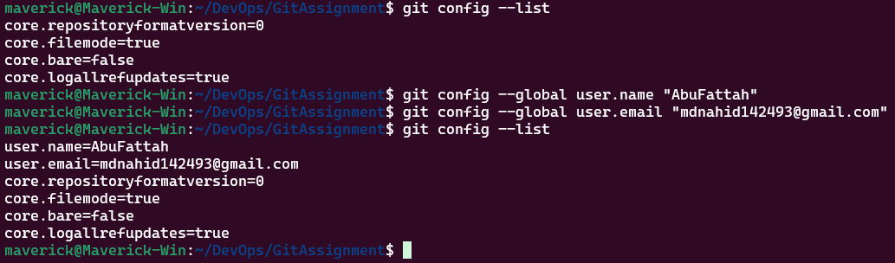

<p align="center">
  <a href="https://example.com/">
    
  </a>

  <h3 align="center">Git Cheat Sheet</h3>

  <p align="center">
   The Essential Git Commands
 </p>

## Table of contents

- [Git Configuration](#git-configuration)

  - [Git Config](#git-config)

- [Initializing, Staging, and Committing](#initializing-staging-and-committing)

  - [Git Init](#git-init)
  - [Git Add](#git-add)

- [Status](#status)
- [What's included](#whats-included)
- [Bugs and feature requests](#bugs-and-feature-requests)
- [Contributing](#contributing)
- [Creators](#creators)
- [Thanks](#thanks)
- [Copyright and license](#copyright-and-license)

## Git Configuration:

### Git Config

`git config` is a command in Git for setting up configuration options. It operates at three levels:

- System Level: Applies to all users and repositories on the system.
- Global Level: Applies to all repositories of a single user.
- Local Level: Applies to a single repository.

1. **List Git Configurations**

```sh
# List all Git configurations
git config --list

# Set global username and email
git config --global user.name "AbuFattah"
git config --global user.email "mdnahid142493@gmail.com"
```

2. **Set User Name and Email**

```sh
# Set global username and email
git config --global user.name "AbuFattah"
git config --global user.email "mdnahid142493@gmail.com"
```



## Initializing, Staging, and Committing :

### Git Init

`git init` is used to initialize a repository in the project directory for tracking a project with Git.

```
git init
```

**Description:**
This command creates a new .git directory that contains all the metadata and object database for your project.


### Git Add

`git add` command is used to stage file contents. This command prepares changes in your working directory for the next commit.

**Example:**

```sh
#stages a single file
git add file1.js

# Stages multiple files
git add file1.js file2.js

# Stages all file contents of current directory
git add .
```


### Git Init

`git init` is used to initialize a repository in the project directory for tracking a project with Git.

```
git init
```

**Description:**
This command creates a new .git directory that contains all the metadata and object database for your project.


### Git Init

`git init` is used to initialize a repository in the project directory for tracking a project with Git.

```
git init
```

**Description:**
This command creates a new .git directory that contains all the metadata and object database for your project.


Here goes all the budgets

## What's included

Some text

```

```

```text
folder1/
└── folder2/
    ├── folder3/
    │   ├── file1
    │   └── file2
    └── folder4/
        ├── file3
        └── file4
```

## Creators

**Creator 1**

- <https://github.com/usernamecreator1>

## Thanks

Some Text

## Copyright and license

Code and documentation copyright 2023-2024 the authors. Code released under the [MIT License](https://reponame/blob/master/LICENSE).

Enjoy :metal:
