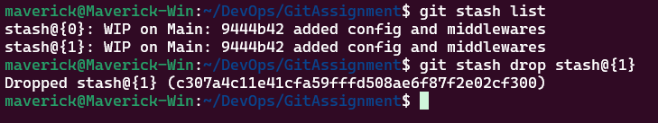

<p align="center">
  <a href="https://example.com/">
    
  </a>

  <h3 align="center">Git Cheat Sheet</h3>

  <p align="center">
   The Essential Git Commands
 </p>

## Table of contents

- [Git Configuration](#git-configuration)

  - [Git Config](#git-config)

- [Initializing, Staging, and Committing](#initializing-staging-and-committing)

  - [Git Init](#git-init)
  - [Git Add](#git-add)
  - [Git Commit](#git-commit)
  - [Git Status](#git-status)
  - [Git Stash](#git-stash)
  - [Git Restore](#git-restore)


## Git Configuration:

### Git Config

`git config` is a command in Git for setting up configuration options. It operates at three levels:

- System Level: Applies to all users and repositories on the system.
- Global Level: Applies to all repositories of a single user.
- Local Level: Applies to a single repository.

1. **List Git Configurations**

```sh
# List all Git configurations
git config --list

# Set global username and email
git config --global user.name "AbuFattah"
git config --global user.email "mdnahid142493@gmail.com"
```

2. **Set User Name and Email**

```sh
# Set global username and email
git config --global user.name "AbuFattah"
git config --global user.email "mdnahid142493@gmail.com"
```


## Initializing, Staging, and Committing :

### Git Init

`git init` is used to initialize a repository in the project directory for tracking a project with Git.

```
git init
```

**Description:**
This command creates a new .git directory that contains all the metadata and object database for your project.


### Git Add

`git add` command is used to stage file contents. This command prepares changes in your working directory for the next commit.

**Example:**

```sh
#stages a single file
git add file1.js

# Stages multiple files
git add file1.js file2.js

# Stages all file conqtents of current directory
git add .
```

**Screenshot:**


### Git Commit

`git commit` records the changes in the repository.

**Example**

```
git commit -m "Your commit header message" -m "Small commit"
```


**Description**
The -m flag: Allows you to specify a commit message inline without opening a text editor. It captures the current state of your files into a new commit in the Git local repository.

### Git Status

`git status` command displays current state of the repository.

```sh
# Displays the current state of the repository
git status
```

**Screenshot**


**Description**:
It shows which files have been modified, which are staged for commit, and which are untracked. This command helps users track changes and manage their workflow effectively.

### Git Stash

The `git stash` command takes your uncommitted changes, saves them away for later use in a temporary store, and then reverts them from your working copy.

```sh
git stash
```

**Screenshot**


#### 1. git stash list

View a list of all stashes you've created

```sh
git stash list
```


#### 2. git stash pop

`git stash pop` applis the most recent stash and remove it from the stash list

```sh
git stash pop
```


#### 3. git stash apply

`git stash apply` applies the stash at stash id without removing it from the stash list. It will apply the most recent changes if no stash id provided.

```sh
#This applies the stash at index 1
git stash apply stash@{1}

# This applies the most recent stash without removing from stash list
git stash apply
```


#### 4. git stash show

The `git stash show` command is used to display summary of changes about stashed changes.

```sh
#Show Changes in Latest Stash
git stash show

# Show Changes in Specific Stash ID
git stash show stash@{<index>}
```


#### 5. git stash drop

The `git stash drop` command is used to remove a stash from the stash list.

```sh
# Removes the most recent stash if not stash id is mentioned
git stash drop
#  Removes the specific stash that matches stash id
git stash drop <stash_id>
```



#### 6. git stash clear

The `git stash clear` command is used to clear the stash list.

```sh
git stash clear
```


**Description:**

Git Stash allows you to temporarily store current changes in your working directory—both staged and unstaged—so you can switch tasks or branches without committing unfinished work. Stashing is useful for saving changes without committing them, letting you return to them later.

### Git Restore

The `git restore` command is used to restore files in the working directory from either the index (staging area) or another commit.

#### 1. `git restore  <filename>`

If the file is staged:
git restore <file> will restore the working directory version of the file to match the staged version. It doesn't touch the staged changes.

If the file is not staged:
git restore <file> will restore the working directory version of the file to match the version in the last commit (HEAD).

```sh
git restore example.txt
```

**Screenshot**


#### 2. `git restore --staged <filename>`

It restores the staging area (index) but not the working tree.

```sh
git restore --staged example.txt
```

**Screenshot**


#### 3. `git restore --worktree <filename>`

This is the default behavior of `git restore` It restores the working directory to match the file in the staging area (if staged), or to the state of the file in the last commit (if not staged).

```sh
git restore --worktreee example.txt

# To restore both worktree and also unstage to match HEAD
git restore --staged --worktreee example.txt

```

**Screenshot**


#### 4. `git restore --source=<commit> <filename>`

This command always restore to the commit hash regardless of staging status.

```sh
# Restore to a specific commit
git restore --source=abc123f file.txt

# Restore to the state 3 commits ago
git restore --source=HEAD~3 file.txt
```

**Screenshot**


**Description**

Git restore: Undo changes in working directory or staging area.
Features:

- Discard working directory changes
- Unstage changes
- Restore to specific commit/branch
- Default: restores working directory
- Options: --staged (for index), --source (specify commit)
- Safer alternative to git checkout for files

<!-- ## Creators

**Creator 1**

- <https://github.com/usernamecreator1>

## Thanks -->
