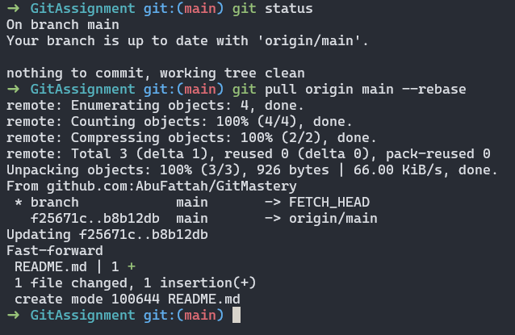

<p align="center">
  <a href="https://example.com/">
    
  </a>

  <h3 align="center">Git Cheat Sheet</h3>

  <p align="center">
   The Essential Git Commands
 </p>

 <p align="center"><i> Crafted by <a href="https://github.com/AbuFattah">Abu Fattah Hossain</a></i></p>

## Table of contents

- [Git Configuration](#git-configuration)

  - [Git Config](#git-config)

- [Initializing, Staging, and Committing](#initializing-staging-and-committing)

  - [Git Init](#git-init)
  - [Git Add](#git-add)
  - [Git Commit](#git-commit)
  - [Git Status](#git-status)
  - [Git Stash](#git-stash)
  - [Git Restore](#git-restore)

- [Inspection & Comparison](#inspection-and-comparison)

  - [Git Show](#git-show)
  - [Git Log](#git-log)
  - [Git Reflog](#git-reflog)
  - [Git Diff](#git-reset)

- [Branching & merging](#branching-and-merging)

  - [Git Branch](#git-show)
  - [Git Checkout](#git-checkout)
  - [Git Merge](#git-merge)
  - [Git Rebase](#git-rebase)

- [Collaboration](#collaboration)

  - [Git Remote](#git-remote)
  - [Git Push](#git-push)
  - [Git Fetch](#git-fetch)
  - [Git Pull](#git-pull)

- [Undoing changes](#undoing-changes)
  - [Git Reset](#git-reset)
  - [Git Revert](#git-revert)
  - [Git Rm](#git-rm)
  - [Git Amend](#git-amend)
  - [Git Cherry Pick](#git-cherry-pick)

## Git Configuration:

### Git Config

`git config` is a command in Git for setting up configuration options. It operates at three levels:

- System Level: Applies to all users and repositories on the system.
- Global Level: Applies to all repositories of a single user.
- Local Level: Applies to a single repository.

1. **List Git Configurations**

```sh
# List all Git configurations
git config --list

# Set global username and email
git config --global user.name "AbuFattah"
git config --global user.email "mdnahid142493@gmail.com"
```

2. **Set User Name and Email**

```sh
# Set global username and email
git config --global user.name "AbuFattah"
git config --global user.email "mdnahid142493@gmail.com"
```


## Initializing, Staging, and Committing :

### Git Init

`git init` is used to initialize a repository in the project directory for tracking a project with Git.

```
git init
```

**Description:**
This command creates a new .git directory that contains all the metadata and object database for your project.


### Git Add

`git add` command is used to stage file contents. This command prepares changes in your working directory for the next commit.

**Example:**

```sh
#stages a single file
git add file1.js

# Stages multiple files
git add file1.js file2.js

# Stages all file conqtents of current directory
git add .
```

**Screenshot:**


### Git Commit

`git commit` records the changes in the repository.

**Example**

```
git commit -m "Your commit header message" -m "Small commit"
```


**Description**
The -m flag: Allows you to specify a commit message inline without opening a text editor. It captures the current state of your files into a new commit in the Git local repository.

### Git Status

`git status` command displays current state of the repository.

```sh
# Displays the current state of the repository
git status
```

**Screenshot**


**Description**:
It shows which files have been modified, which are staged for commit, and which are untracked. This command helps users track changes and manage their workflow effectively.

### Git Stash

The `git stash` command takes your uncommitted changes, saves them away for later use in a temporary store, and then reverts them from your working copy.

```sh
git stash
git stash push -m "My new stash"
```

**Screenshot**


#### 1. git stash list

View a list of all stashes you've created

```sh
git stash list
```


#### 2. git stash pop

`git stash pop` applis the most recent stash and remove it from the stash list

```sh
git stash pop
```


#### 3. git stash apply

`git stash apply` applies the stash at stash id without removing it from the stash list. It will apply the most recent changes if no stash id provided.

```sh
#This applies the stash at index 1
git stash apply stash@{1}

# This applies the most recent stash without removing from stash list
git stash apply
```


#### 4. git stash show

The `git stash show` command is used to display summary of changes about stashed changes.

```sh
#Show Changes in Latest Stash
git stash show

# Show Changes in Specific Stash ID
git stash show stash@{<index>}
```


#### 5. git stash drop

The `git stash drop` command is used to remove a stash from the stash list.

```sh
# Removes the most recent stash if not stash id is mentioned
git stash drop
#  Removes the specific stash that matches stash id
git stash drop <stash_id>
```


#### 6. git stash clear

The `git stash clear` command is used to clear the stash list.

```sh
git stash clear
```


**Description:**

Git Stash allows you to temporarily store current changes in your working directory—both staged and unstaged—so you can switch tasks or branches without committing unfinished work. Stashing is useful for saving changes without committing them, letting you return to them later.

### Git Restore

The `git restore` command is used to restore files in the working directory from either the index (staging area) or another commit.

#### 1. `git restore  <filename>`

If the file is staged:
git restore <file> will restore the working directory version of the file to match the staged version. It doesn't touch the staged changes.

If the file is not staged:
git restore <file> will restore the working directory version of the file to match the version in the last commit (HEAD).

```sh
git restore example.txt
```

**Screenshot**


#### 2. `git restore --staged <filename>`

It restores the staging area (index) but not the working tree.

```sh
git restore --staged example.txt
```

**Screenshot**


#### 3. `git restore --worktree <filename>`

This is the default behavior of `git restore` It restores the working directory to match the file in the staging area (if staged), or to the state of the file in the last commit (if not staged).

```sh
git restore --worktreee example.txt

# To restore both worktree and also unstage to match HEAD
git restore --staged --worktreee example.txt

```

**Screenshot**


#### 4. `git restore --source=<commit> <filename>`

This command always restore to the commit hash regardless of staging status.

```sh
# Restore to a specific commit
git restore --source=abc123f file.txt

# Restore to the state 3 commits ago
git restore --source=HEAD~3 file.txt
```

**Screenshot**


**Description**

Git restore: Undo changes in working directory or staging area.
Features:

- Discard working directory changes
- Unstage changes
- Restore to specific commit/branch
- Default: restores working directory
- Options: --staged (for index), --source (specify commit)
- Safer alternative to git checkout for files

## Inspection and Comparison

### Git Show

`git show` displays information about any git object.

**Examples**

```sh
# Show details of the most recent commit
git show

# Show details of a specific commit
git show <commit-hash>

# Shows the given commit
git show 921a2ff

# Shows the last commit
git show HEAD

# Two steps before the last commit
git show HEAD~2

# Shows the version of file.js stored in the last commit
git show HEAD:file.js

```


**Description:**

It provides a detailed view of the changes introduced in a commit, including diffs, commit message, author, and date.

### Git Log

`git log` displays commit history, showing messages, authors, dates, and changes.

**Examples**

```sh
git log
git log --oneline
git log --graph --oneline --decorate
git log file.js
git log -n 5
git log --stat
git log --patch
```


**Description:**

Common options:

No flag: Full log with commit details

- --oneline: Compact single-line view
- --graph: ASCII graph of branch and merge history
- --decorate: Show branch and tag references
- --stat: Show list of modiufied changes in each commit
- --patch: Shows the actual changes
- -n <number>: Limit to last <number> commits
- file.js: Show commits affecting specific file

### Git Reflog

`git reflog` keeps track of updates to the tip of branches and other references. It logs all changes made to the references in the repository, including commits, branch checkouts, resets, and other reference updates. Reflog entries are local to your repository and are not shared with others.

**Examples**

```sh
git reflog
git reflog show HEAD@{1}
```


**Description:**

- No flag: Full log with commit details
- show < ref > : Show the history of a specific reference
- git reflog is local to your repository and is not shared with others.
- git reflog shows the history of updates to the references (branches, HEAD, etc.), including actions like commits, rebases, resets, and checkouts.
- git reflog is often used for recovery purposes, allowing you to find and restore previous states of the repository after actions like a reset or rebase.

### Git Diff

`git diff` is a powerful tool that shows the differences between various commits, branches, and working directories. It helps developers see changes that have been made to files, allowing them to review and understand modifications before committing them to the repository.

**Examples**

```sh
git diff
git diff <filename>
git diff --staged
git diff HEAD
git diff commit1 commit2
```


**Description:**

Description:
Common options:

- No flag: Show changes in working directory not yet staged
- --staged: Show changes between staging area and last commit
- HEAD: Show all changes since last commit (staged and unstaged)
- [commit]...[commit]: Show changes between two commits

## Branching and Merging

### Git Branch

`git branch` is used for branch management in a Git repository.

**Examples**

```sh
git branch
git branch new-feature
git branch -d old-feature
```


**Description:**

Description:

- No flag: List all local branches
- [branch-name]: Create a new branch
- -d [branch-name]: Delete a branch
- -D [branch-name]: Force delete a branch
- -r: List remote-tracking branches
- -a: List all branches (local and remote)
- -m [old-name] [new-name]: Rename a branch
- --merged: List merged branches
- --no-merged: List unmerged branches

Branches are lightweight pointers to commits, enabling parallel development streams. They're crucial for isolating work, experimenting with new features, and maintaining different versions of a project. The git branch command is essential for implementing Git workflows and navigating your project's development history.

### Git Checkout

`git checkout` switches between branches or restores working tree files.

**Examples**

```sh
git checkout feature-branch
git checkout -b new-feature
git checkout <commit-hash>

```


**Description:**

Description:

- [branch-name]: Switch to a branch
- -b [new-branch]: Create and switch to a new branch
- -: Switch to the previously checked out branch
- [commit]: Move HEAD to a specific commit (detached HEAD state)

### Git Merge

`git merge` integrates changes from different branches. It takes the contents of a **source branch** (branch that you want to integrate changes from.) and integrates them into the **target branch** (the branch you have checked out) .

**Examples**

```sh
git checkout main
# Basic Merge:
git merge feature-branch

# No Fast-Forward Merge
git merge feature-branch --no-ff

# This combines all commits from feature-branch into a single commit on the current branch.
git merge feature-branch --squash

# If a merge conflict occurs, this command reverts the repository to its pre-merge state.
git merge --abort

# lists merged and not merged branches
git branch --merged
git branch --no-merged
```


**Description:**

If the commit history is diverged git merge performs a 3 way merge. Some developer community does not like it as it pollutes the commit history with extra merge commit. But if the branches are not diverged it will do a fast forward merge by default, here it won't create an extra merge commit. It just moves the HEAD pointer to the latest commit.

There are various merge tools which can make handling merge conflict much more smoothly ex: P4Merge.

- No flag: Merges the specified branch into the current branch using a fast-forward merge if possible
- --no-ff: Creates a merge commit even if the merge resolves as a fast-forward
- --squash: Combines all commits from the source branch into a single commit on the target branch
- --abort: Aborts the merge process and tries to reconstruct the pre-merge state

### Git Rebase

`git rebase` reapplies commits on top of another base tip as the word rebase suggests. It is used to integrate changes from one branch into another by moving or combining a sequence of commits.

**Examples**

```sh
# Basic rebase
git checkout feature-branch
git rebase main
# Interactive rebase
git rebase --interactive branch-name
# Continue rebase process after solving merge conflicts
git rebase --continue
# Abort a rebase if conflicts occur
git rebase --abort
# Skip a commit if conflicts occur
git rebase --skip
```


**Description:**

- No flag: Reapplies commits from the current branch onto the specified branch
- --interactive: Allows you to edit, reorder, or squash commits during the rebase
- --continue: Continues the rebase process after resolving conflicts
- --abort: Stops the rebase process and returns to the state before the rebase began
- --skip: Skips the current commit and continues with the rebase

## Collaboration

### Git Remote

`git remote` manages the set of repositories ("remotes") whose branches you track and interact with. Remotes are external repositories that you connect to, allowing you to fetch, pull, and push changes.

**Examples**

```sh
git remote
git remote add upstream url
git remote rm upstream
git remote -v
```


**Description:**

- git remote: Lists the remote repositories currently configured.
- git remote add [name] [url]: Adds a new remote repository with the specified name and URL.
- git remote rm [name]: Removes the remote repository with the specified name.
- git remote -v: Displays the URLs that each remote name points to.

### Git Push

`git push` updates remote references along with associated objects, transferring your local commits to a remote repository.

**Examples**

```sh
# Push Current Branch
git push
# Push Specific Branch
git push origin main
# Set Upstream and Push
git push [--set-upstream | -u] origin feature-branch
# Delete Remote Branch
git push origin --delete feature-branch
# Force Push
git push --force
```


**Description:**

- git push: Pushes the current branch to its upstream remote counterpart.
- git push origin main: Pushes the main branch to the remote repository named origin.
- git push --set-upstream origin feature-branch: Sets feature-branch to track the remote branch on origin and pushes the branch.
- git push origin --delete feature-branch: Deletes the feature-branch from the remote repository origin.
- git push --force: Forces the push even if it results in a non-fast-forward update.

### Git Fetch

The `git fetch` command updates the local repository with the latest changes from a remote repository without affecting the current working directory or branch.

**Examples**

```sh
# Fetch Specific Branch
git fetch origin main

# Fetch All Updates from a Remote
git fetch origin

# Fetch Default Remote
git fetch
```


**Description:**

- git fetch origin master: Fetches updates from the master branch on the origin remote.
- git fetch origin: Fetches all branches and updates from the origin remote.
- git fetch: Equivalent to git fetch origin, fetches all objects from the default remote (typically origin).

### Git Pull

`git pull` fetches from and integrates with another repository or a local branch. It combines git fetch and git merge to update your current branch with changes from the remote repository.

**Examples**

```sh
git pull
git pull origin main
git pull origin feature-branch
git pull --rebase
git pull --no-ff
```



**Description:**

- git pull: Fetches and merges updates from the remote tracking branch configured for the current branch.
- git pull origin main: Fetches and merges updates from the main branch of the origin remote.
- git pull origin feature-branch: Fetches and merges updates from the feature-branch of the origin remote.
- git pull --rebase: Fetches updates from the remote branch and rebases your local commits on top of the fetched branch.
- git pull --no-ff: Forces a merge commit to be created, even if the merge could be resolved with a fast-forward.

## Undoing Changes

### Git Reset

`git pull` fetches from and integrates with another repository or a local branch. It combines git fetch and git merge to update your current branch with changes from the remote repository.

**Examples**

```sh
git reset --soft HEAD^
git reset HEAD~3 OR git reset --mixed HEAD~3
git reset --hard HEAD~2
```


**Description:**

- git reset --soft HEAD^: Moves HEAD to the parent of the current commit, preserving changes in index and working directory.
- git reset --mixed HEAD~3: --mixed flag is optional, it moves HEAD to three commits before the current one, resets index to match, keeps changes in working directory.
- git reset --hard HEAD~2: Discards all changes to 2 commits before the current one.

### Git Revert

`git revert` undoes a specific commit by creating a new commit that inversely applies the changes made by the original commit.

**Examples**

```sh
# Reverts the given commit
git revert 72856ea
# Reverts the last three commits
git revert HEAD~3
Revert and Modify Before Committing
git revert --no-commit HEAD~3.
```


**Description:**

- git revert: Initiates the revert operation in Git.
- --no-commit: Specifies that Git should not automatically create a new commit after performing the revert operation. Instead, it stages the changes in the index.
- HEAD~3: Refers to the commit that is three commits before the current HEAD (typically the parent of the parent of the parent of HEAD).

### Git Rm

`git rm` removes files from the working directory and the index, allowing for the removal of tracked files from version control.

**Examples**

```sh
# Removes from working directory and staging area
git rm file1.js
# Removes from staging area only
git rm --cached file1.js
```


**Description:**

`git rm` is used to manage files and directories in Git, enabling you to delete tracked files from both the working directory and the index, with options to delete recursively and untrack without deleting.

### Git Amend

`git commit --amend` is used to modify the most recent commit in Git history.

**Examples**

```sh
git commit --amend
git commit --amend -m "Updated commit message"
git commit --amend --no-edit
git commit --amend --reset-author
```

**Description:**

git commit --amend: Modifies the most recent commit by adding any staged changes and optionally changing the commit message.
git commit --amend -m "Updated commit message": Modifies the commit message of the most recent commit.
git commit --amend --no-edit: Adds staged changes to the most recent commit without changing the commit message.
git commit --amend --reset-author: Updates the author information in the most recent commit.

### Git Cherry Pick

`git cherry-pick` is used to apply a specific commit from one branch to another.

**Examples**

```sh
git cherry-pick <commit-hash>
git cherry-pick <start-commit>..<end-commit>
git cherry-pick --no-commit <commit-hash>
git cherry-pick --edit <commit-hash>
```


**Description:**

- git cherry-pick [commit-hash]: Applies the commit specified by [commit-hash] from another branch to the current branch.
- git cherry-pick [start-commit]..[end-commit]: Applies a range of commits from [start-commit] to [end-commit] to the current branch.
- git cherry-pick --no-commit [commit-hash]: Applies the changes from [commit-hash] but does not create a new commit automatically.
- git cherry-pick --edit [commit-hash]: Applies the changes and allows you to edit the commit message before committing.
