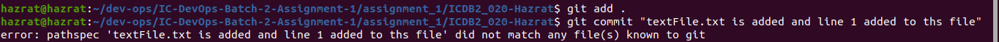
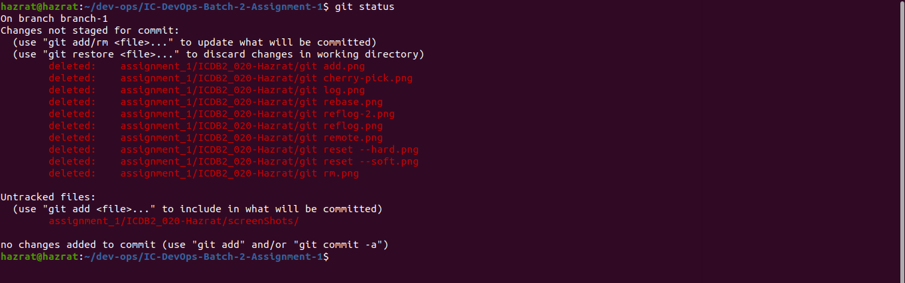
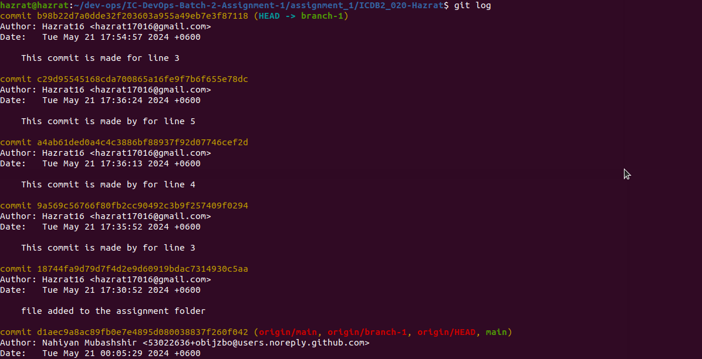
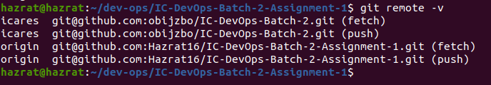
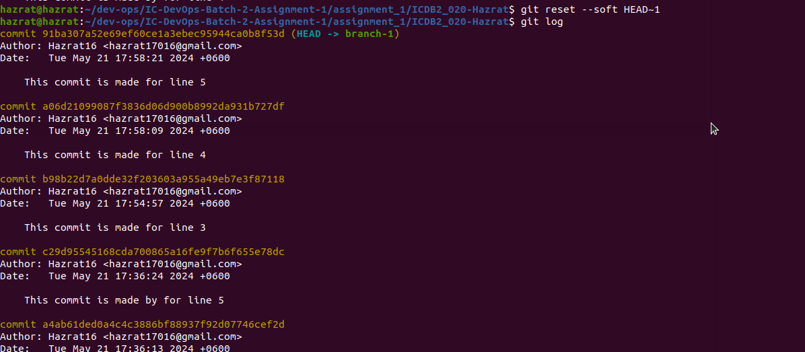
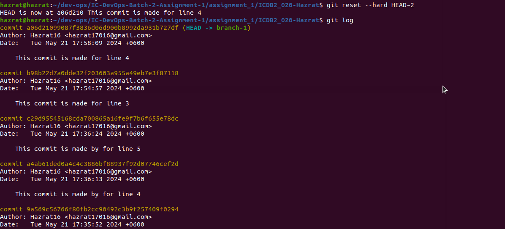
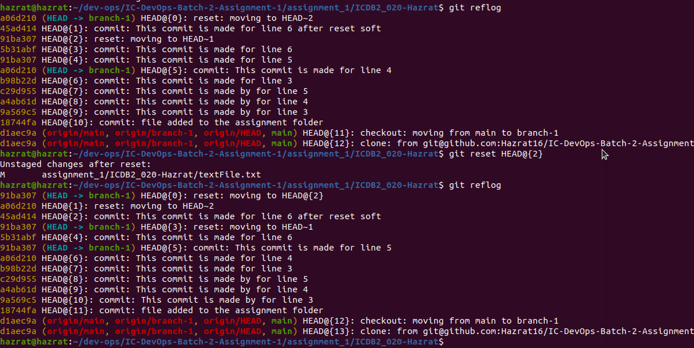
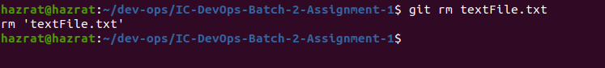

# 📝Scribe sheet of all the git commands in course

## ✒ S.M. Hazrat Ali

<br/><br/>

### Command: git init

Initializes a new Git repository in the current directory

**Usage:**

```sh
git init
```

This command basically reinitialized an existing one or create a new repository
<br/> <br/>

### Command: git add .

Stages all changes in the current directory for the action of next commit

**Usage:**

```sh
git add .
```

We can add a specific file by using this

```sh
git add filename/directory
```


This command basically do stages all modified, newly created or deleted files in the current directory for the action of next commit
<br/><br/>

### Command: git commit -m 'message'

Records the staged changes with a descriptive message

**Usage:**

```sh
git commit -m 'commit message'
```


This command creates a new commit with the staged changes. [`Note:` Should have replace the `commit message` with something `eg: My first git commit`]
<br/> <br/>

### Command: git status

Displays the state of the working directory

**Usage:**

```sh
git status
```


This command shows that which changes have been staged, which haven’t, and which files aren’t being tracked by Git
<br/> <br/>

### Command: git branch

**Usage:**

```sh
git branch
```


This command shows manages branches in the repository.

```sh
git branch -D [branch-name]
```


This will delete you branch locally
<br/> <br/>

### Command: git log

Displays a log of commits in the repository.

**Usage:**

```sh
git log
```


This command shows the commit history, including commit hashes, authors, dates, and messages.
<br/><br/>

### Command: git checkout branch

Switches to a specified branch.

**Usage:**

```sh
git checkout [branch_name]
```

This command changes the current working branch to the specified branch.
<br/><br/>

### Command: git clone <repository_url>

This command creates a local copy (clone)

**Usage:**

```sh
git clone [github-repo-url]
```

Explains that this command creates a local copy (clone) of the remote repository specified by `<repository_url>` here repository url replace with any github repo link user wants to make a local copy.
<br/><br/>

### Command: git remote

This command lists all configured remote repositories

**Usage:**

```sh
git remote
```


This command shows a list of remote repositories that the local repository is configured to track.
<br/><br/>

### Command: git remote add <remote_name> <remote_url>

This command adds a new remote repository to your local repository with the name `remote_name` and the URL `remote_url`

**Usage**

```sh
git remote add xyz [git-ssh/http-url]
```

---

### Command: git reset

There are couple. In this section some of reset's usable commands are given.

#### Command: git reset --soft

**Usage:**

```sh
git reset --soft <commit>
```


This command moves the HEAD to a specified commit, leaving your changes staged. It does not change the working directory or undo any changes.Use it when you want to undo a commit but keep the changes staged, allowing you to edit the commit message or make additional changes before committing again.
<br/><br/>

#### Command: git reset --hard

**Usage:**

```sh
git reset --hard <commit>
```


This command moves the HEAD to a specified commit and discards all changes, both staged and unstaged, back to that commit.Use it with caution as it permanently deletes any changes made after the specified commit. It's essentially like reverting to a previous state.
<br/><br/>

#### Command: git reset HEAD

**Usage:**

```sh
git reset HEAD <file(s)>
```


This command unstages changes for specified file(s), making them untracked again. It doesn't modify the working directory or the commit history.
<br/><br/>

### Command: git remove

This command lists all configured remote repositories

**Usage:**

```sh
git rm [file-name]
```


Removes file(s) from the working directory and stages the deletion.
<br/><br/>

### Command: git mv

This command lists all configured remote repositories

**Usage:**

```sh
git mv <source> <destination>
```

Moves or renames a file and stages the change.
<br/><br/>

### Command: git cherry-pick

This command lists all configured remote repositories

**Usage:**

```sh
git cherry-pick <commit-hash>
```


This command will attempt to apply the changes from the commit with the specific hash to the current branch. If successful, it will create a new commit with those changes.
<br/><br/>
