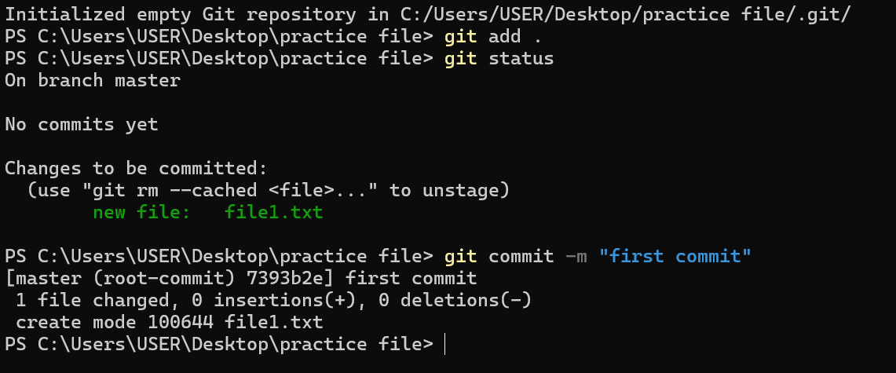
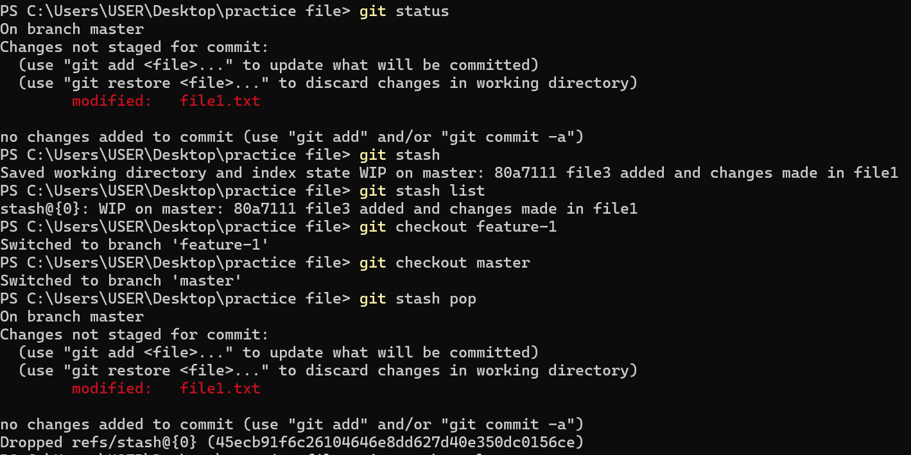
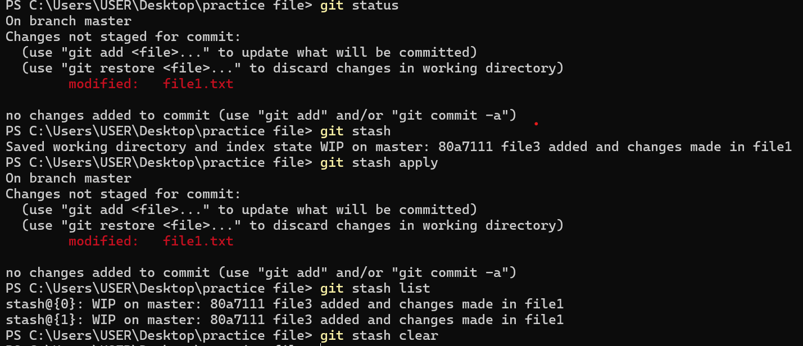
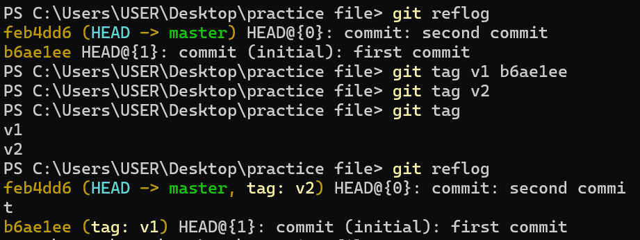
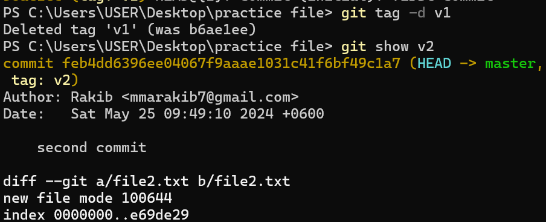
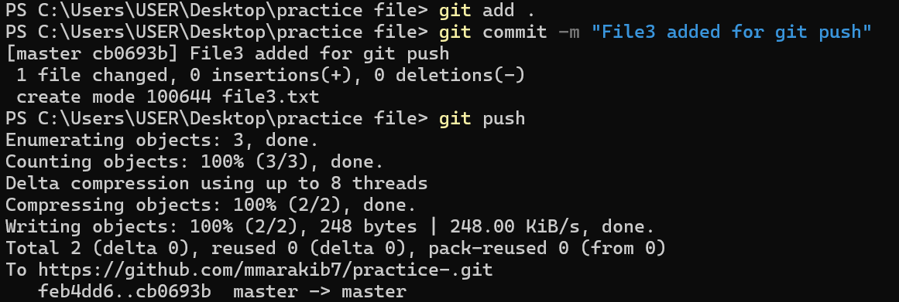
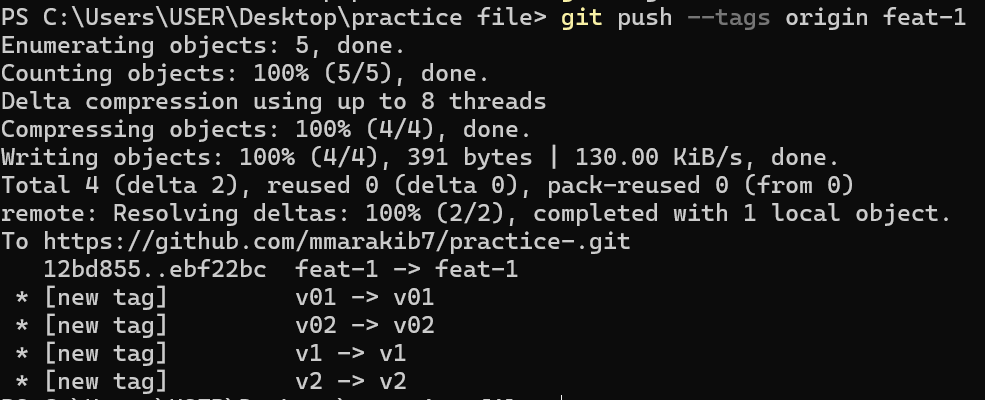

 ## The 'git init'
    git init

 command is used to create a new Git repository.

 ## The 'git add .' 
     git add .

 command is used to stage all the changes in the current directory and its subdirectories for the next commit.
 ## The 'git status' 
     git status
 
 command is used to display the current status of the working directory and the staging area in a Git repository.
 ## The 'git commit'
     git commit -m "Initial commit "

  command is used to record the changes made to files in the repository.

## The 'git branch'
    git branch

 Lists all local branches in the repository.

## The 'git branch [branch_name]'
    git branch feature

 Creates a new branch with the specified name.

## The 'git checkout [branch_name]'
    git checkout feature
 Switches to the specified branch.
## The 'git merge [branch_name]' 
    git merge feature

Merges the specified branch into the current branch.

## The 'git branch -d [branch_name]'
    git branch -d feature
Delete the Feature Branch

## The 'git log'
    git log

 Displays a list of commits in reverse chronological order along with commit details like author, date, and commit message

## The "git reflog'
    git reflog

  Git command that provides a record of all the changes (reference logs) made to the tips of branches and other references in the repository

## The git reset --soft 
    git reset --soft HEAD~1

 powerful way to undo commits without losing your changes.

## The git reset --hard 
    git reset --hard HEAD~1

This resets the branch to the previous commit, and discards all changes in the working directory and index.

## The git reset --mixed 
    git reset --mixed HEAD
 to undo changes by moving the current branch to a specified commit, updating the index (staging area) to match that commit, but leaving the working directory unchanged. This is the default behavior of git reset.

## The 'git stash'
    git stash

 
  a command in Git that temporarily shelves (or stashes) changes in your working directory that you don’t want to commit immediately.

## The 'git stash list'
    git stash list

This shows a list of all stashes you have saved.

## The 'git stash pop'
    git stash pop

This applies the most recently stashed changes and removes them from the stash list.

## The 'git stash apply'
     git stash apply

 Use this to apply stashed changes while keeping the stash entry for potential future use.

## The 'git stash clear'
    git stash clear

This removes all stashes from the stash list.

## The 'git diff <branchA>..<branchB>'
     git diff <branch1> <branch2>

This shows the differences between branchA and branchB.

## The 'git rebase <branch>'
     git rebase <branch>
This command takes the commits from the current branch and replays them on top of the specified branch.

## Tag
    git tag v1.0
Creates a tag at the current HEAD

     git tag <tag-name> <commit-hash>
Creates a tag for a specific commit

    git tag
This command lists all the tags in the repository

    git tag -d <tag-name>
Deletes a tag

    git show <tag-name>
This command shows the details of the " tag, including the commit it points to and the tag message.

##  Setting up a remote in Git 
    git remote add <remote-name> <remote-url>
Setting up the remote by using the 'git remote command'

     git push -u origin master/main

This pushes your changes from the main/master branch to the main branch on the origin remote and sets up the tracking relationship.
      
      git remote -v

To see the newly added remote origin with its URL.
 
 

## Git push
    git push
This command pushes the commits from your current local branch to the corresponding branch on the default remote repository.

## Git push tag
    git push --tags origin main
This pushes both commits and tags from your local main branch to the remote repository.

## Git pull
 A pull request (PR) is the procedure for cintributing to a project by merging the changes from one branch into another branch . Here's a step-by-step explanation of how a pull request works:
- At first we should Fork the repository
- Clone the Forked repository
- Create a new branch
- Make and commit changes.
- push changes to the fork
- create a pull request
- review the changes
- merge the pull request

