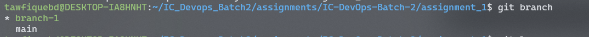
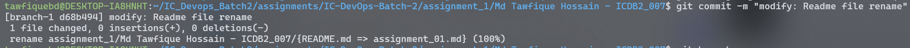

### Git Commands Scribe Sheet 
 

### `git clone`
- **Description:** Clone a repository into a new directory.
- **Example:** 
  ```bash
  git clone https://github.com/your-username/IC-repo.git
  ```

### `git init`
- **Description:** Create an empty Git repository or reinitialize an existing one.
- **Example:**
  ```bash
  git init
  ```

### `git branch`
- **Description:** List, create branches.
- **Example:**
  ```bash
  git branch branch-1
  git branch
  ```
- **Screenshot:** 

### `git checkout with new branch`
- **Description:** Switch branches with creating a new branch.
- **Example:**
  ```bash
  git checkout -b branch-1
  ```

### `git checkout`
- **Description:** Switch branche.
- **Example:**
  ```bash
  git checkout branch-1
  ```


### `git add`
- **Description:** Add file contents to the index (staging area).
- **Example:**
  ```bash
  git add .
  ```

### `git commit`
- **Description:** Record changes to the repository with message.
- **Example:**
  ```bash
  git commit -m "Commit message here"
  ```
- **Screenshot:** 


### `git pull`
- **Description:** Fetch from and integrate with another repository or a local branch.
- **Example:**
  ```bash
  git pull origin main
  ```
- **use case:** Use `git pull` to update your local branch with changes from the remote repository and automatically merge them.

### `git fetch`
- **Description:** Download objects and refs from another repository.
- **Example:**
  ```bash
  git fetch origin
  ```
- **use case:** Use `git fetch` to see what changes are available in the remote repository without merging them into your current branch. This is useful for reviewing changes before merge them.

### `git fetch with rebase`
- **Description:** Fetch changes from the remote repository and reapply your changes on top of the fetched changes.
- **Example:**
  ```bash
  git fetch origin main
  git rebase origin/main
  ```
- **use case:** Use `git fetch and rebase` to add changes from the remote repository into your current branch by replaying your local commits without extra merge commit.
- **Screenshot:** 

### `git reset`
- **Description:** Reset current HEAD to the last specific commit.
- **Example:**
  ```bash
  git reset --soft HEAD~1
  ```
- **use case:** Use `git reset` to discard changes in your working directory and move back to a previous commit. There are flag `--soft` and `--hard` . Hard  will delete uncommitted changes from file history. But soft will only remove commit but will stay chages in file.For 1 step  HEAD~1 for last 2 step use HEAD~2 .
- **Screenshot:** 


### `git log`
- **Description:** Show commit logs with descriptively and in oneline.
- **Example:**
  ```bash
  git log
  git log --oneline
  ```
- **use case:** Use `git log` or `git log --oneline` to view the history of commits. This is helpful for tracking changes and understanding the project history.
- **Screenshot:** 
 

### `git remote`
- **Description:** Manage set of tracked repositories.
- **Example:**
  ```bash
  git remote -v
  git remote add origin https://github.com/your-username/IC-repo.git
  ```
- **use case:** Use `git remote` to manage remote repository connections. This is helpful for linking your local repository with remote repositories.

### `git remote remove`
- **Description:** Remove the remote repository from local.
- **Example:**
  ```bash
  git remote remove origin
  ```
- **use case:** Use `git remote remove origin name` to disconnect your local repository from a remote

 repository.


Assignment by:
- [Md Tawfique Hossain](https://github.com/tawfiquebd)

