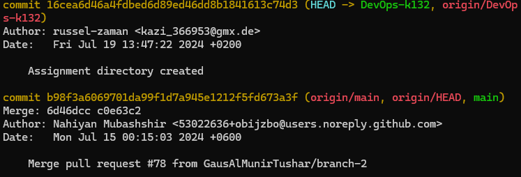
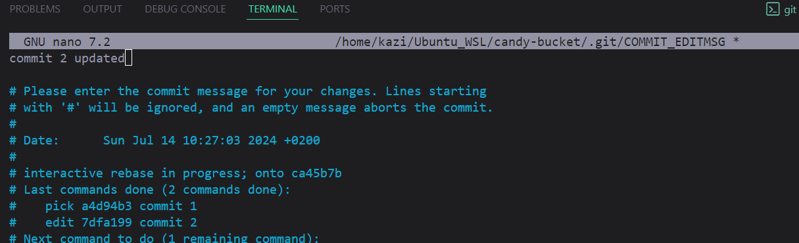

<p align="center">
  <a href="https://example.com/">
    
  </a>

  <h3 align="center">Version Control System</h3>

  <p align="center">
    Git Cheet Sheet
    <br>
  </p>
</p>


## Table of contents
| [Git Init](#git-init)       | [Git Clone](#git-clone)             | [Git Cherry Pick](#git-cherry-Pick)         |
|-----------------------------|---------------------------------|---------------------------------|
| [Git Add](#git-add)         | [Git Remove](#git-remove)           | [Git Amend](#git-amend)           |
| [Git Commit](#git-commit)   | [Git Stash](#git-stash)           | [Git Revert](#git-revert)         |
| [Git Status](#git-status)       | [Git Log](#git-log)       | [Merge Conflict](#merge-conflict)         |
| [Git Branch](#git-branch)   | [Git Reset](#git-reset)   | [Create PR](#create-pr)       |
| [Git Push](#git-push)           | [Git Rebase](#git-rebase)         | [Git Rm](#git-rm) |
| [Git Pull](#git-pull)     | [Git Reflog](#git-reflog)       |                                 |


# Git Commands

## Git Init
To initialize a git repo 

**Command**
``` 
git init
```
**Description :** 
The git init command is used to create a new Git repository. When you run git init, Git initializes a new, empty repository in the directory where you execute the command.

**Example**


## Git Add
Adds files, folder or contents to the staging area.

**Command**
```
git add <file1> (add one file)
git add file1 file2 file3
git add directory/  (all change in directory)

git add . (all all file changes from current directory and subDirectories)
```

**Description :** 
The git add command is used to stage changes in working directory for the next commit. It allows to specify which files or changes user wants to include in the commit.


## Git Commit
The `git commit` command is used to save changes to the local repository.

**Command**
```
git commit -m "Add Commit Message" 
```
**Description :** 
The git add command does not commit changes; it only prepares them for committing. After staging changes, git commit is used to save those changes to the repository.

**Example**


## Git status
To check the status or track the new file which has been added or changed.

**Command**
```
git status
```
**Description :**
The git status command in Git is used to display the state of the working directory and the staging area. It lets to see which changes have been staged, which haven’t, and which files aren’t being tracked by Git.


**Example**


## Git Branch
To create a git branch 

**Command**
```
git checkout <branch-name>    (create)

git branch                    (check)
```
**Description :**
The git branch command in Git is used to manage branches within a repository. Branches are used to create separate lines of development, allowing you to work on different features or fixes independently of the main codebase.

**Example**


## Git Push
Push local work to GitHub

**Command**
```
git push origin main
git push -u origin main
git push origin <branch_name> 
```
**Description :**
The git push command in Git is used to upload local repository content to a remote repository.

The -u or --set-upstream flag sets the remote branch as the upstream branch for your current local branch. This means that future git pull and git push commands can be executed without specifying the remote and branch name. Git will know which remote and branch to use by default.

**Example**


## Git Pull
The git pull command in Git is used to fetch and integrate changes from a remote repository into the current branch of the local repository.

**Command**
```
git pull [repository] [refspec]
git pull origin main
```
**Description :**

It's essentially a combination of two commands: git fetch followed by git merge. This means git pull retrieves the latest changes from the specified remote repository and merges them into your current branch.


## Git Clone
The git clone command in Git is used to create a copy of an existing repository.
**Command**
```
git clone <ssh-address/repository-url> 
```
**Description :**
This command clones the repository located at <repository-url> into a new directory in your current location.


## Git Remove
The git rm command in Git is used to remove files from the working directory and the staging area (index).
**Command**
```
git rm <file>
```
**Description :**
It is a way to delete files and track their removal in the next commit.


## Git Stash
The git stash command in Git is used to save the current state of your working directory and the staging area without committing the changes

**Command**
```
git stash
git stash apply
git stash pop
```
**Description :**
This allows you to switch branches or work on something else without losing your current work. When you're ready to continue working on the stashed changes, you can apply or pop the stash.


## Git Log
The git log command in Git is used to display the commit history of a repository.

**Command**
```
git log
```
**Description :**
It provides a detailed view of the repository's commit history, including the commit hashes, author information, commit dates, and commit messages.
**Example**

**Example**



## Git Reset
git reset allows you to undo changes in your working directory and staging area, and to move the current branch to a different commit. Depending on the options used, git reset can affect your working directory, staging area (index), or both.

**Command**
```
git reset [mode] [commit] 
git reset --soft HEAD~1  
git reset --hard HEAD~1 
git reset HEAD~1      (mixed/default)

# If we want to undo all local commits and go back to the same as the GitHub last commit 

git reset --hard origin/<branch_name>

```
**Description :**
After HEAD~1 says delete last 1 commit. The number says how many commits are deleted

Soft Reset (--soft)    Use this when you want to uncommit changes but keep them staged for further editing: This tag will only delete the commit but keep the changes of code/file which is made regarding that commit.

Mixed Reset (--mixed) (default) Use this when you want to un-stage changes but keep them in your working directory:

Hard Reset (--hard)Use this when you want to completely discard changes and reset to a specific commit. This tag will delete the commit as well as the changes of code/file which is made regarding that commit.


## Git Rebase
The git rebase command in Git is used to reapply commits on top of another base tip. It is commonly used to streamline a series of commits, make the commit history linear, or integrate changes from one branch into another.

**Command**
```
git rebase -i HEAD~3    (Enter rebase mode)
```
**Description :**
This command will open the editor and show the last three commits and options that can be done. To change a specific commit go to that commit(suppose 2nd commit) write edit instead of pick and then save and exit.

**Example**

Now go to the code file, Change or update what you want. Then add those changes by using git add 
After that :  
```
git rebase --continue
```

Resolve to commit if any.

Then git add .    →  then git rebase --continue  →  enter to add the next commit. 


## Git Reflog
The git reflog command in Git is used to view the reference log, which records updates to the tips of branches and other references. 

**Command**
```
git reflog

git reflog <HEAD@{number we want to go back}>
```
**Description :**
This log is an important tool for recovering lost commits, undoing changes, and understanding the history of changes in a repository.


## Git Cherry-pick
The git cherry-pick command in Git is used to apply the changes introduced by a specific commit from one branch onto another branch. This allows you to selectively integrate individual commits without merging or rebasing entire branches.
**Command**
```
git cherry-pick <commit>

git cherry-pick <commit1>^..<commit3>
```

**Example**

````
#git log

commit 0f2f6d5aeb6388bb6870e843a4950f44669a31dd (origin/feature-1, feature-1)
Author: russel-zaman <kazi_366953@gmx.de>
Date:   Sun Jun 30 18:21:08 2024 +0200

    Add file for freature 1
...
````
then take only the commit number with command

```
git cherry-pick 0f2f6d5aeb6388bb6870e843a4950f44669a31dd
```


## Git Amend
The git commit --amend command is used to modify the most recent commit. It is particularly useful for making corrections to the last commit without creating a new commit.
**Command**
```
git commit --amend -m "Updated commit message"
```
**Description :**
This command opens your default text editor to modify the commit message of the most recent commit. If you’ve made changes to files since the last commit, those changes will be included in the amended commit.


## Git Revert
The git revert command in Git is used to create a new commit that reverses the changes made by a previous commit. This command is useful when you need to undo changes in a way that maintains the history of those changes, rather than removing them entirely.

**Command**
```
git revert <commit-hash>
```
**Description :**This command creates a new commit that undoes the changes introduced by the specified commit.


## Merge Conflict
A merge conflict in Git occurs when two branches you're trying to merge have changes in the same part of the same file, or when a file is deleted in one branch and modified in another. Git doesn't know which change to apply, so it stops the merge and lets you resolve the conflict manually. 

Handling Merge Conflicts

Here's a step-by-step guide on how to deal with merge conflicts:

1. Create a Merge Conflict Scenario

For demonstration purposes, let's create a conflict. Assume you have two branches, main and feature-branch.

**Command**

```
# Checkout to main branch
git checkout main

# Create a file and commit it
echo "This is the main branch" > file.txt
git add file.txt
git commit -m "Add file.txt in main branch"

# Create a new branch and make changes
git checkout -b feature-branch
echo "This is the feature branch" > file.txt
git add file.txt
git commit -m "Modify file.txt in feature branch"

# Switch back to main and make conflicting changes
git checkout main
echo "This is another change in main branch" > file.txt
git add file.txt
git commit -m "Modify file.txt in main branch"

```
2. Attempt to Merge
```
git merge feature-branch
```
You'll encounter a conflict:

```
Auto-merging file.txt
CONFLICT (content): Merge conflict in file.txt
Automatic merge failed; fix conflicts and then commit the result.
```
3. View the Conflict

Open the conflicting file (file.txt) in a text editor. It will look something like this:
```
This is another change in main branch
```
"<<<<<<< HEAD" indicates the start of the conflict block. The changes made in the current branch (main) are shown after this line.

======= divides the conflicting changes.

">>>>>>> feature-branch" indicates the end of the conflict block and shows the branch that contributes the conflicting changes.

4. Resolve the Conflict

Edit the file to resolve the conflict. You need to decide how to combine the changes. For example:
```
This is another change in main branch
This is the feature branch
```
Or you might choose one change over the other.

5. Stage the Resolved File

After resolving the conflict, stage the resolved file:
```
git add file.txt
```
6. Complete the Merge

Finish the merge by committing the changes:
```
git commit -m "Resolve merge conflict between main and feature-branch"
```
7. Verify the Merge

Check the history to verify that the merge was successful:
```
git log --oneline --graph
```

## Create PR

To push changes to a base repository (also known as the upstream or original repository) that you don't have direct write access to, you typically need to follow these steps:

1. Fork the Repository: Create a personal copy of the repository in your GitHub account.

2. Clone the Forked Repository: Clone your forked repository to your local machine.

3. Configure Remote Repositories

Add the original repository as an upstream remote to keep your fork updated:
```
git remote add upstream https://github.com/original-username/repository-name.git
```

Verify the new upstream repository you've specified for your fork:
```
git remote -v
```
4. Make Changes: Create a new branch and Commit your changes to the forked repository.
```
git checkout -b "feature-branch"
# Make your changes to the code
git add .
git commit -m "Description of changes"
```
5. Push Changes: Push your changes to your forked repository on GitHub.
```
git push origin feature-branch
```
6. Create a Pull Request (PR): 

- Request the base repository to pull your changes.
- Go to your forked repository on GitHub.
- Click the "Compare & pull request" button for your new branch.

7. Provide a description and click "Create pull request".

- Description 
- How to test the code/change


### Git Rm
The `git rm` command is used to remove files from the staging area and the working directory.
**Example**
```
git rm --cached<file>
Ex: git rm --cached file1.txt
```
**Description :** 

--cached: Removes the file only from the index (staging area) while keeping it in your working directory.

-f: Forces the removal of the file even if it has changes that are staged or it is currently being tracked.
