<h1 align="center"> Git Commands Scribe Sheet </h1>
<p align="center"><i>by @GausAlMunirTushar - ICDB2_085</i></p>


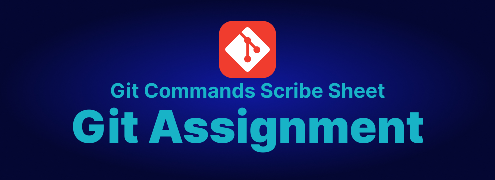
<p align="center">Below is a comprehensive scribe sheet for Git commands. This includes descriptions, examples and screenshots. </p>

### Table of Contents : 

1. [Git Basic Commands](#git-basic-commands)
   - [Git Version](#git-version)
   - [Git Config](#git-config)
   - [Git Init](#git-init)
   - [Git Status](#git-status)
   - [Git Add](#git-add)
   - [Git Commit](#git-commit)
   - [Git Branch](#git-branch)
   - [Git Remote](#git-remote)
   - [Git Push](#git-push)
   - [Git Pull](#git-pull)
2. [Git Advanced Commands](#git-advanced-commands)
   - [Git Log](#git-log)
   - [Git Reset](#git-reset)
   - [Git Relog](#git-relog)
   - [Git Diff](#git-reset)
   - [Git Stash](#git-stash)
   - [Git Merge](#git-merge)
   - [Git Revert](#git-revert)
---

## Git Basic Commands
### Git Version
Displays the currently installed version of Git.
**Example**
```bash
   git --version
```
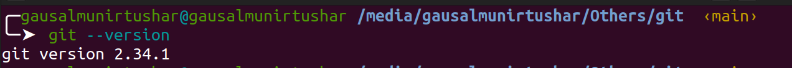
**Description :** 
Displays the current version of Git installed on your system. This command is useful for verifying that Git is installed and for checking the installed version to ensure compatibility with other tools or repositories.


### Git Config
Git config command is a convenience function that is used to set Git configuration values on a global or local project level
**Description :** 
The git config command allows you to get and set configuration options that control the appearance and behavior of Git. Configurations can be set at three levels:

- System: Applies to every user on the system and all their repositories.
- Global: Applies to all repositories for the current user.
- Local: Applies to the specific repository you are currently working in

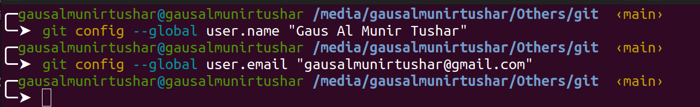

1. **Set User Name**
   Sets the name that will be attached to your commits and tags. 
   **Example**
```bash
   // global config name
   git config --global user.name "Gaus Al Munir Tushar"
```
2. **Set User Email**
Sets the email address that will be attached to your commits and tags.
```bash
   // global config email
   git config --global user.name "Gaus Al Munir Tushar"
```
3. **Set Default Text Editor**
Sets the default text editor that will be used by commands like git commit for editing commit messages
```bash
   git config --global core.editor "editor"
   git config --global core.editor "code"
```

### Git Init
Initializes a new Git repository.
**Example**
```bash
   git init
```
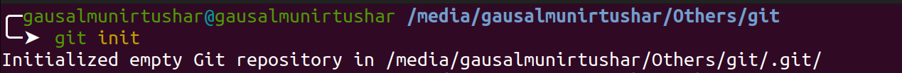
**Description :** 
Initializes a new Git repository. This command creates a new subdirectory named .git that contains all the necessary repository files.
### Git Status
To view the current status of the repository:
**Example**
```bash
   git status
```
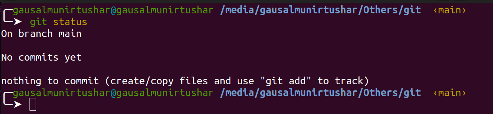
- Untracked files:

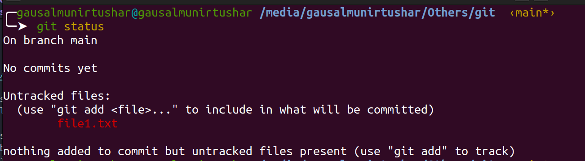
**Description :** 
When run git status, Git provides information about:
- Modified files: Files that have been changed but not yet staged for commit.
- Staged files: Changes that have been added to the staging area and are ready to be committed.
- Untracked files: Files that are not tracked by Git.

### Git Add
Adds file contents to the staging area.
**Example**

1. `git add file1.txt`: Adds changes in `file1.txt` to the staging area.
```bash
   git add file1.txt
```
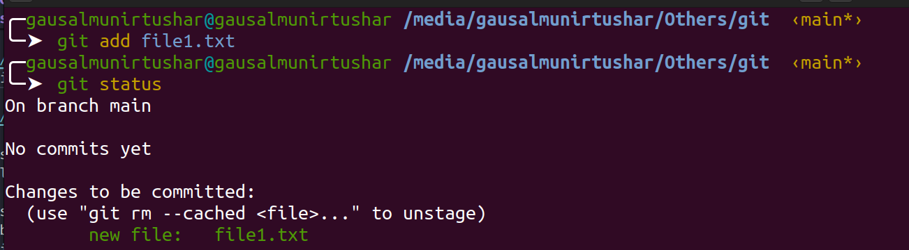
2. `git add . `: Adds all changes in the current directory and its subdirectories to the staging area.
```bash
   git add .
```
3. `git add --all` : Adds all changes in the entire working tree to the staging area, including untracked files and removing files that have been deleted.
```bash
   git add --all
```

**Description :**
When you make changes to files in your working directory, Git doesn't automatically track those changes. You need to explicitly tell Git which changes you want to include in the next commit using git add.


### Git Commit
The `git commit` command is used to record changes to the repository.
**Example**
```bash
   git commit -m "commit message"
```
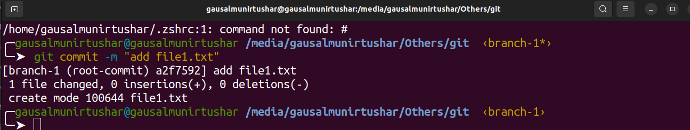
**Description :**
- The -m flag allows you to provide a commit message inline with the command.
- The commit message should be a brief description of the changes you are committing.
- After running git commit, Git creates a new commit with the changes staged in the index and records it permanently in the repository's history.

### Git Branch 
The  `git branch` command is used to list, create, or delete branches in a Git repository

**Example**

- To list all the local branches in the repository:
```bash 
   git branch
```
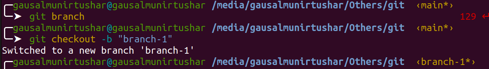
- Creating a Branch
To create a new branch in Git, you use the git branch command followed by the name of the new branch you want to create.
```bash
   git branch branch-1
```
- Deleting a Branch
To delete a branch in Git, you use the `git branch -d` command followed by the name of the branch you want to delete.
```bash
   git branch -d branch-1
```

- Checking Out a Branch
To switch to a different branch in Git, you use the `git checkout command` followed by the name of the branch you want to switch to.
```bash
   git checkout branch-1
```

**Description :**
- When used without options, git branch lists all the local branches in the repository.
The current branch is indicated with an asterisk (*).
- Can create a new branch by providing a name after the git branch command.
- To delete a branch, use the -d option followed by the name of the branch you want to delete.

### Git Remote
The `git remote` command allows you to manage the remote repositories associated with your local repository. You can add, rename, remove, and view information about remotes.
**Example**
1. `git remote -v`: Lists all remote repositories along with their URLs.
```bash
   git remote -v
``` 
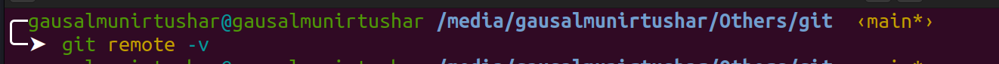
2. `git remote add <name of origin> <url> `: Adds a new remote repository.
```bash
   git remote add origin https://github.com/gausalmunirtushar/devops-career-path.git
``` 
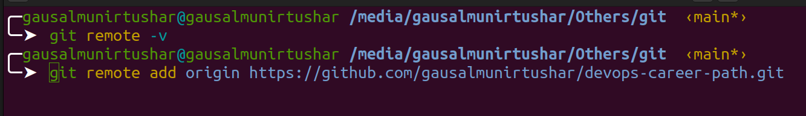
3. `git remote remove origin `: Removes the specified remote repository.
```bash
   git remote remove origin
``` 
**Description :**
- The -v option stands for "verbose," and it displays both the URL of the remote repository and its nickname.
- When clone a repository, Git automatically creates a remote called origin that points to the original repository.
- add multiple remotes to your repository to collaborate with others or to manage different hosting services.


### Git Push
The `git push` command is used to upload local repository content to a remote repository.

**Example**
To push the commits from the local main branch to the main branch on the remote repository named origin:
```bash
   git push origin main
``` 
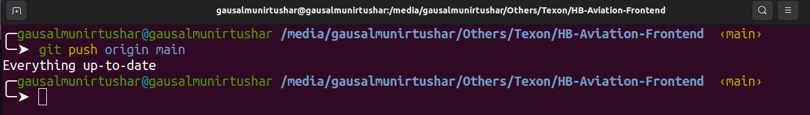
**Description :**
- `git push`: This is the command to push your local commits to a remote repository.
- `origin`: This is the default name Git gives to the server from which you cloned your repository. It represents the remote repository.
- `main`: This is the name of the branch you want to push your commits to on the remote repository.

### Git Pull
The `git pull` command is used to fetch and integrate changes from a remote repository into the current branch of your local repository.
**Example**
```bash
   git pull origin main
```
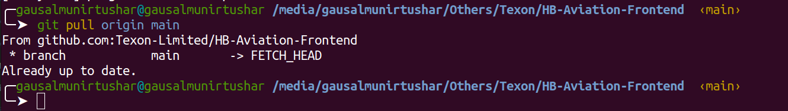
**Description :**
- git pull is a combination of two other Git commands: git fetch and git merge.
- It fetches changes from the specified remote repository and integrates them into the current branch.
- The <remote> argument specifies the remote repository from which - want to pull changes, and <branch> specifies the branch from which you want to pull changes.
- After fetching the changes, git pull automatically merges them into your current branch.

[Back to Top](#git-basic-commands)


## Git Advanced Commands

### Git Log
The `git log` command is used to view the commit history of a repository. It displays a list of commits in reverse chronological order, showing the commit hash, author, date, and commit message.

**Example**
```bash
git log
```
**Description :**
- `git log` is a powerful tool for inspecting the history of a repository.
- It shows the commit history, including the commit hash (SHA-1 checksum), author name, email, date, and commit message.
- By default, git log displays the commits starting from the most recent.


### Git Reset
The `git reset` command is used to reset the current HEAD to a specified state. It can be used to undo changes, unstage files, or move the HEAD to a different commit.


**Example**
```bash 
   git reset HEAD~1
```
- git reset --hard moves the HEAD to the specified commit and discards all changes after that commit.

**Git Reset Soft and Hard**
```bash
   git reset --soft HEAD~1

```
- `git reset --soft` moves the HEAD to the specified commit, keeping the changes in the index.
```bash
   git reset --soft HEAD~1
```
- `git reset --hard` moves the HEAD to the specified commit and discards all changes after that commit.

**Description :**
- `git reset` is a versatile command with different options for resetting the repository state.
- With `git reset HEAD~1`, the HEAD moves back one commit, effectively undoing the last commit and keeping changes in the working directory.
- Depending on the options used (soft, mixed, or hard), git reset can reset the staging area, working directory, or both.


### Git Diff
The `git diff` command is used to view the difference between the working directory, staging area, and the most recent commit. It shows changes line by line, highlighting additions, deletions, and modifications.
**Example**
```bash
   git diff
```

**Description :**
- `git diff` is a fundamental command for reviewing changes made to files in a repository.
- It compares changes between the working directory and the staging area (index) by default.
- With additional arguments, such as commit hashes or file paths, git diff can compare different versions of files or commits.
- `git diff` is essential for understanding the current state of the repository and tracking modifications.


### Git Stash
The `git stash` command is used to temporarily store changes that are not ready to be committed. It allows you to switch branches or perform other operations without committing incomplete changes.
**Example**
```bash
   git stash
```
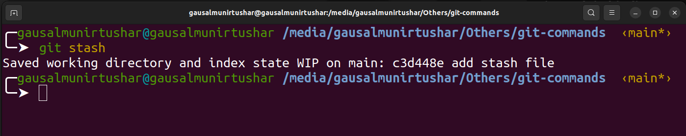
**Description :**
- `git stash` is a handy tool for managing work in progress without committing changes.
- It saves the current state of the working directory and staging area, allowing you to revert to it later.
- Stashed changes can be applied or discarded using git stash apply or git stash drop commands.
- git stash is useful for switching context quickly or temporarily setting aside unfinished work.

### Git Merge
The git merge command is used to integrate changes from one branch into another. It combines the commit history of two branches, creating a new merge commit.
**Example**
```bash
   git merge branch-1
```
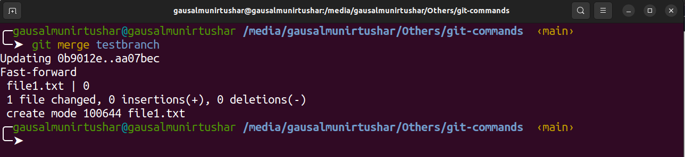
**Description :**
- `git merge` is essential for incorporating changes from one branch into another.
- It creates a new commit that combines the changes of the specified branch into the current branch.
- Merge conflicts may occur if changes in both branches conflict with each other, requiring manual resolution.
- git merge is a fundamental tool for collaboration and managing feature development in Git repositories.


### Git Revert
The `git revert` command is used to undo changes made in previous commits. It creates a new commit that reverts the changes made in the specified commit.

**Example**
```bash
   git revert 345adgd
```

**Description :**
- `git revert` creates a new commit that undoes the changes introduced by the specified commit.
- It does not modify the commit history but instead creates a new commit with the reversed changes.
- Multiple commits can be reverted in a single command by specifying their commit hashes.
- Reverting a merge commit requires specifying the parent commit to revert to.

### Git Fetch
The `git fetch` command is used to download the latest data from a remote repository without merging it with the data in your local repository.
**Example**
```bash
   git fetch origin
```

**Description :**
- `git fetch` retrieves the latest changes from the remote repository specified by its name (e.g., origin).
- It downloads new branches, tags, and commits from the remote repository without modifying your local branches.
- After fetching, you can inspect the changes using commands like git log or git diff.
- `git fetch` is useful for updating your local repository with changes from the remote repository without automatically merging them into your working branch.

[Back to Top](#git-basic-commands)