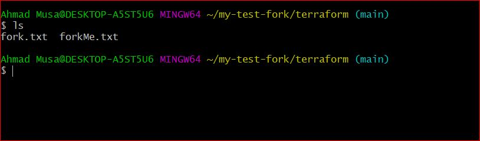
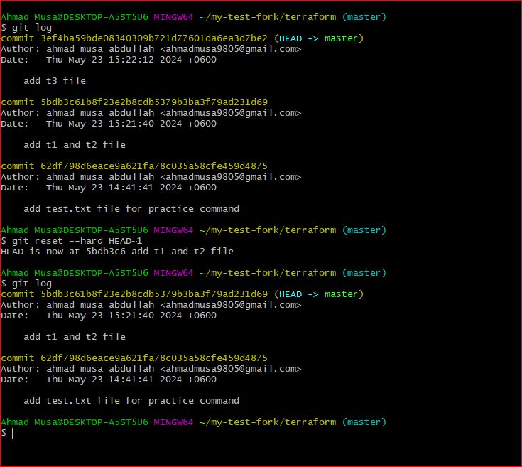

# Git Command Scribe Sheet

## Setup and Configuration

- **git config**

  - Description: Set configuration values for your user name, email, and other preferences.
  - Example:
    ```bash
    git config --global user.name "Your Name"
    git config --global user.email "your.email@example.com"
    ```
  - Screenshot: 

- **git config -l**

  - Description: List all the current configuration settings.
  - Example:
    ```bash
    git config -l
    ```
  - Screenshot: 

- **git config --global user.name/user.email**
  - Description: Set the global username and email for all repositories.
  - Example:
    ```bash
    git config --global user.name "Your Name"
    git config --global user.email "your.email@example.com"
    ```
  - Screenshot: 

## Basic Commands

- **ls**

  - Description: List directory contents.
  - Example:
    ```bash
    ls
    ```
  - Screenshot: 

- **ls -a**

  - Description: List all files, including hidden files.
  - Example:
    ```bash
    ls -a
    ```
  - Screenshot: 

- **git init**

  - Description: Initialize a new Git repository.
  - Example:
    ```bash
    git init
    ```
  - Screenshot: 

- **git clone**

  - Description: Clone a repository into a new directory.
  - Example:
    ```bash
    git clone https://github.com/user/repo.git
    ```
  - Screenshot: 

- **git add filename**

  - Description: Add a specific file to the staging area.
  - Example:
    ```bash
    git add filename
    ```
  - Screenshot: 

- **git add .**

  - Description: Add all changes in the current directory to the staging area.
  - Example:
    ```bash
    git add .
    ```
  - Screenshot: 
  - Screenshot: 

- **git reset**

  - Description: Unstage a file or set of files.
  - Example:
    ```bash
    git reset filename
    ```
  - Screenshot: 

- **git status**

  - Description: Show the working tree status.
  - Example:
    ```bash
    git status
    ```
  - Screenshot: 

- **git commit -m "message"**

  - Description: Commit the staged snapshot with a message.
  - Example:
    ```bash
    git commit -m "Initial commit"
    ```
  - Screenshot: 

- **git log**
  - Description: Show commit logs.
  - Example:
    ```bash
    git log
    ```
  - Screenshot: 

## Branching and Merging

- **git checkout -b "branchName"**

  - Description: Create a new branch and switch to it.
  - Example:
    ```bash
    git checkout -b feature-branch
    ```
  - Screenshot: 

- **git branch**

  - Description: List all branches.
  - Example:
    ```bash
    git branch
    ```
  - Screenshot: 

- **git checkout "branchName"**

  - Description: Switch to the specified branch.
  - Example:
    ```bash
    git checkout main
    ```
  - Screenshot: 

- **git merge "branchName"**

  - Description: Merge the specified branch into the current branch.
  - Example:
    ```bash
    git merge feature-branch
    ```
  - Screenshot: 

- **git branch -D/-d "branchName"**
  - Description: Delete the specified branch.
  - Example:
    ```bash
    git branch -d feature-branch
    ```
  - Screenshot: 

## Advanced Commands

- **vim filename**

  - Description: Open a file in Vim editor.
  - Example:
    ```bash
    vim filename
    ```
  - Screenshot: 
  - Screenshot: 

- **cat filename**

  - Description: Concatenate and display file contents.
  - Example:
    ```bash
    cat filename
    ```
  - Screenshot: 

- **git config --global alias.variable "command"**

  - Description: Create a global alias for a Git command.
  - Example:
    ```bash
    git config --global alias.co checkout
    ```
  - Screenshot: 

- **git remote**

  - Description: Manage set of tracked repositories.
  - Example:
    ```bash
    git remote
    ```
  - Screenshot: 

- **git remote -v**

  - Description: Show URLs of remote repositories.
  - Example:
    ```bash
    git remote -v
    ```
  - Screenshot: 

- **git remote add origin link**

  - Description: Add a new remote repository.
  - Example:
    ```bash
    git remote add origin https://github.com/user/repo.git
    ```
  - Screenshot: 

- **git remote remove origin**

  - Description: Remove a remote repository.
  - Example:
    ```bash
    git remote remove origin
    ```
  - Screenshot: 

- **git fetch origin main**

  - Description: Fetch changes from the remote main branch.
  - Example:
    ```bash
    git fetch origin main
    ```
  - Screenshot: 

- **git pull origin main**

  - Description: Fetch and merge changes from the remote main branch.
  - Example:
    ```bash
    git pull origin main
    ```
  - Screenshot: 

- **git rebase origin/main**

  - Description: Rebase your current branch onto the remote main branch.
  - Example:
    ```bash
    git rebase origin/main
    ```
  - Screenshot: 

- **git reset HEAD~1/2/3...**

  - Description: Reset the current branch to a previous commit.
  - Example:
    ```bash
    git reset HEAD~1
    ```
  - Screenshot: 

- **mv oldFilename newFilename**

  - Description: Rename or move a file.
  - Example:
    ```bash
    mv oldFilename newFilename
    ```
  - Screenshot: 

- **git reset --hard origin/main**

  - Description: Reset the current branch to the state of a remote branch.
  - Example:
    ```bash
    git reset --hard origin/featureName
    ```
  - Screenshot: 

- **git reflog**

  - Description: Show a log of changes to the local repository.
  - Example:
    ```bash
    git reflog
    ```
  - Screenshot: 

- **git reflog HEAD@{int}**

  - Description: Show the reflog for a specific HEAD reference.
  - Example:
    ```bash
    git reflog HEAD@{1}
    ```
  - Screenshot: 

- **git cherry-pick commitId**

  - Description: Apply changes from a specific commit.
  - Example:
    ```bash
    git cherry-pick commitId
    ```
  - Screenshot: 

- **git stash**

  - Description: Stash the changes in a dirty working directory.
  - Example:
    ```bash
    git stash
    ```
  - Screenshot: 

- **git stash pop**

  - Description: Apply the most recent stash and remove it from the stash list.
  - Example:
    ```bash
    git stash pop
    ```
  - Screenshot: 

- **git stash list**

  - Description: List all stashed changes.
  - Example:
    ```bash
    git stash list
    ```
  - Screenshot: 

- **git stash apply stash@{int}**

  - Description: Apply a specific stash without removing it from the stash list.
  - Example:
    ```bash
    git stash apply stash@{1}
    ```
  - Screenshot: 

- **git rebase --continue**

  - Description: Continue the rebase process after resolving conflicts.
  - Example:
    ```bash
    git rebase --continue
    ```
  - Screenshot: 

- **git reset HEAD~[int-any without bracket]**

  - Description: Reset the current branch to a specified number of commits back.
  - Example:
    ```bash
    git reset HEAD~3
    ```
  - Screenshot: 

- **git reset --soft HEAD~[int]**

  - Description: Soft reset the current branch to a specified number of commits back.
  - Example:
    ```bash
    git reset --soft HEAD~3
    ```
  - Screenshot: 

- **git reset --hard HEAD~[int]**

  - Description: Hard reset the current branch to a specified number of commits back.
  - Example:
    ```bash
    git reset --hard HEAD~3
    ```
  - Screenshot: 

- **git reset --hard origin/main**

  - Description: Hard reset the current branch to match the remote main branch.
  - Example:
    ```bash
    git reset --hard origin/main
    ```
  - Screenshot: 

- **git rebase -i HEAD~[int]**

  - Description: Interactive rebase for a specified number of commits back.
  - Example:
    ```bash
    git rebase -i HEAD~3
    ```
  - Screenshot: 

- **git rebase branchName**
  - Description: Rebase the current branch onto another branch.
  - Example:
    ```bash
    git rebase main master
    ```
  - Screenshot: 

## Additional Commands

- **git remote set-url origin [new_url]**

  - Description: Change the URL of the remote repository.
  - Example:
    ```bash
    git remote set-url origin https://github.com/user/new-repo.git
    ```
  - Screenshot: 

- **git log --oneline**

  - Description: Display the commit logs in a compact form with each commit on one line.
  - Example:
    ```bash
    git log --oneline
    ```
  - Screenshot: 

- **git clean**

  - Description: Remove untracked files from the working directory.
  - Example:
    ```bash
    git clean -f
    ```
  - Screenshot: 

- **git shortlog**

  - Description: Summarize git log output.
  - Example:
    ```bash
    git shortlog
    ```
  - Screenshot: 

- **git mv**
  - Description: Move or rename a file, a directory, or a symlink.
  - Example:
    ```bash
    git mv oldFilename newFilename
    ```
  - Screenshot: 
