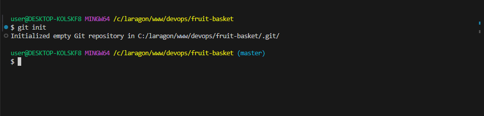
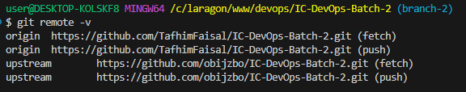
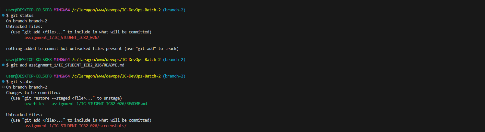
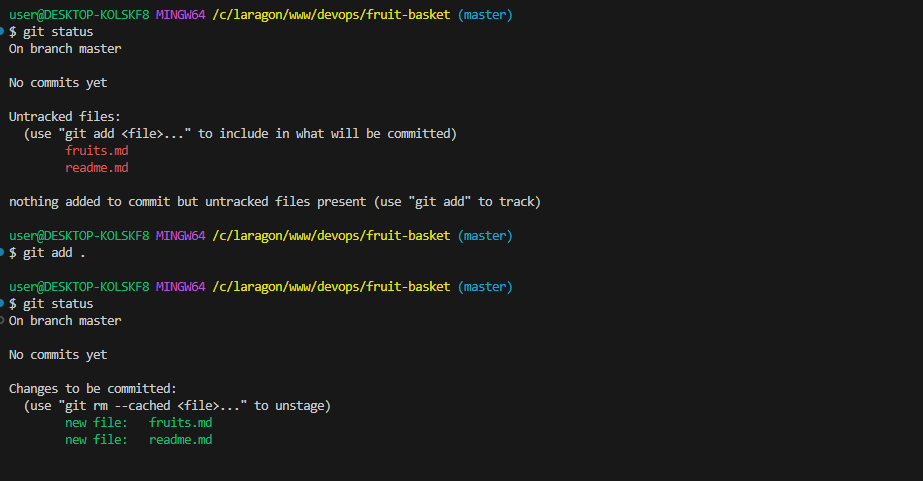
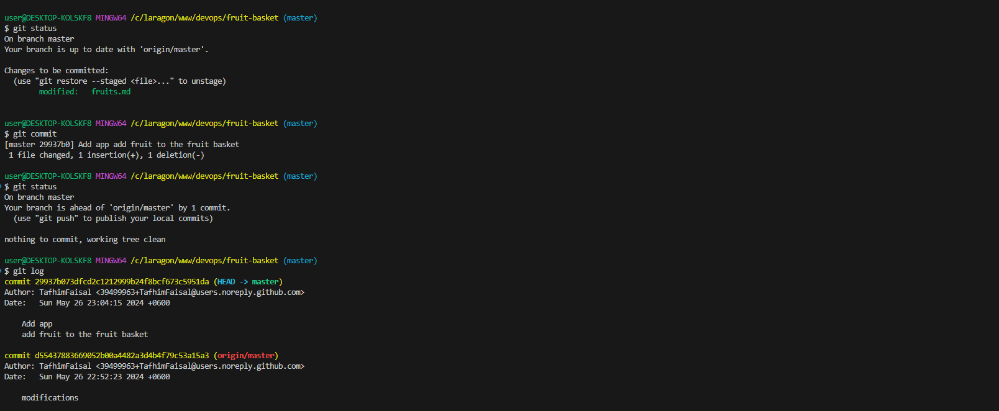
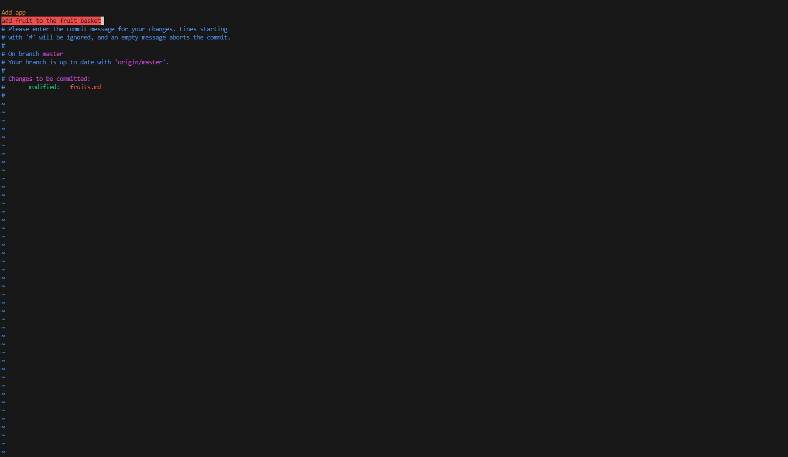
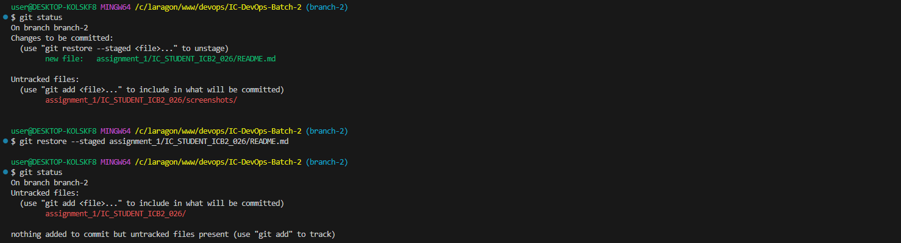
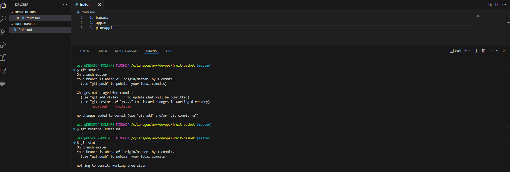
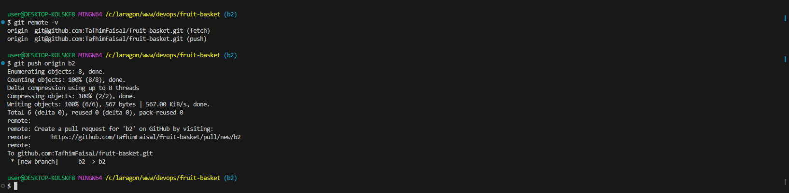

# list of all basic git command:
description with attached screenshots are given below.

1. [Config git](#Config-git):
    - [git config --global user.name "github-user-name"](#config-git)
    - [git config --global -l](#show-all-global-env)
    - [git config --global alias.co 'checkout'](#set-alias)
2. [Initialize Repository](#Initialize-Repository):
    - [git init](#initialize-repository)
3. [Initialize Remote Repositories](#Initialize-Remote-Repositories):
    - [git remote add < remote-name > < clone-url > / < ssh-url >](#add-remote)
    - [git remote -v](#remote-list)
    - [git remote remove < remote-name >](#remove-remote)
4. [Stage Changes](#stage-changes):
    - [git add .](#stage-all-changed-file) 
    - [git add -A](#stage-the-deleted-files) 
    - [git add < file1 > < file2 >](#stage-changed-file) 
5. [Create a Commit](#create-a-commit): 
    - [git commit -m "commit message"](#add-commit-message) 
    - [git commit](#add-commit-description)
6. [Unstage Changes:](#unstage-changes)
    - [git restore --staged < file-name >](#unstage)
    - [git restore < file-name >](#discard)
7. [Stash changes:](#stage-changes)
    - [git stash](#stash)
    - [git stash list](#stash-list)
    - [git stash pop stash@{int}](#stash-pop)
    - [git stash drop stash@{int}](#stash-drop)
    - [git stash apply stash@{int}](#stash-apply)
    - [git stash clear](#stash-clear)
8. [Push Updates:](#push)
    - [git push](#update)
    - [git push < remote-name > < branch-name >](#update-remote-branch)
    - [git push < remote-name > --all](#update-all)
9. Check the Status: 
    - git status
10. Manage branch:
    - git branch < branch-name >
    - git branch -a
    - git branch -d
    - git branch -D
    - git branch -m < old-branch-name > < new-branch-name >
11. Checkout to branch:
    - git checkout < branch-name >
    - git checkout -b < branch-name >
12. View Commit History:
    - git log
    - git log --oneline
13. Pull Updates:
    - git pull < remote-name > < branch-name >
14. fetch updates:
    - git fetch < remote-name > < branch-name >
15. Chanage Base:
    - git rebase < branch-name >
    - git rebase --continue
    - git rebase --abort
16. Remove Untracked Files:
    - git clean -n
    - git clean -f
    - git clean -f -e < pattern >
    - git clean -f -d
    - git clean -i
17. Manage the reference logs:
    - git reflog
18. Reset commits:
    - git reset --hard < commit-hash >
    - git reset --soft < commit-hash >
    - git reset --mixed < commit-hash >
    - git reset < file >
    - git reset HEAD~[int]
    - git reset HEAD@{int}
19. Cherry pick commits:
    - git cherry-picking < commit-hash >
    - git cherry-pick --continue
    - git cherry-pick --abort
20. Clone repository:
    - git clone < repository-url > < directory >
    - git clone -b < branch-name > < repository-url >
    - git clone --depth 1 < repository-url >

# Config git:
*git config --global* used to set global environment variable for git.

## Set global env
Below command will set global environment variable of user name for git.

### command
```bash
git config --global user.name "github-user-name"
```

### screenshot


## Show all global env
Below command will show all the global environment set for git.

### command
```bash
git config --global -l
```

### screenshot


## Set alias
Below command will set alias for checkout, this will enable us to right co instead of checkout in git command.

### command
```bash
git config --global alias.co 'checkout'
```

### screenshot


# Initialize Repository:
command below will Initialize git an empty repository.

### command
```bash
git init
```

### screenshot


# Initialize Remote Repositories:
*git remote* command will enable us to add or remove the remote repository to our local repository.

## Add remote
command below will add remote repository to our local repository

### command
```bash
git remote add < remote-name > < clone-url > / < ssh-url >
```

### screenshot


## Remote list
command below with show the added list of repository.

### command
```bash
git remote -v
```

### screenshot


## Remove remote
command below will remove remote
### command
```bash
git remote remove < remote-name >
```
### screenshot


# Stage Changes:
*git add* command will enable us to stage changed file, it will track this file to create commit.

## Stage Changed file:
command below will stage the given files.

### command
```bash
git add < file1 > < file2 > 
```
### screenshot


## Stage all Changed file:
command below will stage all file that have changes 

### command
```bash
git add .
```
### screenshot


## Stage the deleted files
command below will stage all file that have changes and deleted files.

### command
```bash
git add -A 
```
### screenshot


# Create a Commit:
*git commit* command will enable to add message and description on staged changes.

## Add Commit message:
command below will add message to staged changes.

### command
```bash
git commit -m "commit message"
```
### screenshot


## Add commit description:
command below will add message and description.

### command
```bash
git commit
```

### screenshot



# Unstage Changes:
*git restore* command will enable to add message and description on staged changes.

## Unstage:
command below will unstage staged files.

### command
```bash
git restore --staged < file-name >
```
### screenshot


## Discard:
command below will descard unstaged files changes.

### command
```bash
git restore < file-name >
```
### screenshot



# Stash changes:
*git stash* command will save staged files changes in to temporary localtion.

## Stash:
command below will save staged file in to temporary location.

### command
```bash
git stash
```
### screenshot


## Stash list:
command below will show the list of stashed changes.

### command
```bash
git stash list
```
### screenshot


## Stash pop:
command below will delete given stash number and apply it on the files.

### command
```bash
git stash pop stash@{int}
```
### screenshot


## Stash drop:
command below will delete given stash.

### command
```bash
git stash drop stash@{int}
```
### screenshot


## Stash apply:
command below will apply stashed changes on the file but not delete it from the stash.

### command
```bash
git stash apply stash@{int}
```
### screenshot


## Stash clear:
command below will clear stash.

### command
```bash
git stash clear
```
### screenshot


# Push:
*git push* will push the updated commits to the present repository

## update:
command below will update the present branch with commited changes

### command
```bash
git push
```
### screenshot


## Update remote branch:
command below will update the given branch with given remote

### command
```bash
git push < remote-name > < branch-name >
```
### screenshot


## Update all:
command below will update the all branch with given remote

### command
```bash
git push < remote-name > --all
```
### screenshot

