# list of all basic git command:
description with attached screenshots are given below.

1. [Config git](#Config-git):
    - [git config --global user.name "github-user-name"](#config-git)
    - [git config --global -l](#show-all-global-env)
    - [git config --global alias.co 'checkout'](#set-alias)
2. [Initialize Repository](#Initialize-Repository):
    - [git init](#initialize-repository)
3. [Initialize Remote Repositories](#Initialize-Remote-Repositories):
    - [git remote add < remote-name > < clone-url > / < ssh-url >](#add-remote)
    - [git remote -v](#remote-list)
    - [git remote remove < remote-name >](#remove-remote)
4. [Stage Changes](#stage-changes):
    - [git add .](#stage-all-changed-file) 
    - [git add -A](#stage-the-deleted-files) 
    - [git add < file1 > < file2 >](#stage-changed-file) 
5. [Create a Commit](#create-a-commit): 
    - [git commit -m "commit message"](#add-commit-message) 
    - [git commit](#add-commit-description)
6. [Unstage Changes:](#unstage-changes)
    - [git restore --staged < file-name >](#unstage)
    - [git restore < file-name >](#discard)
7. [Stash changes:](#stage-changes)
    - [git stash](#stash)
    - [git stash list](#stash-list)
    - [git stash pop stash@{int}](#stash-pop)
    - [git stash drop stash@{int}](#stash-drop)
    - [git stash apply stash@{int}](#stash-apply)
    - [git stash clear](#stash-clear)
8. [Push Updates:](#push)
    - [git push](#update)
    - [git push < remote-name > < branch-name >](#update-remote-branch)
    - [git push < remote-name > --all](#update-all)
9. [Check the Status:](#check-the-status) 
    - [git status](#check-the-status)
10. [Manage branch:](#manage-branch)
    - [git branch](#branch-list)
    - [git branch -a](#all-branch-list)
    - [git branch < branch-name >](#create-branch)
    - [git branch -d](#delete-branch)
    - [git branch -D](#force-delete-branch)
    - [git branch -m < old-branch-name > < new-branch-name >](#rename-branch)
11. [Checkout to branch:](#checkout-to-branch)  
    - [git checkout < branch-name >](#checkout-branch)
    - [git checkout -b < branch-name >](#checkout-and-create-branch)
12. [View Commit History:](#view-commit-history)
    - [git log](#show-log)
    - [git log --oneline](#show-compacked-log)
13. [Pull Updates:](#pull-updates)
    - [git pull < remote-name > < branch-name >](#pull-updates)
14. [fetch updates:](#fetch-updates)
    - [git fetch < remote-name > < branch-name >](#fetch-updates)
15. [Chanage Base:](#chanage-base)
    - [git rebase < branch-name >](#rebase)
    - [git rebase --continue](#continue-rebase)
    - [git rebase --abort](#abort-rebase)
16. [Remove Untracked Files:](#remove-untracked-files)
    - [git clean -n](#show-clean-file)
    - [git clean -f](#fource-clean)
    - [git clean -f -e < pattern >](#clean-by-pattern)
    - [git clean -f -d](#clean-file-and-directory)
    - [git clean -i](#clean-intaractive-mode)
17. [Manage the reference logs:](#reference-logs)
    - [git reflog](#reference-logs)
18. [Reset commits:](#reset-commits)
    - [git reset --hard < commit-hash >](#hard-reset)
    - [git reset --soft < commit-hash >](#soft-reset)
    - [git reset --mixed < commit-hash >](#mixed-reset)
    - [git reset < file >](#file-reset)
    - [git reset HEAD~[int]](#move-head)
    - [git reset HEAD@{int}](#recovering-after-a-hard-reset)
19. [Cherry pick commits:](#cherry-pick)
    - [git cherry-picking < commit-hash >](#cherry-pick-by-commit)
    - [git cherry-pick --continue](#cherry-pick-continue)
    - [git cherry-pick --abort](#cherry-pick-abort)
20. [Clone repository:](#clone-repository)
    - [git clone < repository-url > < directory >](#clone-in-directory)
    - [git clone -b < branch-name > < repository-url >](#clone-from-branch)
    - [git clone --depth 1 < repository-url >](#clone-by-depth)

# Config git:
*git config --global* used to set global environment variable for git.

## Set global env
Below command will set global environment variable of user name for git.

### command
```bash
git config --global user.name "github-user-name"
```

### screenshot
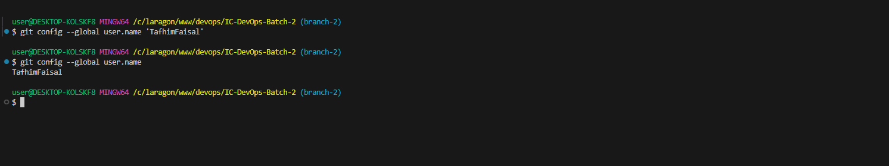

## Show all global env
Below command will show all the global environment set for git.

### command
```bash
git config --global -l
```

### screenshot
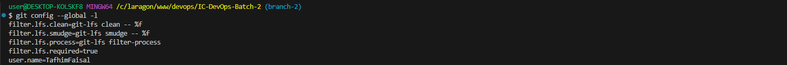

## Set alias
Below command will set alias for checkout, this will enable us to right co instead of checkout in git command.

### command
```bash
git config --global alias.co 'checkout'
```

### screenshot
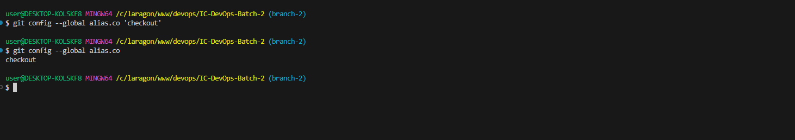

# Initialize Repository:
command below will Initialize git an empty repository.

### command
```bash
git init
```

### screenshot


# Initialize Remote Repositories:
*git remote* command will enable us to add or remove the remote repository to our local repository.

## Add remote
command below will add remote repository to our local repository

### command
```bash
git remote add < remote-name > < clone-url > / < ssh-url >
```

### screenshot


## Remote list
command below with show the added list of repository.

### command
```bash
git remote -v
```

### screenshot


## Remove remote
command below will remove remote
### command
```bash
git remote remove < remote-name >
```
### screenshot
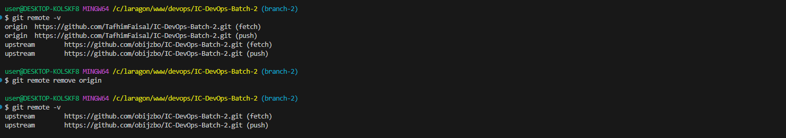

# Stage Changes:
*git add* command will enable us to stage changed file, it will track this file to create commit.

## Stage Changed file:
command below will stage the given files.

### command
```bash
git add < file1 > < file2 > 
```
### screenshot


## Stage all Changed file:
command below will stage all file that have changes 

### command
```bash
git add .
```
### screenshot


## Stage the deleted files
command below will stage all file that have changes and deleted files.

### command
```bash
git add -A 
```
### screenshot
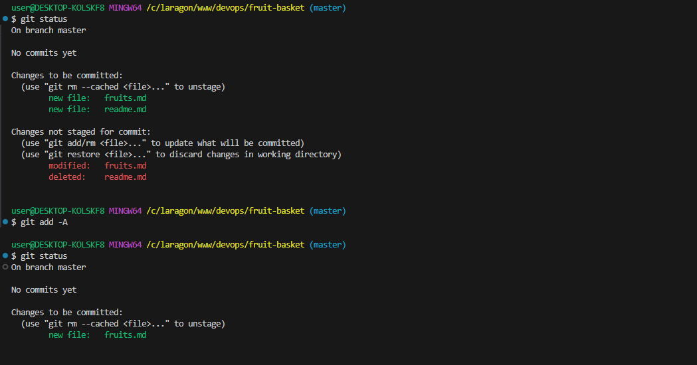

# Create a Commit:
*git commit* command will enable to add message and description on staged changes.

## Add Commit message:
command below will add message to staged changes.

### command
```bash
git commit -m "commit message"
```
### screenshot
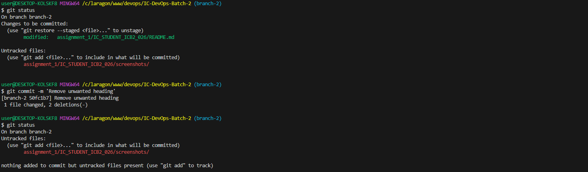

## Add commit description:
command below will add message and description.

### command
```bash
git commit
```

### screenshot


# Unstage Changes:
*git restore* command will enable to add message and description on staged changes.

## Unstage:
command below will unstage staged files.

### command
```bash
git restore --staged < file-name >
```
### screenshot


## Discard:
command below will descard unstaged files changes.

### command
```bash
git restore < file-name >
```
### screenshot
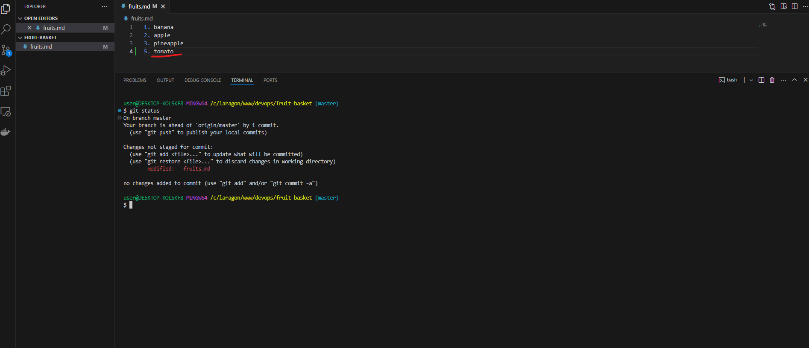


# Stash changes:
*git stash* command will save staged files changes in to temporary localtion.

## Stash:
command below will save staged file in to temporary location.

### command
```bash
git stash
```
### screenshot
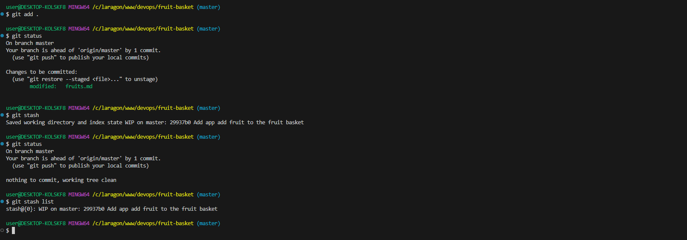

## Stash list:
command below will show the list of stashed changes.

### command
```bash
git stash list
```
### screenshot


## Stash pop:
command below will delete given stash number and apply it on the files.

### command
```bash
git stash pop stash@{int}
```
### screenshot
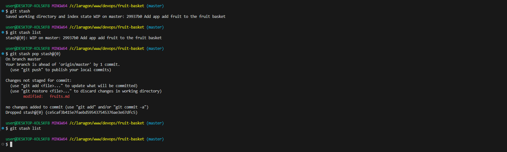

## Stash drop:
command below will delete given stash.

### command
```bash
git stash drop stash@{int}
```
### screenshot
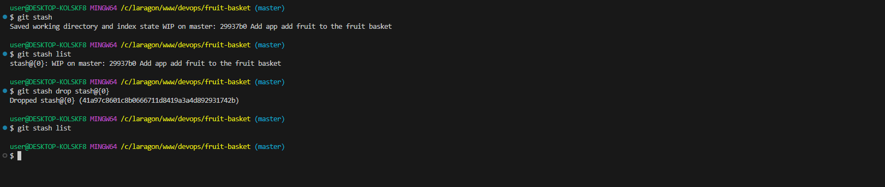

## Stash apply:
command below will apply stashed changes on the file but not delete it from the stash.

### command
```bash
git stash apply stash@{int}
```
### screenshot
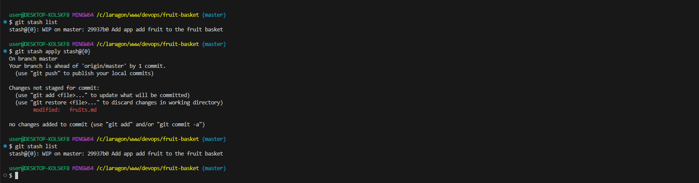

## Stash clear:
command below will clear stash.

### command
```bash
git stash clear
```
### screenshot
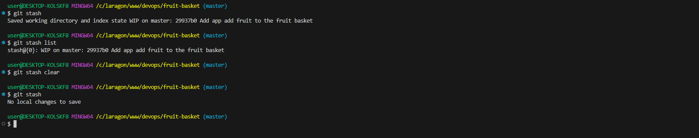

# Push:
*git push* will push the updated commits to the present repository

## update:
command below will update the present branch with commited changes

### command
```bash
git push
```
### screenshot
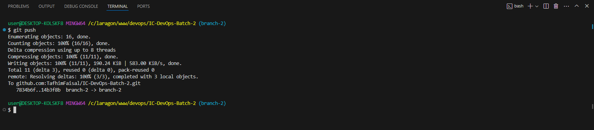

## Update remote branch:
command below will update the given branch with given remote

### command
```bash
git push < remote-name > < branch-name >
```
### screenshot


## Update all:
command below will update the all branch with given remote

### command
```bash
git push < remote-name > --all
```
### screenshot
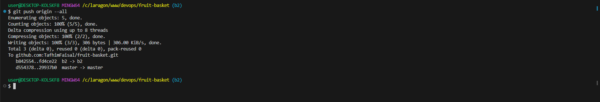

# Check the Status:

### command
```bash
git status
```
### screenshot
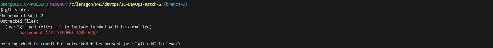

# Manage branch:
*git branch* command will let user manage branch

## Branch list
below command will show the list of localy fetched branches 
### command
```bash
git branch
```
### screenshot
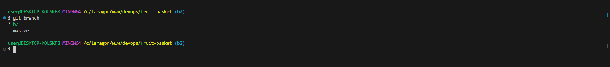

## All branch list:
below command will show a list of all branch local and remote
### command
```bash
git branch -a
```
### screenshot
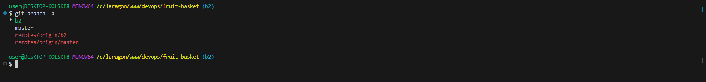

## Create Branch
below command will create new branch
### command
```bash
git branch < branch-name >
```
### screenshot
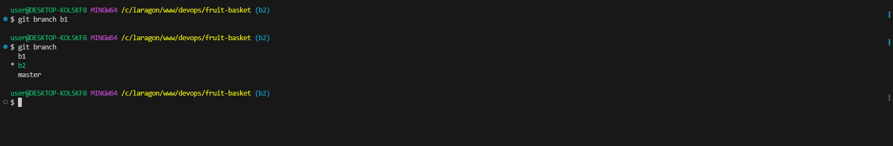

## Delete branch:
below command will delete branch
### command
```bash
git branch -d
```
### screenshot
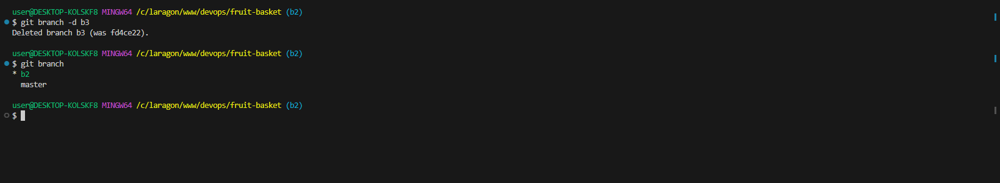

## Force Delete Branch:
below command will force delete a branch even if it has unstaged files.
### command
```bash
git branch -D
```
### screenshot
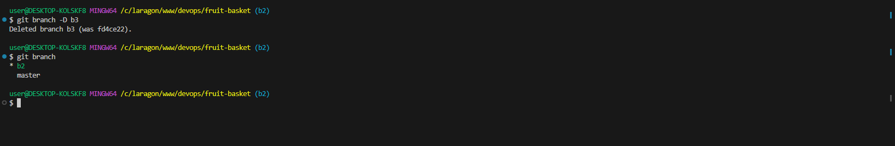

## Rename Branch
below command with rename branch
### command
```bash
git branch -m < old-branch-name > < new-branch-name >
```
### screenshot
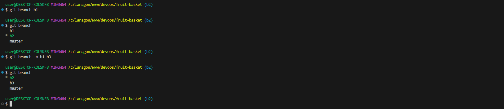

# Checkout to branch:
*checkout* command will enable user to change branch and create branch

## checkout Branch
below command with rename branch
### command
```bash
git checkout < branch-name >
```
### screenshot
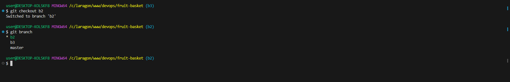

## checkout and create branch
below command with rename branch
### command
```bash
git checkout -b < branch-name >
```
### screenshot
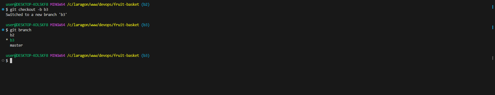


# View Commit History:
*git log* will show and let user interact with log
## show log
below command will show commit history
### command
```bash
git log
```
### screenshot
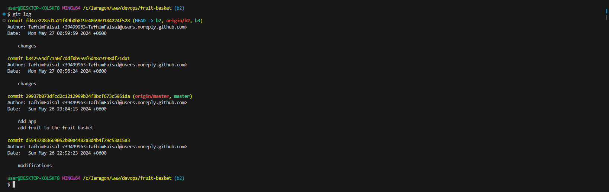

## show compacked log
below command show commit history in compacked way
### command
```bash
git log --oneline
```
### screenshot
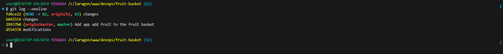


# Pull Updates:
below command will pull updates from given branch and remote and appy it to present branch
### command
```bash
git pull < remote-name > < branch-name >
```
### screenshot
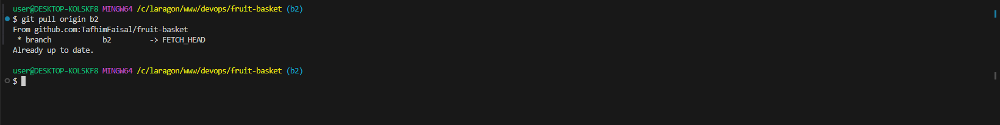


# Fetch updates:
below command will fetch updates from given branch and remote but will not appy it to present branch
### command
```bash
git fetch < remote-name > < branch-name >
```
### screenshot
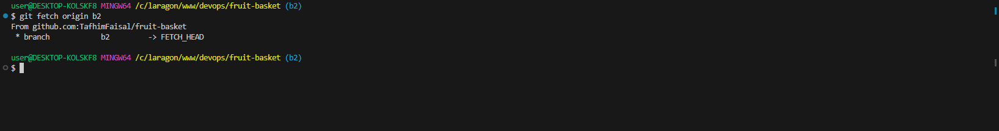


# Chanage Base:
*git rebase* command change base and merge code from enother branch.

## Rebase
below command will change base of current branch to provided branch
### command
```bash
git rebase < branch-name >
```
### screenshot
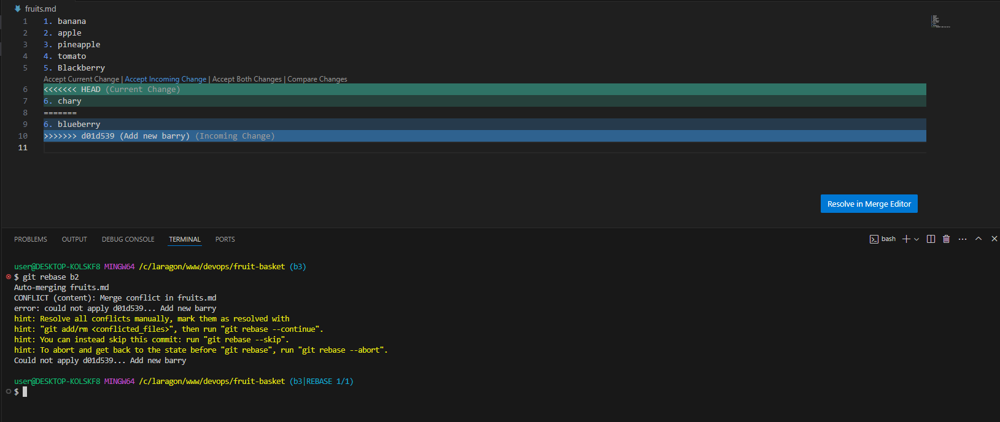

## Continue Rebase
when changing base, conflict can be happend, on that case *git rebase* let user resolv the conflict one by one. 
after resolving conflict we need to user below command to continue the rebasing. 
### command
```bash
git rebase --continue
```
### screenshot
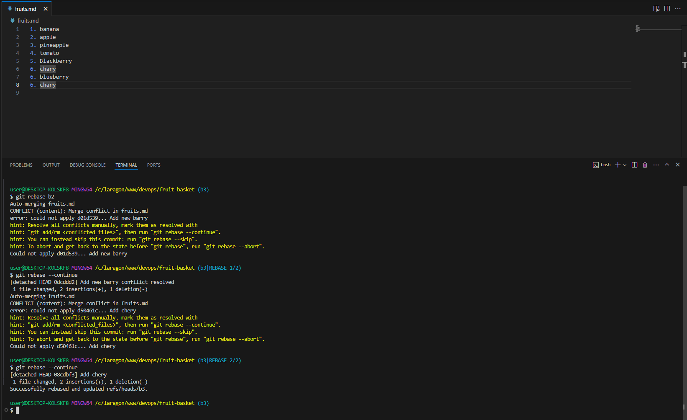

## Abort rebase
when changing base, conflict can be happend, on that case *git rebase* let user resolv the conflict one by one. 
if we dont want to rebase on that case, we can abort the rebasing by using below command
### command
```bash
git rebase --abort
```
### screenshot
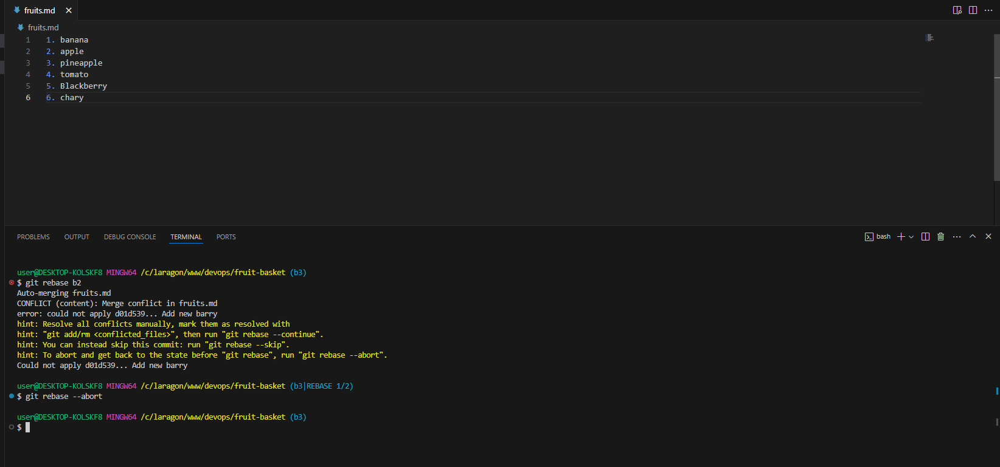

# Remove Untracked Files:
*git clean* will clean unstaged file

## Show clean file
command below will show the file that will be removed, if cleaned
### command
```bash
git clean -n
```
### screenshot
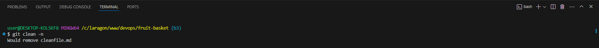

## Fource clean
command below will fource clean unstaged file
### command
```bash
git clean -f
```
### screenshot
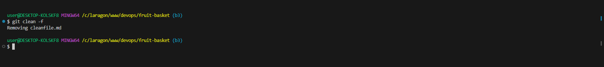

## Clean by pattern
command below will fource clean file that mache the pattern
### command
```bash
git clean -f -e < pattern >
```
### screenshot
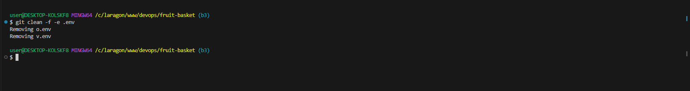

## Clean file and directory
command below will delete unstaged file and directory
### command
```bash
git clean -f -d
```
### screenshot
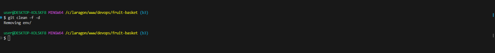

## Clean intaractive mode
command below will open an intaractive mode to remove unstaged file
### command
```bash
git clean -i
```
### screenshot
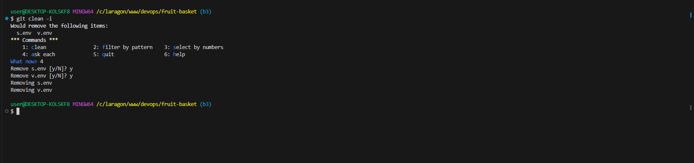


# Reference logs:
command below will show the commit history
### command
```bash
git reflog
```
### screenshot


# Reset commits:

## Hard reset
This command moves the HEAD to the specified commit and resets both the index and the working directory. 
All changes after the specified commit are discarded.
### command
```bash
git reset --hard < commit-hash >
```
### screenshot
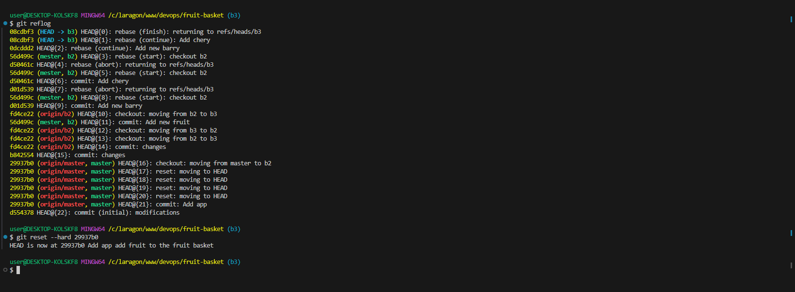

## Soft Reset
This moves HEAD to the specified commit but keeps your changes staged for commit. 
Useful if you want to amend the last few commits but keep the changes ready to commit.
### command
```bash
git reset --soft < commit-hash >
```
### screenshot
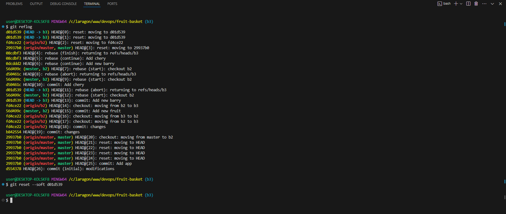

## Mixed Reset
This command moves the HEAD to the specified commit and resets the index, but it doesn't change the working directory. 
Changes remain in your working directory but are no longer staged for commit. This is the default behavior if no option is specified.
### command
```bash
git reset --mixed < commit-hash >
```
### screenshot
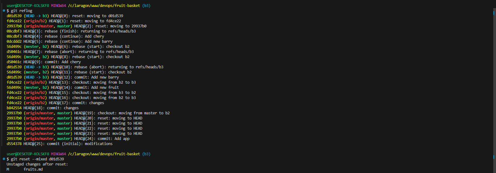

## File Reset
command below will unstage a single file while keeping changes in the working directory
### command
```bash
git reset < file >
```
### screenshot
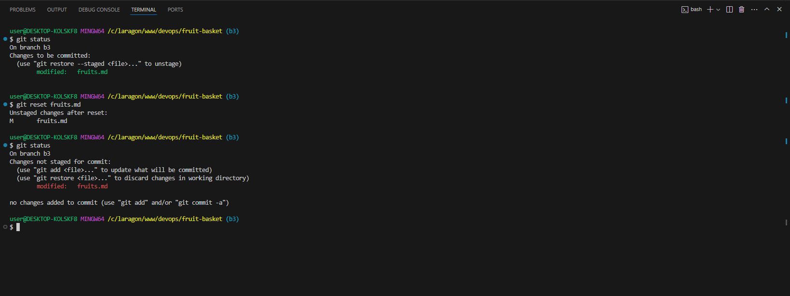

## Move HEAD
command below will move back the commit as much number as it provided in command
Here, [int] is an integer specifying how many commits to go back. For example, 
git reset HEAD~1 moves the current branch back by one commit.
### command
```bash
git reset HEAD~[int]
```
### screenshot
![git reset HEAD~[int]](screenshots/git_reset_head_tilda.png)

## Recovering After a Hard Reset
if you performed a hard reset and want to undo it. 
Command below will reset to the Commit Before the Hard Reset
### command
```bash
git reset HEAD@{int}
```
### screenshot
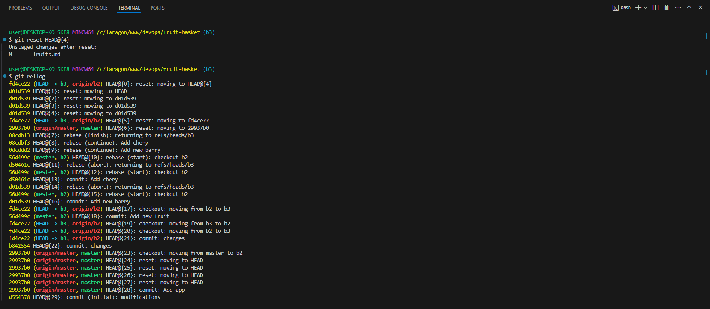


# Cherry pick:
*git cherry-pick* used to apply specific commits from one branch to another.

## Cherry pick by commit
command below will apply the changes in provided commit.
### command
```bash
git cherry-picking < commit-hash >
```
### screenshot
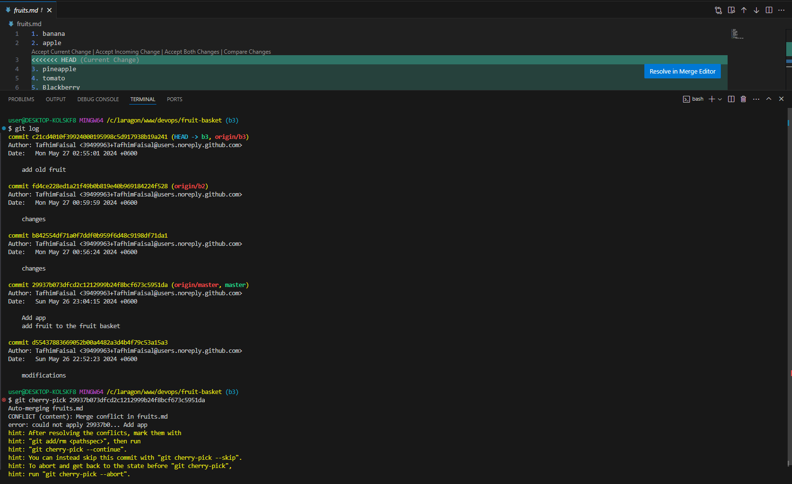


## Cherry pick continue
incase of merge conflict, after resolving the conflict command below needs to be run to continue the cherry-pick
### command
```bash
git cherry-pick --continue
```
### screenshot
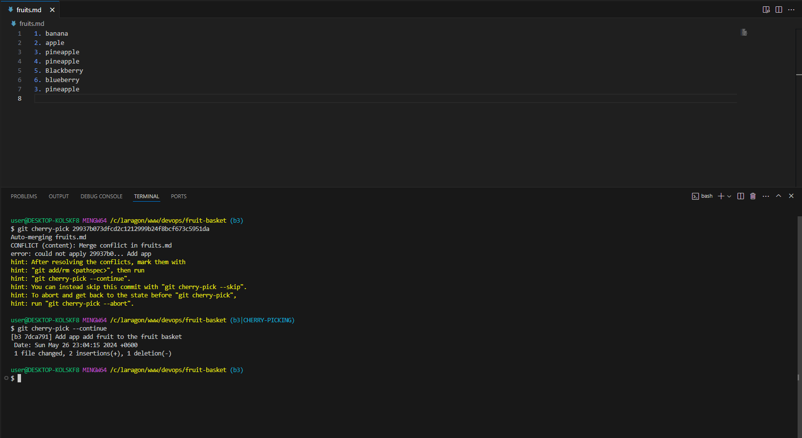

## Cherry pick abort
command below will abort the cherry-pick
### command
```bash
git cherry-pick --abort
```
### screenshot
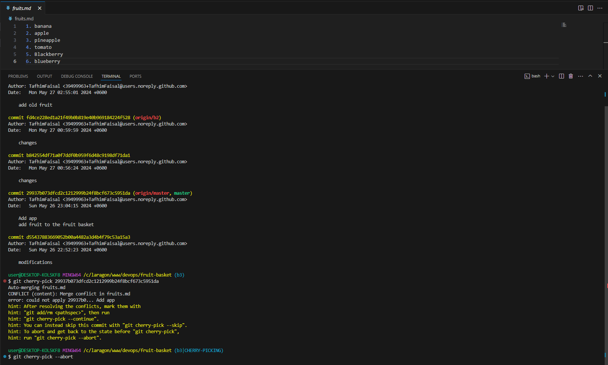


# Clone repository:
*git clone* will clone the remote repository

## Clone in directory
command below will clone the given repository in the given diractory folder
### command
```bash
git clone < repository-url > < directory >
```
### screenshot
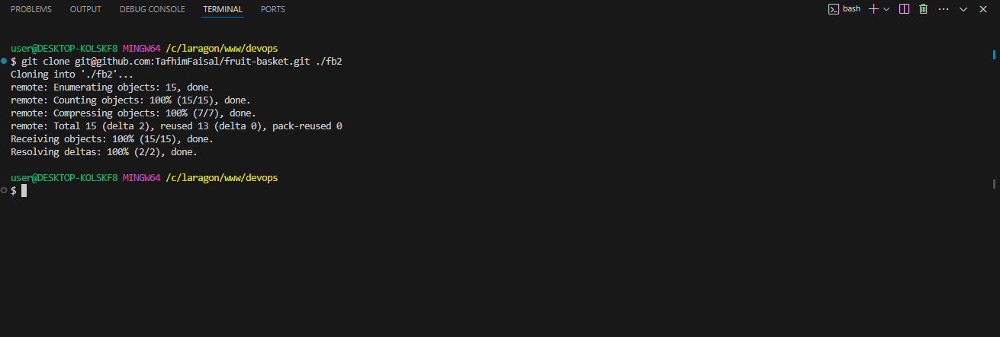

## Clone from branch
command below will clone from given branch of given repository 
### command
```bash
git clone -b < branch-name > < repository-url >
```
### screenshot
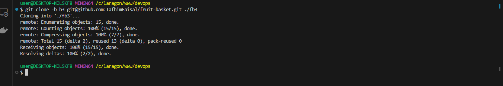

## Clone by depth
command below will clone the latest snapshot of given repository
### command
```bash
git clone --depth 1 < repository-url >
```
### screenshot
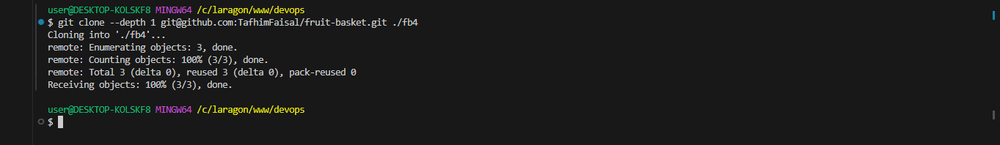