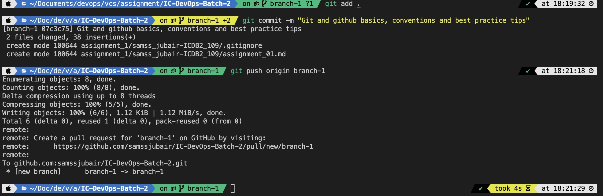

# Git and GitHub Cheat Sheet

## Version Control Systems (VCS)

### Types of VCS:
- **SVN (Apache Subversion):** Centralized VCS.
- **Git:** Distributed VCS, developed for Linux.

### Platforms:
- **GitHub:** Git hosting service owned by Microsoft.

## Key Concepts

### Commit Conventions:
1. Use present tense.
2. Capitalize the first word.
3. Keep PRs concise and avoid including too many files.

### Branch Management:
- For large teams, using forks can be more efficient than managing multiple branches.

### Pull Request (PR) Guidelines:
- Provide a detailed description for every PR.
- If a PR breaks, both the reviewer and developer share responsibility (50-50).

### Authentication:
- SSH is used for secure authentication.

### Terminology:
- **GitHub:** Uses "Pull Request".
- **GitLab:** Uses "Merge Request". Both are equivalent.

### Commit Management:
- Avoid minor commits like "fix typos"; amend such commits instead.
- Use rebase to stack new changes on top of previous commits.

### Licensing:
- Some companies purchase GitHub/GitLab licenses and host them on their own domains.


## Essential Git Commands

### Git add, commit and push 



### Staging and Resetting Changes:
```
// To stage changes
git add .

// To unstage changes
git reset

// Display all git commands
git
```

Git Alias Configuration:
```
git config --global alias.co 'checkout'
```

### Fetch vs. Pull:
- **Pull:** Combines fetch and merge/rebase.

### Merge vs. Rebase:
- **Merge:** Adds an extra commit.
- **Rebase:** Does not add an extra commit but changes commit hashes.

### Reset:
- Resets a commit, code remains the same.
```bash
git reset HEAD~1  
git reset --hard origin/branch-name  # Undoes reset from remote
git reflog
```

### Git Reflog:
- **git log:** Shows commits.
- **reflog:** Shows git activities.

### Git Cherry-pick:
- Pick a commit from another branch.
```bash
git cherry-pick commit-hash
```

### Git Reflog:
- **git log:** Shows commits.
- **reflog:** Shows git activities.

### Git Cherry-pick:
- Pick a commit from another branch.
```bash
git cherry-pick commit-hash
```

### Stash:
Temporarily save changes, useful for switching branches.

```
git stash
git stash pop
git stash list
```

### GitHub CLI Tool:
Check out a PR using:
```
gh pr checkout 5
```

### Reset Options:
- soft: Resets the commit, keeps changes staged.
- hard: Resets commit and code. Use with caution.
- No flag: Changes will be unstaged, requiring git add ...
To remove all local changes and fetch code from remote:

```
git reset --hard origin/main
```

### Modify Previous Commit:
```
git rebase -i HEAD~3  # Opens vim for modification
# After editing, continue rebase
git rebase --continue
```

### Git Log:
- **git log:** Shows commit history.
- **git log --oneline:** Shows commit history in one line.
- **git log --oneline --graph:** Shows commit history in graph format.

### Git Diff:
- **git diff:** Shows changes in the working directory.