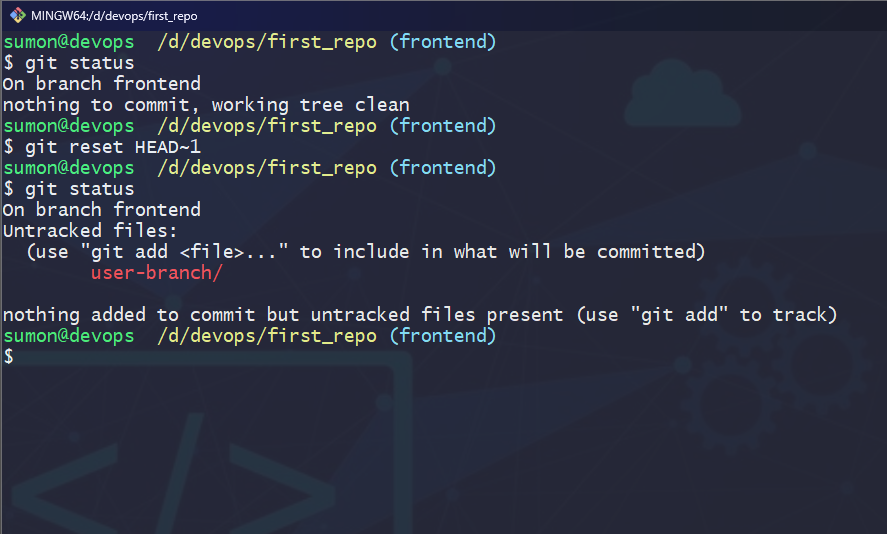

<div style="text-align: center;">


<!-- br -->

# Necessary Git Commands

> Here listed some necessary Git commands. It's help a developer to find git commands easily.

<!-- br -->

#### By

## <a href="https://github.com/msicse" > Md Sumon Islam</a>

</div>

## Table of contents

- [Quick start](#quick-start)
- [Installation](#installation)

  - [Windows](#windows)
  - [Mac](#mac)
  - [Linux](#linux)

  
## Quick start

- [Installation](#installation)
- [Configuration](#configuration)
- [Intialization and Commit](#intialization-and-commit)
- [Basic Git Commands](#basic-git-commands)
- [Branching and Merging](#branching-and-merging)
- [Remote Repositories](#remote-repositories)
- [Git Managing History](#git-managing-history)

## Installation

### Windows

- Download the latest version of Git from https://git-scm.com/downloads
- Install it in the system
- After installing, launch the Git Bash

### Mac

#### Using Installer

- Download the latest Git for Mac installer from https://sourceforge.net/projects/git-osx-installer/files

- Follow the prompts to install Git.

#### Using Homebrew

```
$ brew install git
```

### Linux

#### Debian/Ubuntu

```
apt-get install git
```

#### Fedora

> up to Fedora 21

```
yum install git
```

> Fedora 22 and later

```
dnf install git
```


## Configuration

> To configur Git to your local machine, follow the instruction

### Check Git Version

```
$ git --version
```

### Setup Git user name

```
$ git config --global user.name "sumon"
```

### Setup Git user email

```
$ git config --global user.email "eubsumon@gmail.com"
```

### Git Configuration

> The command returns a list of information about your git configuration including user name and emai.

```
$ git config -l
```
  

### Generate SSH Key

```
$ ssh-keygen -t rsa -C 'eubsumon@gmail.com'
```


### Add SSH key to Github

- Copy the SSH key from id_rsa.pub file
- Login to your github account
- Go to Setting > SSH and GPG keys > New SSH key
- Give a title and Paste the key in key section
- Click on **Add SSH Key**


<br>
<br>


### Check SSH Connection

```
ssh -T git@github.com
```


## Intialization

### Initialize a repo:

> Everything starts from here. The first step is to initialize a new Git repo locally in your project root.

```
git init
```

> Creates a new Git repository in the specified directory.

```
git init <directory>
```


### Git clone

> To clone a repository from a remote server to your local machine.

```
git clone <repository_url>
```

> Clones a specific branch from a repository.

```
git clone –branch <branch_name> <repository_url>
```


## Basic Git Commands

### Add a file

> The command add a file to the staging area. Just replace filename with the name of the file you want to add.

```
git add file_name
```

### Add only certain files

> With the asterisk in the command below, you can add all files starting with 'fil' in the staging area.

```
git add fil*
```

### Add all files in the staging area

> To add all files in your project to the staging area, you can use a wildcard `. `

```
git add .
```

### Git Status

> This command will show the status of the current repository including staged, unstaged, and untracked files.

```
git status
```

> Displays ignored files in addition to the regular status output.

```
git status –ignored
```

### Git Commit:

> This command will open a text editor in the terminal where you can write a full commit message.
> A commit message is made up of a short summary of changes, an empty line, and a full description of the changes after it.

```
git commit
```

### Commit changes with a message

> You can add a commit message without opening the editor. This command lets you only specify a short summary for your commit message.

```
git commit -m "Add first and secound file"
```


### Git Reset

> Moves the branch pointer to a specified commit, resetting the staging area and the working directory to match the specified commit.

```
git reset HEAD~1
```



> Moves the branch pointer to a specified commit, discarding all changes in the staging area and the working directory, effectively resetting the repository to the specified commit or branch.

```
git reset --hard HEAD
```


### Git reflog

> Reflog command is used to display the reference log of the repository

```
git reflog
```


### Git Log

> This command shows the commit history for the current repository

```
git log
```

### Commit history including changes

> This command shows the commit's history including all files and their changes:

```
git log -p
```

### See a specific commit

> This command shows a specific commit.

```
git show commit-id
```


### Log stat

> To show statistics about the changes in each commit, including line(s) changed and file names.

```
git log --stat
```


### Git Stash

> Stashes the changes in the working directory, allowing you to switch to a different branch or commit without committing the changes.

```
git stash
```


## Branching and Merging

### Git Branch

> To show how many local branch in the reposatory

```
git branch
```

### Create a new branch

```
git branch branch_name
```


### Creates a new branch and switches to it

```
git checkout -b branch_name
```

### Switches to the specified branch

```
git checkout branch_name
```

### Delete a branch

> Deletes the specified branch.

```
git branch -d branch_name
```


### Lists all local and remote branches.

```
git branch -a
```

### List remote branches

```
git branch -r
```


### Git Tag

> Show all tags

```
git tag
```

### Creates a lightweight tag at the current commit.

```
git tag tag_name
```

### Show specific tag information

```
git show tag_name
```


### Merge branch

> Merges the specified branch into the current branch.

```
git merge branch_name
```


## Remote Repositories

### Remote List

> To see all remote repositories for your local repository with this command:

```
git remote -v
```

### Git add remote

> Adds a new remote repository with the specified name and URL

```
git remote add name url
```


### Git fetch

> Retrieves change from a remote repository, including new branches and commit. and it don't not merge with local repository.Must be merge after fetching.

```
git fetch
```

> Retrieves change from the specified remote repository.

```
git fetch <remote>
```


### Git pull

> Fetches changes from the remote repository and merges them into the current branch.

```
git pull
```

> Fetches changes from the specified remote repository and merges them into the current branch.

```
git pull <remote>
```


### Git push

> Pushes local commits to the remote repository.

```
git push
```

> Pushes local commits to the specified remote repository.

```
git push <remote>
```

> Pushes local commits to the specified branch of the remote repository.

```
git push <remote> <branch>
```

> This command will force a push request.

```
git push -f
```


## Git Managing History

### Git revert

> We will create a new commit that is the opposite of everything in the given commit

```
git revert HEAD
```


### Git rebase

> We can transfer completed work from one branch to another using git rebase

```
git rebase branch_name
```

