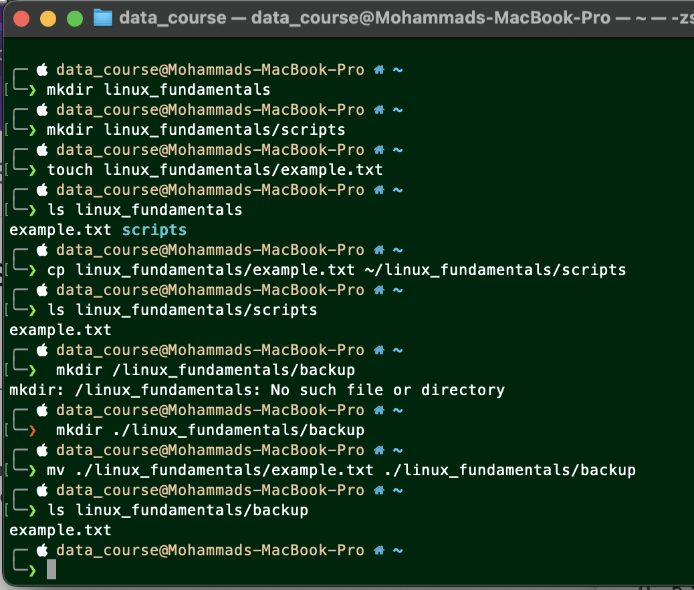
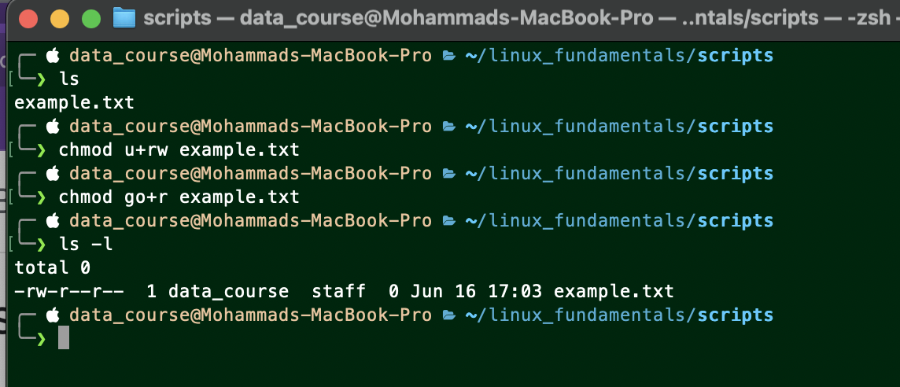
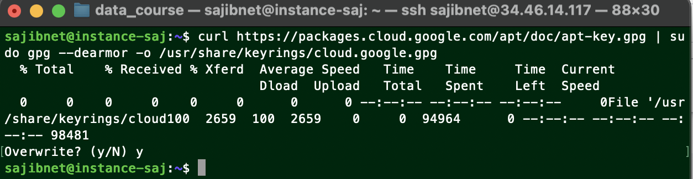

# Table of content
1. [File System Navigation](#file-system-navigation)
2. [File and Directory Operations](#file-and-directory-operations)
3. [File Modification](#file-modification)
4. [Ownership](#ownership)
5. [User add or modify](#user-add-or-modify)
6. [Hard Or Soft Link](#hard-or-soft-link)
7. [Package installation](#package-installation)

# File System Navigation

```sh
    ls-l
    cd var/log
    which $SHELL
    echo $SHELL
```


# File and Directory Operations

```sh
    mkdir linux_fundamentals
    mkdir linux_fundamentals/scripts
    touch linux_fundamentals/example.txt
    cp linux_fundamentals/example.txt ~/linux_fundamentals/scripts
    mkdir linux_fundamentals/backup
    mv ./linux_fundamentals/example.txt ./linux_fundamentals/backup
    chmod u+rw example.txt
    chmod go+r example.txt
    ls -l
```




# File Modification

```sh
    touch ~/example.txt
    sudo useradd -m student
    sudo chown student example.txt
    sudo groupadd students
    sudo chown :students example.txt
    ls -la 

```


# Ownership

```sh
    mkdir ~/project
    cd project
    touch report.txt
    chmod 700 report.txt
    chmod 755 report.txt
    ls -la
    
```


# User add or modify

```sh
    sudo useradd -m -d /home/developer_home developer
    sudo usermod -s /bin/sh developer
    sudo /cat/passwd
```

```sh
    sudo usermod -l devuser developer
    sudo groupadd devgroup
    sudo usermod -aG devgroup devuser
    sudo /cat/passwd

    sudo su devuser
    groups
```


```sh
    sudo passwd devuser
    su devuser    
```


# Hard Or Soft Link


```sh
    touch original.txt
    ln -s original.txt softlink.txt
    ls -la

    rm original.txt
    ls -la # or ls -l softlink.txt   
```

```sh
    touch datafile.txt
    ln datafile.txt hardlink.txt
    ls -la # ls -l ~/datafile.txt ~/hardlink.txt
```
```sh
    ls -i ~/datafile.txt ~/hardlink.txt # check inode of both files
    rm ~/datafile. txt
    find ~ -name "*,txt"
```


# Package installation and Tree
### Install gcloud CLI tool using apt (Instruction :https://cloud.google.com/sdk/docs/install#deb)

```sh
sudo apt-get update
sudo apt-get install tree
```


```sh
sudo apt install apt-transport-https ca-certificates gnupg curl
curl https://packages.cloud.google.com/apt/doc/apt-key.gpg | sudo gpg --dearmor -o /usr/share/keyrings/cloud.google.gpg
sudo apt-get update && sudo apt-get install google-cloud-cli


gcloud version
gcloud init
```





