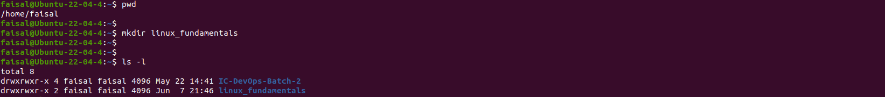

## File System Navigation

Verify the current directory is home

```bash
# pwd command is used to print current working directory
pwd
```


List all contents of the home directory

```bash
# ls command is used to list contents of a directory
ls -la
```


There is a shorter command (an alias) that works the same way. 

```bash
ll
alias ll
```


Change directory to /var/log and verify

```bash
# cd command is used to change directory to another directory
cd /var/log && pwd
```


List all contents of the /var/log directory.
We might not get all contents in a single window so let's view first and last 10 contents

```bash
# head command is used to print top lines of a file (head without any options prints first 10 lines)
ls -la|head
# tail command is used to print bottom lines of a file (tail without any options prints last 10 lines)
ls -la|tail
```


Get the location of bash using which

```bash
# which command is used get the location of a binary
which bash
```


Get the current shell

```bash
# echo command is used to print something on the standard output.
echo $SHELL
```


## File and Directory Operations

Verify urrent directory & create directory linux_fundamentals inside home directory

```bash
pwd

# mkdir command is used to create a new directory
mkdir linux_fundamentals
ls -l
```


Change directory to linux_fundamentals and create subdirectory scripts

```bash
cd linux_fundamentals && pwd
mkdir scripts
ls -l
```


Create empty file example.txt inside linux_fundamentals and Copy example.txt file to scripts 

```bash
# touch command is used to create a new file or modify timestamp of a file
touch example.txt
cp example.txt scripts/
ls -l scripts/
```


Go back to home directory and create backup directory inside linux_fundamentals directory

```bash
cd
mkdir -p linux_fundamentals/backup

Move example.txt file from linux_fundamentals directory to backup direcotry

# mv command is used to move a file or direcotry to another location or to rename a file or directory
mv linux_fundamentals/example.txt linux_fundamentals/backup/
ls -l linux_fundamentals/backup/example.txt 
```


## Permissions
Change the permission of example.txt file so that owner can read and write, and group members and others can only read the file.

```bash
cd linux_fundamentals/backup/
# chmod command is used to change permission bits of a file or directory
chmod 644 example.txt
ls -l example.txt 
```

