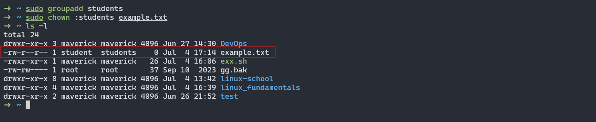
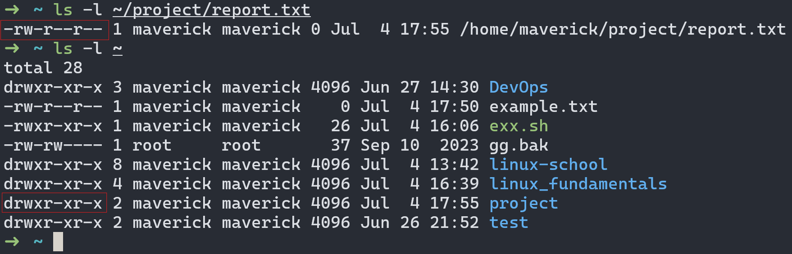
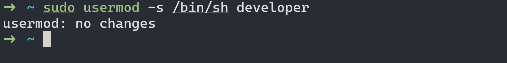

<p align="center">
  <a href="https://example.com/">
    
  </a>

  <h3 align="center">Linux Fundamentals</h3>

  <p align="center">
   The fundamentals of linux through practical examples
 </p>

 <p align="center"><i> Crafted by <a href="https://github.com/AbuFattah">Abu Fattah Hossain</a></i></p>

## Table of contents

- [File System Navigation](#file-system-navigation)
- [File and Directory Operations](#file-and-directory-operations)
- [File Modification](#file-modification)
- [Ownership](#ownership)
- [User add/modify](#user-addmodify)
- [Hard/Soft Link](#hardsoft-link)
- [Package installation](#package-installation)

## File System Navigation

#### 1. List the contents of the home directory.

```bash
ls -la ~
```

The '~' tilde symbol is a shorthand for the home directory. Doing `ls -la ~` will list all the contnents of the home directory including hidden files.

- `-l` flag shows detailed information of files and directories
- `-a` flag shows all files and directories including hidden files


#### 2. Change the current directory to /var/log and list its contents.

```bash
cd /var/log
ls
```

`cd <directory_path>` command is used to change directory.


#### 3. Find and display the path to the bash executable using the which command.

```bash
which bash
```

`which <command name>` command is used to display path to the executable file.


#### 4. Find current shell

```bash
echo $SHELL
```

`echo` command prints a string and `$SHELL` is a global environment variable which stores the current shell that is being by the user. Therefore, `echo $SHELL` displays the current shell.


## File and Directory Operations

#### 1. Create a directory named linux_fundamentals in your home directory.

```bash
cd ~
mkdir linux_fundamentals
```

`mkdir <directory name>` command is used to create a directory .


#### 2. Inside linux_fundamentals, create a subdirectory named scripts.

```bash
mkdir linux_fundamentals/scripts
```

`mkdir linux_fundamentals/<new directory>` this command will create a new directory inside linux_fundamentals


#### 3. Create an empty file named example.txt inside the linux_fundamentals directory.

```bash
touch example.txt
```

`touch <filename>` command is used to create an empty file.


#### 4. Copy example.txt to the scripts directory.

```bash
cp example.txt scripts
```

`cp <sourcefile_path> <target_directory>` command is used to copy file from source path to target directory. Both source path and target directory can be both relative or absolute.


#### 5. Move example.txt from linux_fundamentals to linux_fundamentals/backup.

```bash
mkdir backup && mv example.txt backup/
```

- First create a directory named backup and then use `mv <source_path> <target_directory>` command to move example.txt file to backup directory.

- The `&&` operator can be used to execute to commands sequentially.


## Permissions

#### 1. Change the permissions of example.txt to read and write for the owner, and read-only for the group and others.

```bash
# Using numeric representation
chmod 644 example.txt

# Without symbolic representation
chmod u=rw,g=r,o=r example.txt
ls -l
```

- `chmod` command is used to change file permissions.
- 644: This is the numeric representation of the permissions:
  - 6: Read (4) + Write (2) for the owner.
  - 4: Read-only for the group.
  - 4: Read-only for others.
- Symbolic representation
  - `u=rw` sets read and write permission for user
  - `g=r` , `o=r` sets read permission for group and others respectively.


#### 2. Verify the permission changes using ls -l

```bash
ls -l linux_fundamentals/scripts/example.txt
```

When we do `ls -l` we can see that user has read and write (rw-) permission, group and others have read (r--) permission.


## File Modification

#### 1. Create a file named example.txt in your home directory.

```bash
touch ~/example.txt
```

`touch` command is used to create an example.txt file in home directory


#### 2. Change the owner of example.txt to a user named student

```bash
# Create the user: student
sudo useradd student

# Change owner to student
sudo chown student ~/example.txt

```

- `useradd <username>` command is used to add a user.
- `chown <username> <filename>` command is used to change ownership of a file.


#### 3. Change the group of example.txt to a group named students.

```bash
# Create the group : students
sudo groupadd students

# Change group to students
sudo chown :students example.txt
```

- This command needs sudo privilege.
- `groupadd <group_name>` command is used to create a group.
- `chown :<group_name> <filename>` command is used to change group of a file.



#### 4. Verify the changes using appropriate commands.

```bash
ls -l ~/example.txt
```

`ls -l <file_path>` shows the permissions and ownership of a file/directory.


## Ownership

#### 1. Create a directory named project in your home directory.

```bash
mkdir ~/project
```

`mkdir ~/<diretory_name>` creates a directory in the home directory.


#### 2. Create a file named report.txt inside the project directory.

```bash
touch ~/project/report.txt
```

`touch ~/project/report.txt` command creates report.txt file inside project directory.


#### 3. Set the permissions of report.txt to read and write for the owner, and read-only for the group and others.

```bash
chmod 644  ~/project/report.txt
```

- `chmod` command is used to change file permissions.
- 644: This is the numeric representation of the permissions:
  - 6: Read (4) + Write (2) for the owner.
  - 4: Read-only for the group.
  - 4: Read-only for others.


#### 4. Set the permissions of the project directory to read, write, and execute for the owner, and read and execute for the group and others

```bash
chmod 755  ~/project
```

- `chmod` command is used to change file permissions.
- 755: This is the numeric representation of the permissions:
  - 7: Read (4) + Write (2) + Execute(1) for the owner.
  - 5: Read (4) + Execute(1) for the group.
  - 5: Read (4) + Execute(1) for others.


#### 5. Verify the changes using appropriate commands.

```bash
ls -l ~/project/report.txt
ls -l ~
```

`ls -l <file_path>` shows the permissions and ownership of a file/directory.



## User add/modify

#### 1. Create a new user named developer.

```bash
sudo useradd developer
```

`useradd <username>` command is used to add a user.


#### 2. Set the home directory of the user developer to /home/developer_home.

```bash
# create /home/developer_home directory
sudo mkdir /home/developer_home

# modifying home directory for user: developer
sudo usermod -d /home/developer_home developer
```

`usermod` command is used to modify user's attributes. Such as, `sudo usermod -d /home/developer_home developer` changes directory to /home/developer_home. The `-d` flag is used to change home direcotry.


#### 3. Assign the shell /bin/sh to the user developer.

```bash
sudo usermod -s /bin/sh developer
```

In `sudo usermod -s /bin/sh developer` command, the `-s` flag along with shell directory is passed to assign a shell.



#### 4. Verify the new user's information.

```bash
# View user info
tail /etc/passwd
```

The /etc/passwd file contains user information, by using the `tail` we can view the /etc/passwd fille from last.


#### 5. Change the username of the user developer to devuser.

```bash
sudo usermod -l devuser developer
```

In `usermod -l <new_username> <current_username>` command, the -l flag is used to update the user name.


#### 6. Add devuser to a group named devgroup.

```bash
# Create a group
sudo addgroup devgroup
# Add devuser to devgroup
sudo usermod -aG devgroup devuser
```

The -aG flag is used to add a user to a group.


#### 7. Set the password of devuser to devpass. ( hint: use passwd command. Run passwd --help to see available options)

```bash
sudo passwd devuser
```

`passwd <username>` command is used to set password of the specified user.


#### 8. Verify the changes made to the user.

```bash
tail /etc/passwd
tail /etc/group
```

The `tail` command shows the last 10 lines of a file, here the `/etc/passwd` directory contains user information and `/etc/group` contain group information. Using the `tail` command on both files we can see that the user name of developer has been changed to **devuser** and the dev user is in **developer** group


```bash
sudo su - devuser
groups
```

We can also verify the changes by switching user to devuser using `sudo su - devuser` command. After that executing the `groups` command will list all the users the devuser belongs to.


## Hard/Soft Link

#### 1. Create a file named original.txt in your home directory.

```bash
cd ~
touch original.txt
ls
```

`cd ~` command changed directory to home directory and then `touch original.txt` creates original.txt file in the home directory.


#### 2. Create a symbolic link named softlink.txt pointing to original.txt.

```bash
ln -s original.txt softlink.txt
```

To create a symbolic link we need to use the `ln -s <original_file> <softlink_name>` command along with `-s` flag, which is used to create a softlink.


#### 3. Verify the symbolic link and ensure it points to the correct file.

```bash
ls -l softlink.txt
```

`ls -l softlink.txt` shows the softlink and the actual file that it is pointing to.


#### 4. Delete the original file original.txt and observe the status of the symbolic link

```bash
rm original.txt
```

`rm original.txt` removes the original.txt as a result the softlink now no longer points to a valid file.


#### 5. Create a file named datafile.txt in your home directory.

```bash
touch datafile.txt
ls -l datafile.txt
```

`touch datafile.txt` creates datafile.txt file in the home directory.


#### 6. Create a hard link named hardlink.txt pointing to datafile.txt

```bash
ln datafile.txt hardlink.txt
```

To create a hard link we need to use the `ln <data_file> <hardlink_name>` command with or without the `-P` flag. This will create a hard link that points to the same data blocks on disk as datafile.txt. Both data file and hard link file share the same inode.


#### 7. Verify the hard link and ensure it correctly points to the file

```bash
ls -li hardlink.txt datafile.txt
```

Using the `-i` flag in the `ls` command we can view the inod of each file. Since, both datafile.txt and hardlink.txt have same inode, the hardlink creation has been successfull.


#### 8. Check the inode of both datafile.txt and hardlink.txt

```bash
ls -i datafile.txt hardlink.txt
```

The `-i` flag in `ls` command is used to check inodes of files


#### 9. Delete the original file datafile.txt and observe the status of the hard link.

```bash
rm datafile.txt
ls -li hardlink.txt
```

Deleting the datafile.txt has no impact on the hardlink as you can see that it has the same inode as before.


#### 10. Find all .txt files in your home directory. ( use find command. Run find --help for usage)

```bash
find ~/ -type f -name '*.txt'
```

Find command is used to find files or directories in the specified direcotry.

- `- type` flag is used to specify the type of file to search (`f` for regular files and `d` for directory)
- `- name` flag is used to match files based on specific pattern.


## Package Installation

#### 1. Update repo cache using apt/apt-get

```bash
sudo apt update
```

This command fetches the latest package lists from the repositories specified in the `/etc/apt/sources.list` file or any files in the `/etc/apt/sources.list.d` directory.


#### 2. Install a package named tree

```bash
sudo apt install tree
```

`apt install <package_name>` command is used to install a specific package from the repositories mentioned in the sources.


#### 3. Install gcloud CLI tool using apt ( Follow instructions from here: https://cloud.google.com/sdk/docs/install#deb )

1. #### Installing dependencies

```bash
sudo apt install apt-transport-https ca-certificates gnupg
```

This command Installs the necessary dependencies for managing keys and transporting securely.


2. #### Importing the Google Cloud public key

```bash
curl https://packages.cloud.google.com/apt/doc/apt-key.gpg | sudo gpg --dearmor -o /usr/share/keyrings/cloud.google.gpg
```

- `curl https://packages.cloud.google.com/apt/doc/apt-key.gpg` command fetches public key from google cloud repository.

- `sudo gpg --dearmor` command is used to convert GPG file from binary to plain text
- `-o /usr/share/keyrings/cloud.google.gpg` command defines the path to store the public key.


3. #### Add the gcloud CLI distribution URI as a package source

```bash
echo "deb [signed-by=/usr/share/keyrings/cloud.google.gpg] https://packages.cloud.google.com/apt cloud-sdk main" | sudo tee -a /etc/apt/sources.list.d/google-cloud-sdk.list
```

The distribution URL is piped to the `tee` command which appends the URL to the `/etc/apt/sources.list.d/google-cloud-sdk.list` file using `-a` flag.


4. #### Update and install the gcloud CLI:

```bash
sudo apt update && sudo apt install google-cloud-cli
```

`sudo apt update` command updates the package repositories and `sudo apt install google-cloud-cli` command installs **google-cloud-cli** from the repository that is in the source list.


