# Linux Fundamentals - Assigment

- [File System Navigation](#file-system-navigation)
- [File and Directory Operations](#file-and-directory-operations)
- [Permissions](#permissions)
- [Ownership](#managing-users-in-linux)
- [Symbolic and Hard Links](#symbolic-and-hard-links-in-linux)
- [Package Installation](#package-installation)

## File System Navigation

##### 1. List the contents of the home directory:

To view the contents of the home directory, employ the ls command:

**_Example :_**

```bash
    ls ~
```

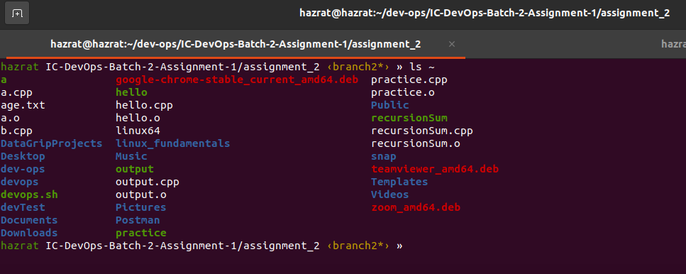

**Explanation:** The ~ symbol denotes the home directory of the current user.

Alternatively, you can navigate to the home directory and then list its contents:

**_Example :_**

```bash
    ls -al
```

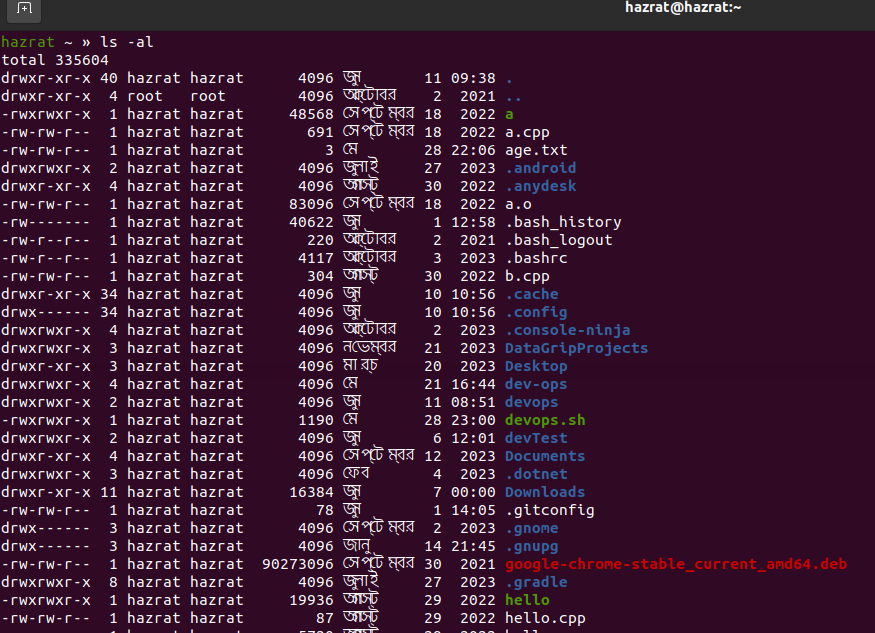

**Explanation:** The `-al` flag reveals all contents within the current directory.

##### 2. Change the current directory to `/var/log` and list its contents.

Initiate the directory switch using `cd`, followed by listing its contents with `ls`:

**_Example :_**

```bash
    cd /var/log
    ls
```

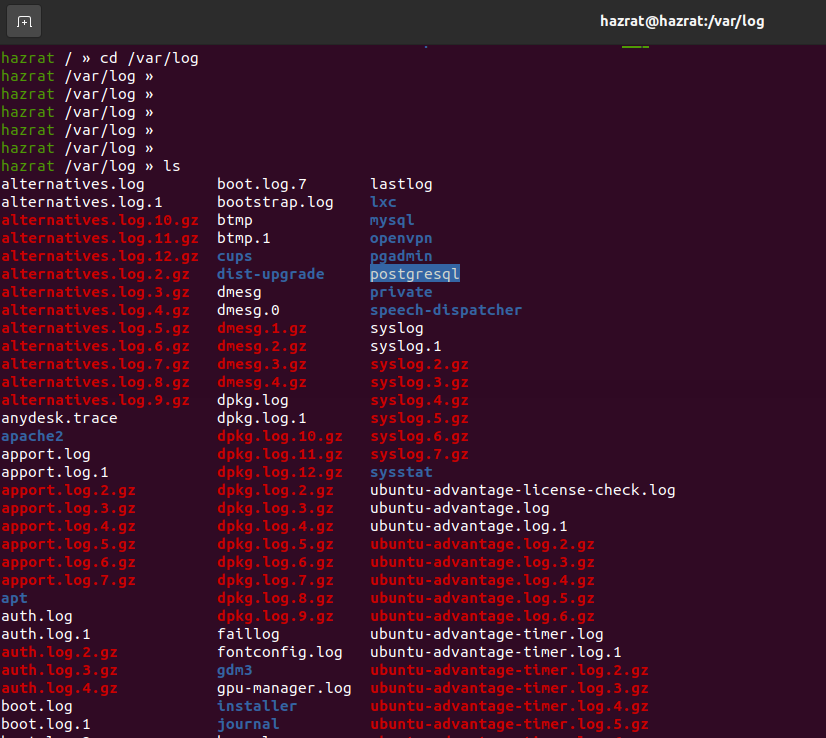

**Explanation:** `cd` alters the current directory to `/var/log`, while `ls` displays its contents.

##### 3. Find and display the path to the bash executable using the `which` command:

**_Example :_**

```bash
    which bash
```

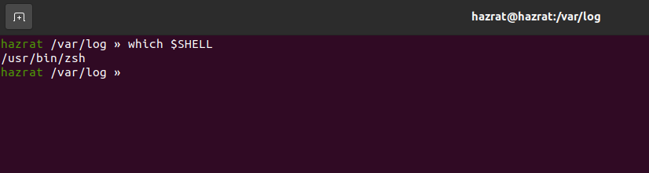
**Explanation:** The `which` command divulges the full path of shell commands, such as `bash`.

##### 4. Find the current shell:

**_Example :_**

```bash
    echo $SHELL
```

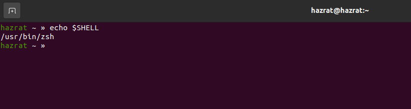
**Explanation:** The `$SHELL` environment variable holds the path to the current shell.

## File and Directory Operations

#### 1. Create a directory named `linux_fundamentals` in your home directory:

**_Example :_**

```bash
    mkdir ~/linux_fundamentals
```

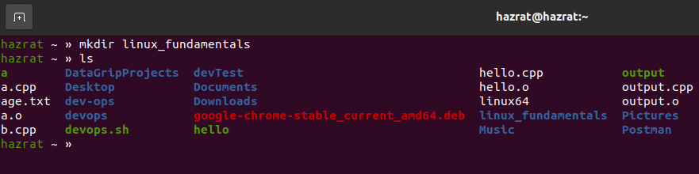
**Explanation :** mkdir creates a new directory. `~ ` indicates the home directory.

#### 2. Inside linux_fundamentals, create a subdirectory named scripts:

```bash
    mkdir ~/linux_fundamentals/scripts
```

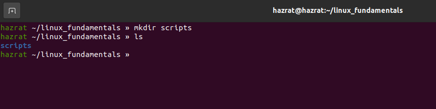

**Explanation :** This creates the scripts directory inside linux_fundamentals.

#### 3. Create an empty file named example.txt inside the linux_fundamentals directory:

**_Example :_**

```bash
    touch ~/linux_fundamentals/example.txt
```

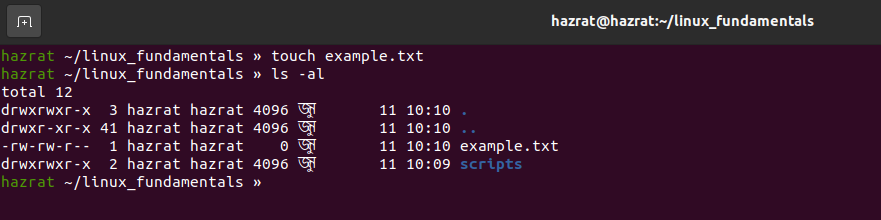
**Explanation:** touch creates an empty file if it doesn't already exist.

#### 4. Copy `example.txt` to the `scripts` directory:

**_Example :_**

```bash
cp example.txt scripts

```

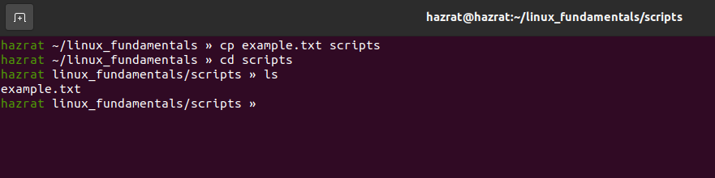
**Explanation:** `cp` copies files. Here, it copies `example.txt` to the scripts directory.

#### 5. Move `example.txt` from `linux_fundamentals` to `linux_fundamentals/backup`:

First, create the `backup` directory:

**_Example :_**

```bash
    mkdir ~/linux_fundamentals/backup
```

Then move the file:

```bash
    mv ~/linux_fundamentals/example.txt ~/linux_fundamentals/backup/
```

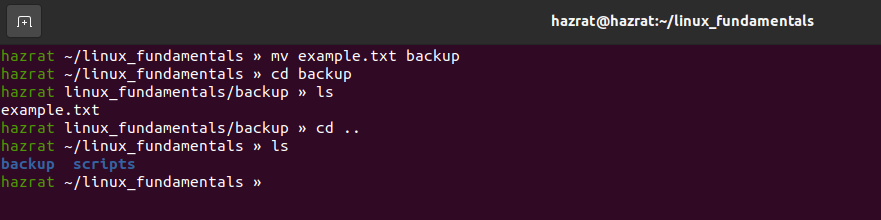

**Explanation:** `mv` moves files. This moves `example.txt` to the backup directory.

## Permissions

#### 1. Change the permissions of example.txt to read and write for the owner, and read-only for the group and others:

**_Example :_**

```bash
    chmod 644 example.txt
```

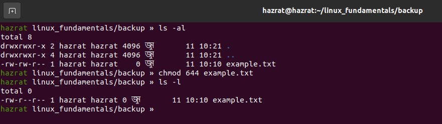

**Explanation:** `chmod 644` modifies file permissions to `rw-r--r--`. This configuration grants the owner read and write privileges (6), and restricts the group and others to read-only access (4).

#### 2. Verify the permission changes using `ls -l`:

**_Example :_**

```bash
    ls -l example.txt
```


**Explanation:** `ls -l` presents detailed file information, inclusive of its permissions.

## Ownership

### Steps to Create Directory and File with Specific Permissions

#### 1. Create a directory named project in your home directory

```bash
mkdir ~/project
```

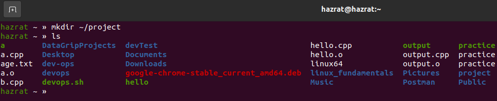
**Explanation:**  
This command creates a directory named `project` within your home directory (`~`).

#### 2. Create a file named report.txt inside the project directory

```bash
touch ~/project/report.txt
```


**Explanation:**  
`touch` is used to create an empty file named `report.txt` inside the `project` directory.

#### 3. Set the permissions of report.txt as specified

```bash
chmod 644 ~/project/report.txt
```

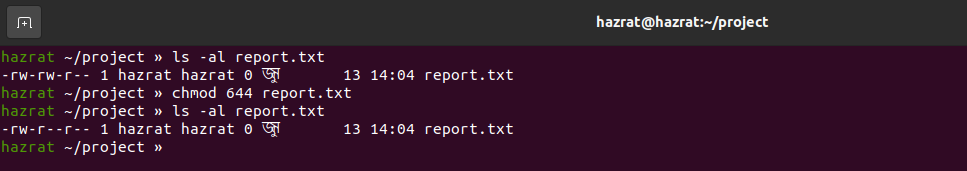
**Explanation:**  
`chmod 644` sets the permissions for `report.txt` as follows:

- `6` (read and write) for the owner.
- `4` (read only) for the group.
- `4` (read only) for others.

#### 4. Set the permissions of the project directory as specified

```bash
chmod 755 ~/project
```

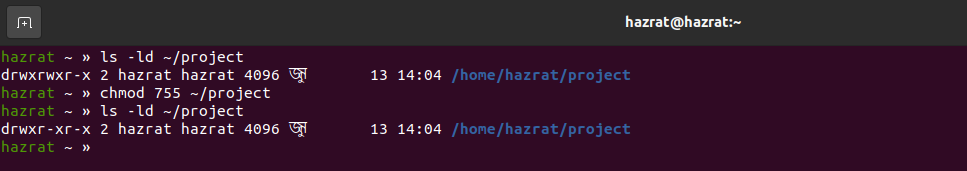
**Explanation:**  
`chmod 755` sets the permissions for the `project` directory as follows:

- `7` (read, write, execute) for the owner.
- `5` (read, execute) for the group.
- `5` (read, execute) for others.

### Verification

#### Verify the permissions of report.txt

```bash
ls -l ~/project/report.txt
```

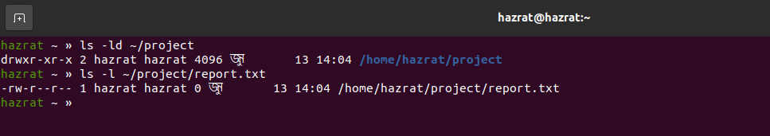
**Explanation:**  
The output `-rw-r-----` indicates that `report.txt` has the permissions `rw` (read and write) for the owner, `r` (read only) for the group, and `r` (read only) for others.

#### Verify the permissions of the project directory

```bash
ls -ld ~/project
```


**Explanation:**  
The output `drwxr-xr-x` indicates that `project` directory has the permissions `rwx` (read, write, execute) for the owner, `r-x` (read, execute) for the group, and `r-x` (read, execute) for others.

## Managing Users in Linux

### 1. Create a new user named developer:

```bash
sudo adduser developer
```

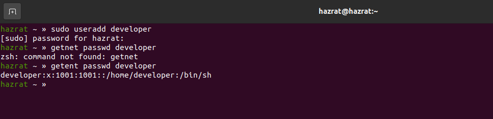

**Explanation:** `adduser` command is used to create a new user in Linux.

### 2. Set the home directory of the user developer to /home/developer_home:

```bash
sudo usermod -d /home/developer_home developer
```

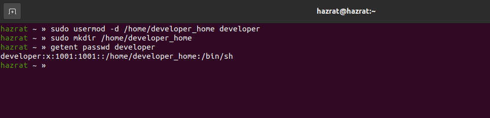

**Explanation:** `usermod -d` command changes the home directory of the specified user.

### 3. Assign the shell /bin/sh to the user developer:

```bash
sudo usermod -s /bin/sh developer
```

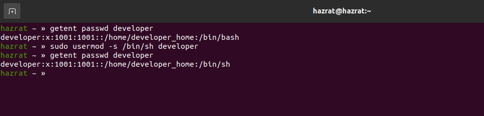

**Explanation:** `usermod -s` command sets the login shell for the specified user.

### 4. Verify the new user's information:

```bash
id developer
```

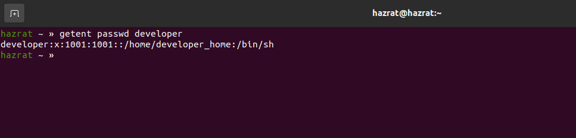

**Explanation:** `id` command displays user and group information for the specified user.

### 5. Change the username of the user developer to devuser:

```bash
sudo usermod -l devuser developer
```

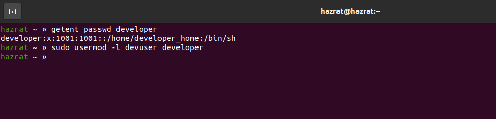

**Explanation:** `usermod -l` command changes the username of an existing user.

### 6. Add devuser to a group named devgroup:

```bash
sudo usermod -aG devgroup devuser
```

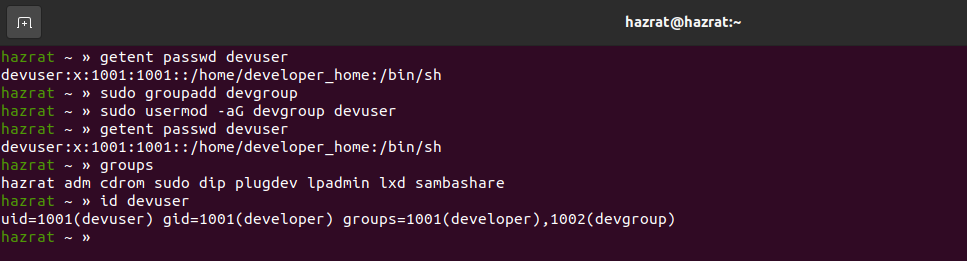

**Explanation:** `usermod -aG` command adds a user to a supplementary group.

### 7. Set the password of devuser to devpass:

```bash
sudo passwd devuser
```

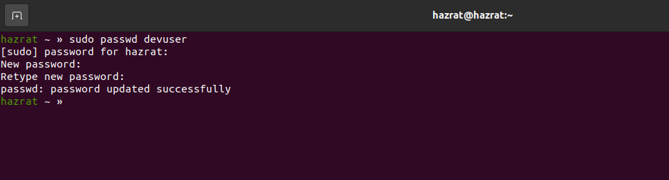

(Enter `devpass` when prompted)

**Explanation:** `passwd` command sets or changes a user's password.

### 8. Verify the changes made to the user:

```bash
id devuser
```

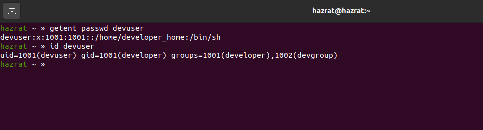

**Explanation:** Verify the user information to ensure all modifications are correctly applied.

## Symbolic and Hard Links in Linux

### 1. Create a file named original.txt in your home directory:

```bash
touch ~/original.txt
```

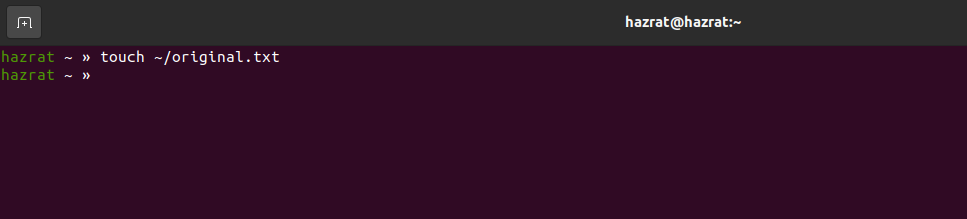

**Explanation:** `touch` command is used to create an empty file.

### 2. Create a symbolic link named softlink.txt pointing to original.txt:

```bash
ln -s ~/original.txt ~/softlink.txt
```

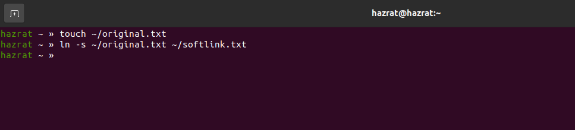

**Explanation:** `ln -s` command creates a symbolic link (`-s` flag) named `softlink.txt` pointing to `original.txt`.

### 3. Verify the symbolic link and ensure it points to the correct file:

```bash
ls -l ~/softlink.txt
```

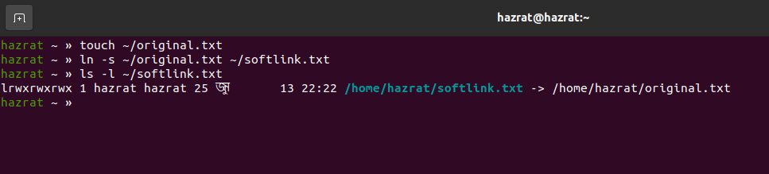

**Explanation:** `ls -l` lists detailed information about `softlink.txt`, confirming it points to `original.txt`.

### 4. Delete the original file original.txt and observe the status of the symbolic link:

```bash
rm ~/original.txt
ls -l ~/softlink.txt
```

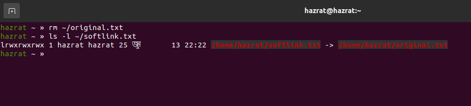

**Explanation:** Removing `original.txt` and checking `softlink.txt` confirms symbolic links are dependent on the original file.

### 5. Create a file named datafile.txt in your home directory:

```bash
touch ~/datafile.txt
```

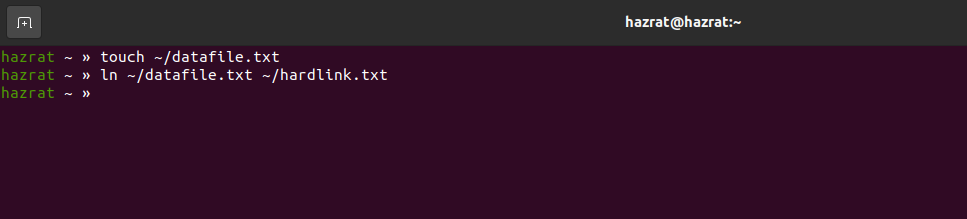

**Explanation:** Creating a new file `datafile.txt` for hard linking.

### 6. Create a hard link named hardlink.txt pointing to datafile.txt:

```bash
ln ~/datafile.txt ~/hardlink.txt
```


**Explanation:** `ln` command creates a hard link by default (without `-s` flag), linking `hardlink.txt` to `datafile.txt`.

### 7. Verify the hard link and ensure it correctly points to the file:

```bash
ls -l ~/hardlink.txt
```

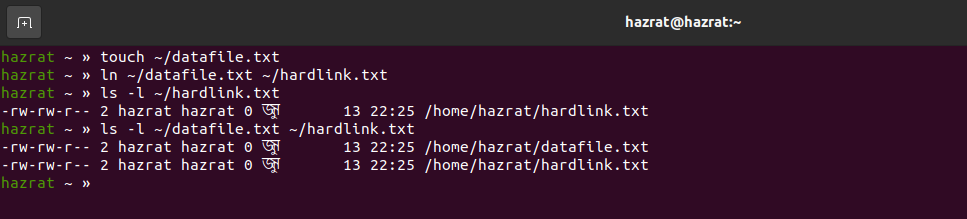

**Explanation:** `ls -l` confirms `hardlink.txt` is linked to `datafile.txt`.

### 8. Check the inode of both datafile.txt and hardlink.txt:

```bash
ls -i ~/datafile.txt
ls -i ~/hardlink.txt
```

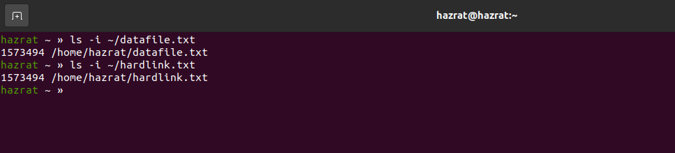

**Explanation:** `ls -i` displays the inode number of each file. Inodes for hard links point to the same data blocks.

### 9. Delete the original file datafile.txt and observe the status of the hard link:

```bash
rm ~/datafile.txt
ls -l ~/hardlink.txt
```

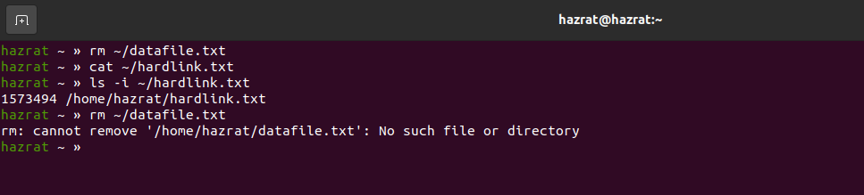

**Explanation:** Removing `datafile.txt` and verifying `hardlink.txt` demonstrates that hard links maintain access to file data as long as one link remains.

### 10. Find all .txt files in your home directory:

```bash
find ~ -type f -name "*.txt"
```

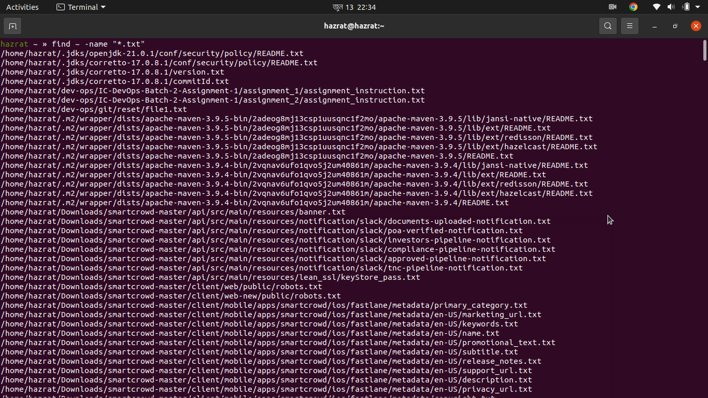

**Explanation:** `find` command searches for files (`-type f`) with names ending in `.txt` in the home directory (`~`).

## Package Installation

### 1. Update Repo Cache Using apt/apt-get

**Example:**

```bash
sudo apt update
```

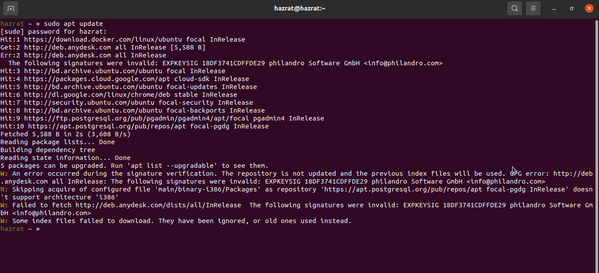

**Explanation:**  
The `apt update` command refreshes the local package index. It retrieves the latest package information from the repositories specified in `/etc/apt/sources.list`, ensuring that your system has the latest version information for available packages.

### 2. Install a Package Named tree

**Example:**

```bash
sudo apt install tree
```

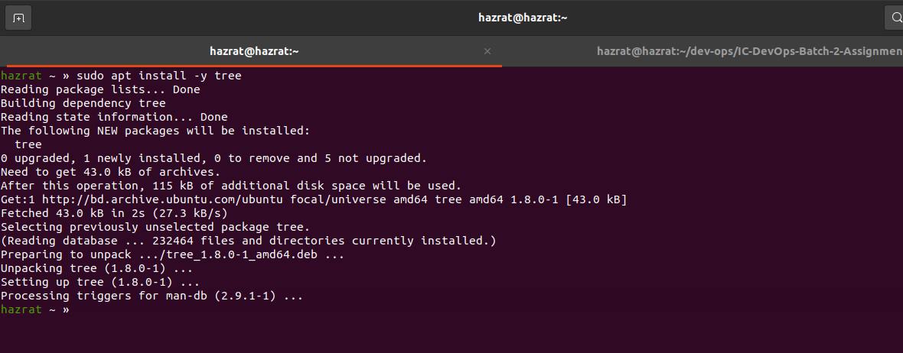

**Explanation:**  
`apt install tree` installs the `tree` package, which provides a command-line utility that displays directory structures in a tree-like format. This command fetches the `tree` package from the configured repositories and installs it on your system.

### 3. Install gcloud CLI Tool Using apt

**Example:**

```bash
# Add the Cloud SDK distribution URI as a package source
echo "deb [signed-by=/usr/share/keyrings/cloud.google.gpg] https://packages.cloud.google.com/apt cloud-sdk main" | sudo tee -a /etc/apt/sources.list.d/google-cloud-sdk.list

# Import the Google Cloud public key
sudo apt-get install apt-transport-https ca-certificates gnupg
curl https://packages.cloud.google.com/apt/doc/apt-key.gpg | sudo tee /usr/share/keyrings/cloud.google.gpg > /dev/null

# Update and install the Cloud SDK
sudo apt-get update && sudo apt-get install google-cloud-sdk
```

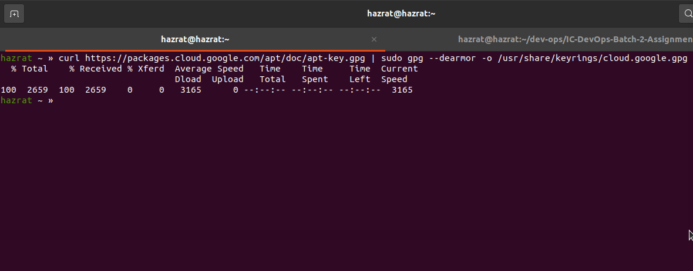
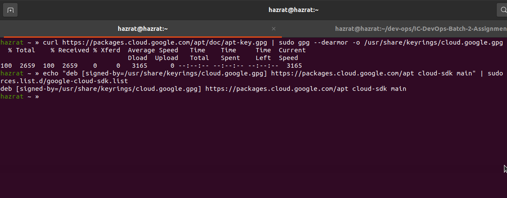
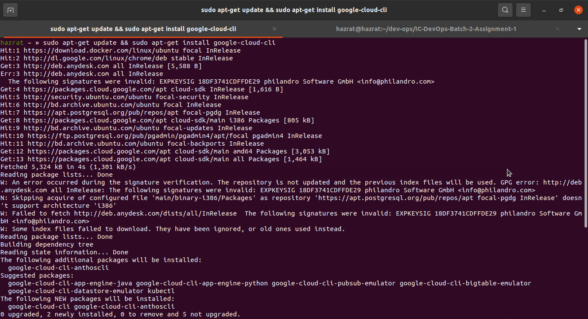
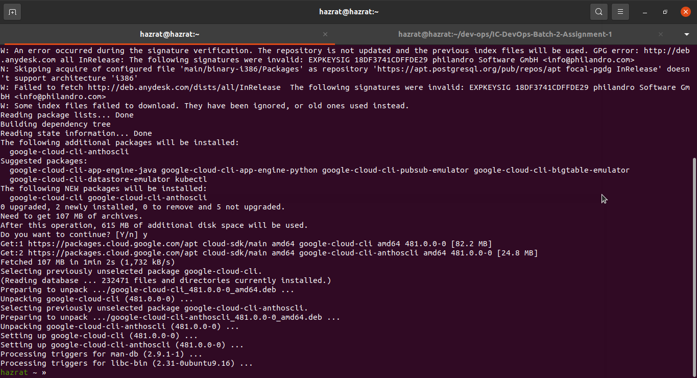
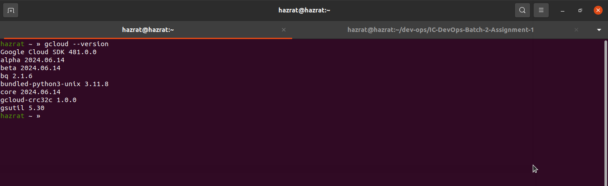

**Explanation:**  
To install the Google Cloud SDK CLI tool (`gcloud`), these steps are followed:

1. Add the Cloud SDK distribution URI to `google-cloud-sdk.list` so that `apt` knows where to fetch the package.
2. Import the Google Cloud public key to verify package integrity.
3. Update the package list (`apt-get update`) and then install the `google-cloud-sdk` package (`apt-get install google-cloud-sdk`) using `apt-get`.
