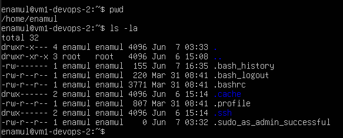
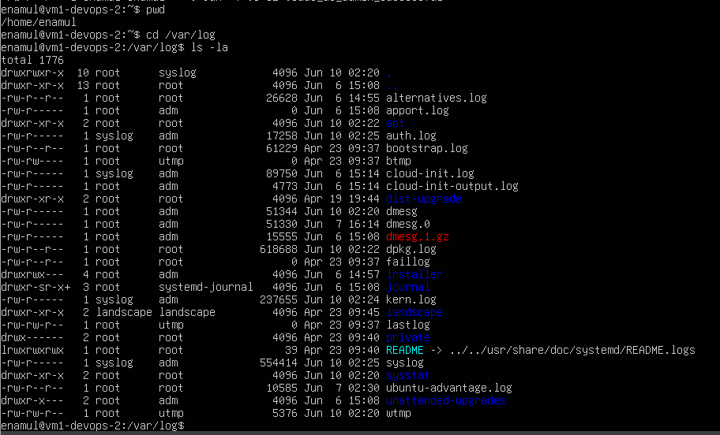
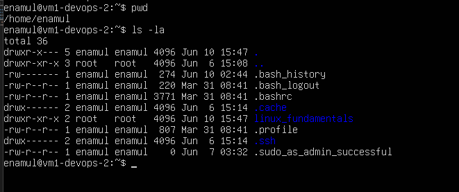
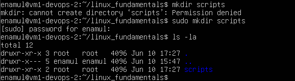
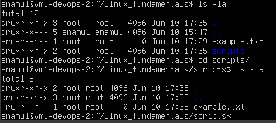
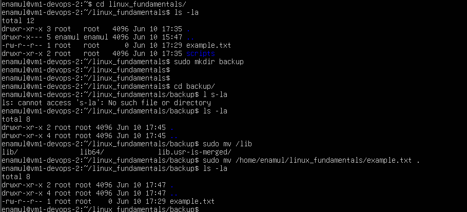
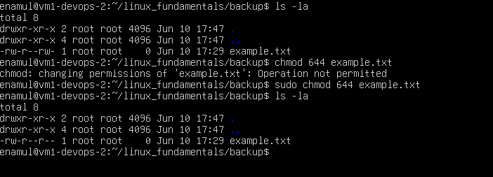
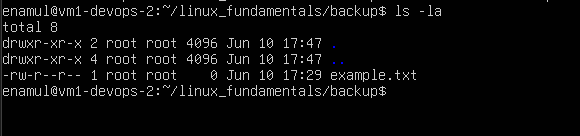

## File System Navigation

#### List the contents of the home directory

>_ls -la_

#### Change the current directory to `/var/log` and list its contents.

>_cd /var/log_

#### Find and display the path to the `bash` executable using the `which` command.

>_which bash_

#### Find current shell

>_echo $SHELL_

>_echo $0_

## File and Directory Operations

#### Create a directory named `linux_fundamentals` in your home directory.

>_sudo mkdir linux_fundamentals_

#### Inside `linux_fundamentals`, create a subdirectory named `scripts`.

>_sudo mkdir scripts_

#### Create an empty file named `example.txt` inside the `linux_fundamentals` directory.

>_sudo touch example.txt_

#### Copy `example.txt` to the `scripts` directory.

>_sudo cp example.txt scripts/_

#### Move `example.txt` from linux_fundamentals to `linux_fundamentals/backup`.

>_sudo mv /home/enamul/linux_fundamentals/example.txt ._

## Permissions

#### Change the permissions of example.txt to read and write for the owner, and `read-only` for the group and others.

>_sudo chmod 644 example.txt_

#### Verify the permission changes using ls -l

>_ls -la_

