## File System Navigation

#### List the contents of the home directory

>_ls -la_

#### Change the current directory to `/var/log` and list its contents.

>_cd /var/log_

#### Find and display the path to the `bash` executable using the `which` command.

>_which bash_

#### Find current shell

>_echo $SHELL_

>_echo $0_

## File and Directory Operations

#### Create a directory named `linux_fundamentals` in your home directory.

>_sudo mkdir linux_fundamentals_

#### Inside `linux_fundamentals`, create a subdirectory named `scripts`.

>_sudo mkdir scripts_

#### Create an empty file named `example.txt` inside the `linux_fundamentals` directory.

>_sudo touch example.txt_

#### Copy `example.txt` to the `scripts` directory.

>_sudo cp example.txt scripts/_

#### Move `example.txt` from linux_fundamentals to `linux_fundamentals/backup`.

>_sudo mv /home/enamul/linux_fundamentals/example.txt ._

## Permissions

#### Change the permissions of example.txt to read and write for the owner, and `read-only` for the group and others.

>_sudo chmod 644 example.txt_

#### Verify the permission changes using ls -l

>_ls -la_

## File Modification

#### Create a file named example.txt in your home directory.

>_sudo touch example.txt_

#### Change the owner of example.txt to a user named student

>_sudo chown student:enamul example.txt_

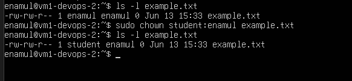

#### Change the group of example.txt to a group named students.

>_sudo chown student:estudent example.txt_
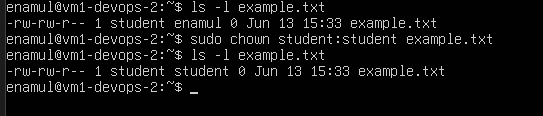

#### Verify the changes using appropriate commands.

>_ls -l example.txt_
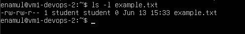

## Ownership

#### Create a directory named project in your home directory.
>_sudo mkdir project_
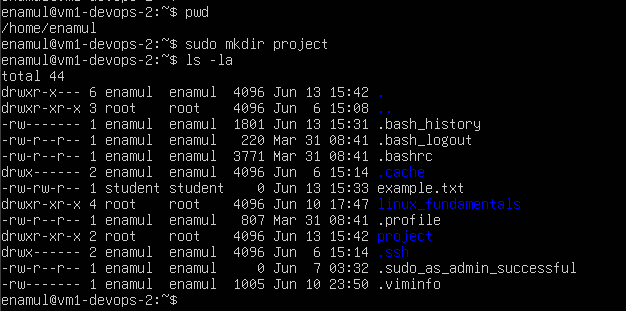

#### Create a file named report.txt inside the project directory.

>_sudo touch report_
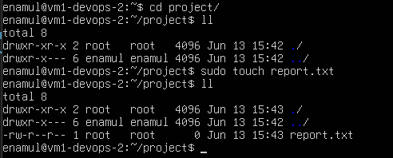

#### Set the permissions of report.txt to read and write for the owner, and read-only for the group and others.

>_sudo chmod 644 report.txt_
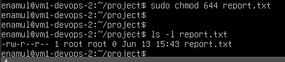

#### Set the permissions of the project directory to read, write, and execute for the owner, and read and execute for the group and others

>_sudo chmod 755 project/_
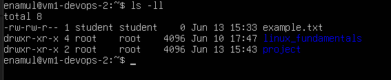

#### Verify the changes using appropriate commands.

>_sudo ls -ll_ 

## User add/modify

#### Create a new user named developer.

>_sudo useradd developer_
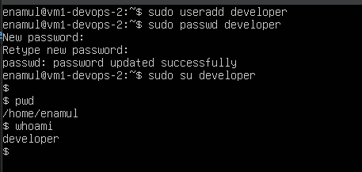

#### Set the home directory of the user developer to /home/developer_home.

>_sudo usermod -d /home/developer_home developer_

#### Assign the shell /bin/sh to the user developer.

>_sudo chsh -s /bin/sh developer_
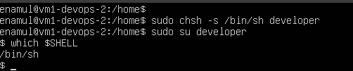
#### Verify the new user's information.

>_which $SHELL

#### Change the username of the user developer to devuser.

>_sudo usermod -l devuser developer_
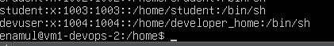

#### Add devuser to a group named devgroup.

>_sudo usermod -aG devgroup devuser_
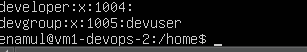

#### Set the password of devuser to devpass. ( hint: use passwd command. Run passwd --help to see available options)

>_sudo passwd devuser_
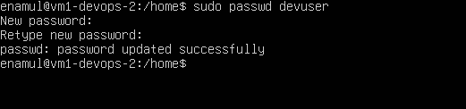

#### Verify the changes made to the user.

>_su - devuser_
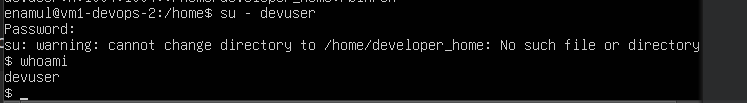

## Hard/Soft Link

#### Create a file named original.txt in your home directory.

>_sudo touch original.txt_
#### Create a symbolic link named softlink.txt pointing to original.txt.

>sudo ln -s original.txt softlink.txt_

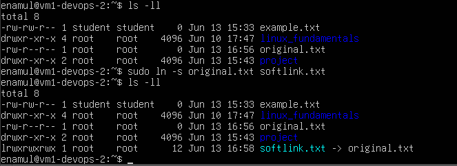

#### Verify the symbolic link and ensure it points to the correct file.

>_ls -l softlink.txt_

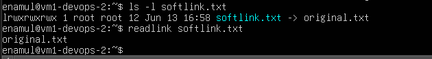

#### Delete the original file original.txt and observe the status of the symbolic link.

>_sudo rm -rf orifinal.txt_

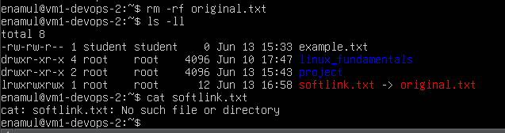

#### Create a file named datafile.txt in your home directory.

>_sudo touch datafile.txt_

#### Create a hard link named hardlink.txt pointing to datafile.txt.

>_sudo ln datafile.txt hardlink.txt_

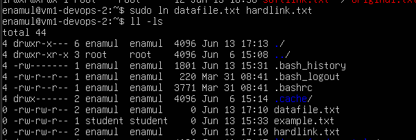

#### Verify the hard link and ensure it correctly points to the file.

>ls -l datafile.txt hardlink.txt_

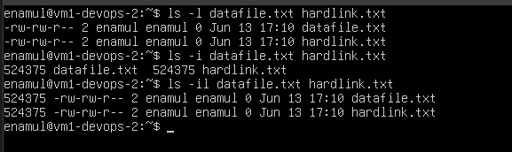

#### Check the inode of both datafile.txt and hardlink.txt

>_ls -il datalink.txt hardlink.txt_

#### Delete the original file datafile.txt and observe the status of the hard link.

>_rm -rf datafile.txt_

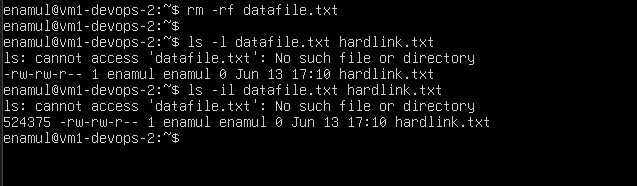

#### Find all .txt files in your home directory. ( use find command. Run find --help for usage)

>_sudo find /home/enamul -type f -name "*.txt"

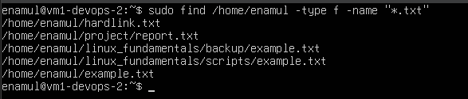

## Package installation

#### Update repo cache using apt/apt-get

>_apt-get update_
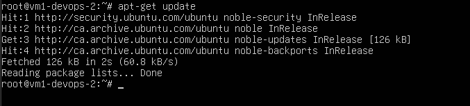

#### Install a package named tree

>_apt install tree_

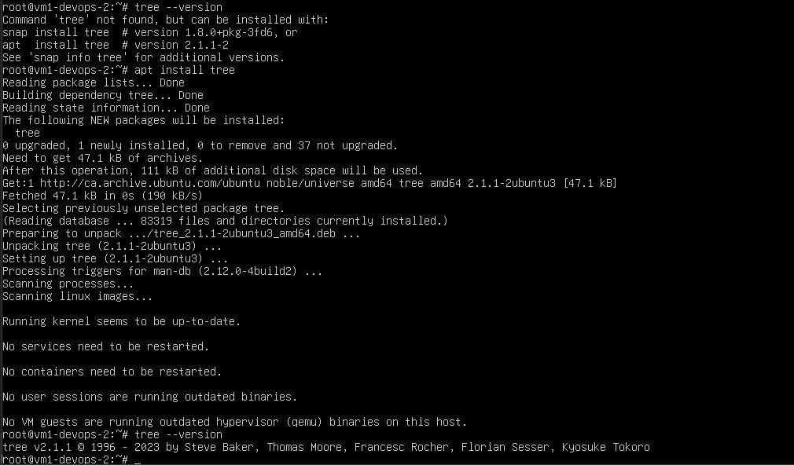

#### Install gcloud CLI tool using apt ( Follow instructions from here: https://cloud.google.com/sdk/docs/install#deb )