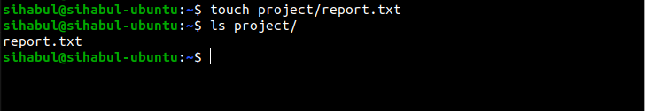

# File System Navigation:

### List the contents of the home directory.

> ls -la

### Change the current directory to /var/log and list its contents.

> cd /var/log
>
> ls -la

### Find and display the path to the bash executable using the which command.

> which bash

### Find current shell

> echo $SHELL

# File and Directory Operations

### Create a directory named linux_fundamentals in your home directory.

> mkdir linux_fundamentals

### Inside linux_fundamentals, create a subdirectory named scripts.

> mkdir linux_fundamentals/scripts

### Create an empty file named example.txt inside the linux_fundamentals directory.

> touch example.txt

### Copy example.txt to the scripts directory.

> cp example.txt /home/sihabul/linux_fundamentals/scripts/

### Move example.txt from linux_fundamentals to linux_fundamentals/backup.

> mkdir backup
>
> mv example.txt backup/

## Permissions

### Change the permissions of example.txt to read and write for the owner, and read-only for the group and others.

> chmod 644 example.txt

### Verify the permission changes using ls -l

> ls -la

# File Modification

### Create a file named example.txt in your home directory.

> touch example.txt

### Change the owner of example.txt to a user named student

> sudo useradd student
>
> sudo chown student example.txt 

### Change the group of example.txt to a group named students.

> sudo chown :student example.txt 

### Verify the changes using appropriate commands.

> ls -la | grep example.txt

# Ownership

### Create a directory named project in your home directory.

> mkdir ~/project

### Create a file named report.txt inside the project directory.

> touch project/report.txt

### Set the permissions of report.txt to read and write for the owner, and read-only for the group and others.

> chmod 644 project/report.txt 

### Set the permissions of the project directory to read, write, and execute for the owner, and read and execute for the group and others

> chmod 755 project/

### Verify the changes using appropriate commands.

> ls -la | grep project
>
> cd project/
> 
> ls -la

