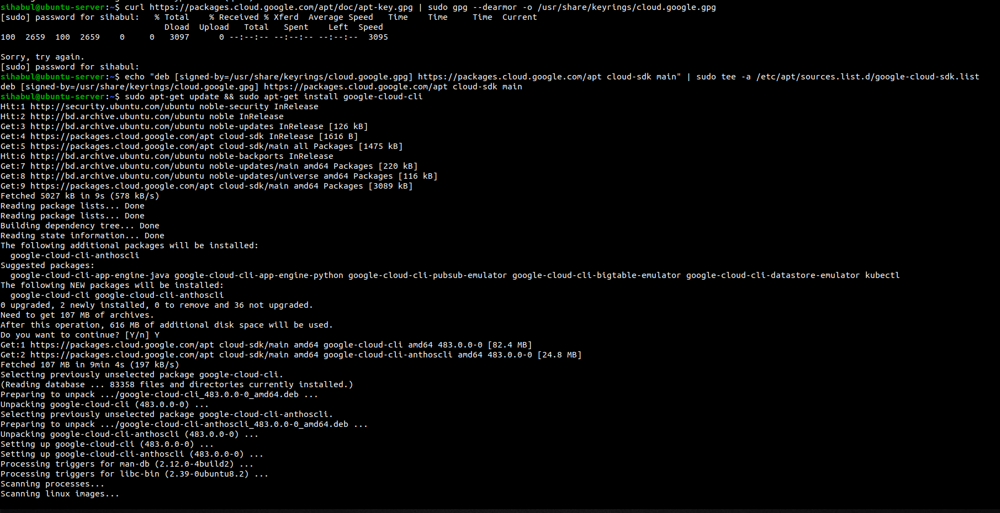

# File System Navigation:

### List the contents of the home directory.

> ls -la

### Change the current directory to /var/log and list its contents.

> cd /var/log
>
> ls -la

### Find and display the path to the bash executable using the which command.

> which bash

### Find current shell

> echo $SHELL

# File and Directory Operations

### Create a directory named linux_fundamentals in your home directory.

> mkdir linux_fundamentals

### Inside linux_fundamentals, create a subdirectory named scripts.

> mkdir linux_fundamentals/scripts

### Create an empty file named example.txt inside the linux_fundamentals directory.

> touch example.txt

### Copy example.txt to the scripts directory.

> cp example.txt /home/sihabul/linux_fundamentals/scripts/

### Move example.txt from linux_fundamentals to linux_fundamentals/backup.

> mkdir backup
>
> mv example.txt backup/

## Permissions

### Change the permissions of example.txt to read and write for the owner, and read-only for the group and others.

> chmod 644 example.txt

### Verify the permission changes using ls -l

> ls -la

# File Modification

### Create a file named example.txt in your home directory.

> touch example.txt

### Change the owner of example.txt to a user named student

> sudo useradd student
>
> sudo chown student example.txt 

### Change the group of example.txt to a group named students.

> sudo chown :student example.txt 

### Verify the changes using appropriate commands.

> ls -la | grep example.txt

# Ownership

### Create a directory named project in your home directory.

> mkdir ~/project

### Create a file named report.txt inside the project directory.

> touch project/report.txt

### Set the permissions of report.txt to read and write for the owner, and read-only for the group and others.

> chmod 644 project/report.txt 

### Set the permissions of the project directory to read, write, and execute for the owner, and read and execute for the group and others

> chmod 755 project/

### Verify the changes using appropriate commands.

> ls -la | grep project
>
> cd project/
> 
> ls -la

# User add/modify
### Create a new user named developer.

> sudo useradd developer

### Set the home directory of the user developer to /home/developer_home.

> sudo usermod -d /home/developer_home developer

### Assign the shell /bin/sh to the user developer.

> sudo chsh --shell /bin/sh developer

### Verify the new user's information.

> cat /etc/passwd | grep developer

### Change the username of the user developer to devuser.

> sudo usermod -l devuser developer

### Add devuser to a group named devgroup.

> sudo groupadd devgroup
>
> sudo usermod -aG devgroup devuser

### Set the password of devuser to devpass. ( hint: use passwd command. Run passwd --help to see available options)

> sudo passwd devuser

### Verify the changes made to the user.

> cat /etc/passwd | grep developer

# Hard/Soft Link
### Create a file named original.txt in your home directory.

> touch original.txt

### Create a symbolic link named softlink.txt pointing to original.txt.

> ln -s original.txt softlink.txt

### Verify the symbolic link and ensure it points to the correct file.

> ls -l softlink.txt

### Delete the original file original.txt and observe the status of the symbolic link.

> rm original.txt
>
> ls -l softlink.txt

### Create a file named datafile.txt in your home directory

> touch datafile.txt

### Create a hard link named hardlink.txt pointing to datafile.txt

> ln datafile.txt hardlink.txt

### Verify the hard link and ensure it correctly points to the file

> ls -l datafile.txt hardlink.txt

### Check the inode of both datafile.txt and hardlink.txt

> ls -i datafile.txt hardlink.txt

### Delete the original file datafile.txt and observe the status of the hard link

> rm datafile.txt
>
> ls -l hardlink.txt

### Find all .txt files in your home directory. (Use the find command. Run find --help for usage.)

> find ~ -name "*.txt"

# Package installation
### Update repo cache using apt/apt-get

> sudo apt update

### Install a package named tree

> sudo apt install tree

### Install gcloud CLI tool using apt ( Follow instructions from here: https://cloud.google.com/sdk/docs/install#deb )

> 