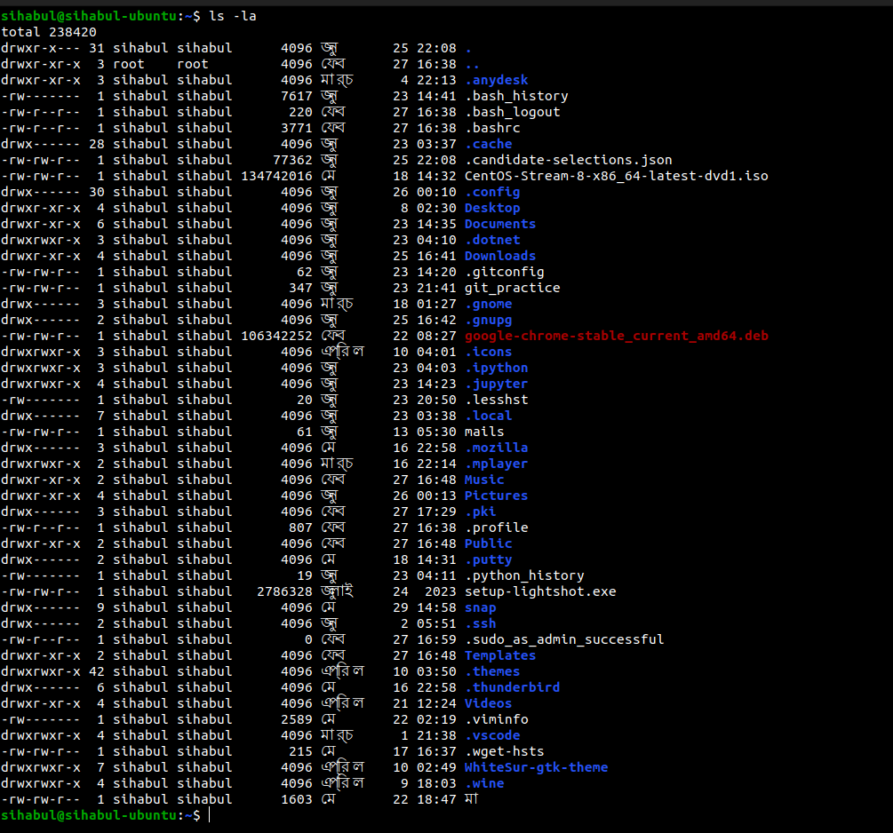

# File System Navigation:

### List the contents of the home directory.

> ls -la

### Change the current directory to /var/log and list its contents.

> cd
> ls -la

### Find and display the path to the bash executable using the which command.

> which bash

### Find current shell

> echo $SHELL

