<p align="center">
  <a href="https://example.com/">
    
  </a>

  <h3 align="center">Linux Fundamental</h3>

</p>


# Table of Content

- [File System Navigation](#file-system-navigation)
- [File and Directory Operations](#file-and-directory-operations)
- [Permissions](#permissions)
- [Ownership](#ownership)
- [User add/modify](#user-add/modify)
- [Hard/Soft Link](#hard/soft-link)
- [Package installation](#package-installation)


## File System Navigation

##### 1. List the contents of the home directory:

To view the contents of the home directory "ls" command can be used while user in home directory, otherwise "ls ~"

**_Example :_**

```bash
    ls ~
```
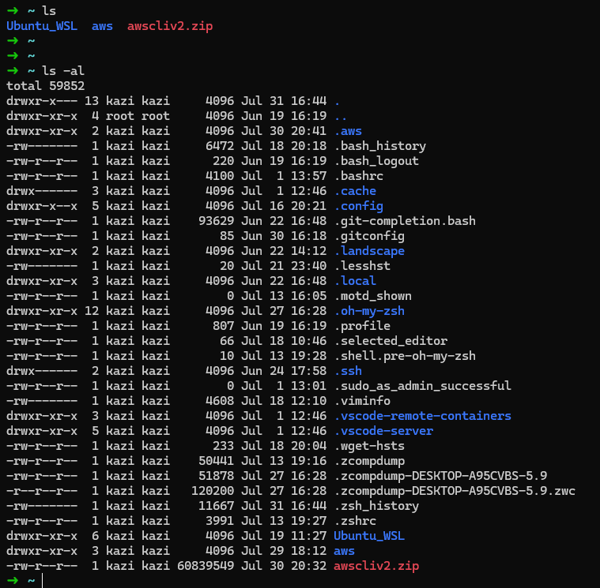

**Explanation:** The `-al` flag reveals all contents within the current directory.

##### 2. Change the current directory to `/var/log` and list its contents.

Initiate the directory switch using `cd`, followed by listing its contents with `ls`:

**_Example :_**

```bash
    cd /var/log
    ls
```

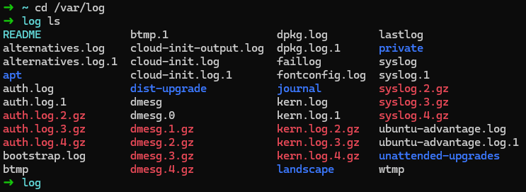

**Explanation:** `cd` alters the current directory to `/var/log`, while `ls` displays its contents.

##### 3. Find and display the path to the bash executable using the `which` command:

**_Example :_**

```bash
    which bash
```

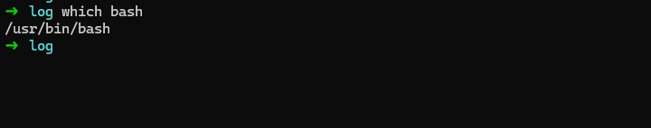
**Explanation:** The `which` command divulges the full path of shell commands, such as `bash`.

##### 4. Find the current shell:

**_Example :_**

```bash
    echo $SHELL
```

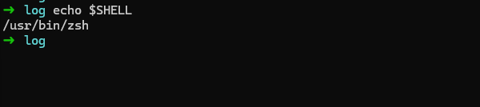
**Explanation:** The `$SHELL` environment variable holds the path to the current shell.


## File and Directory Operations

#### 1. Create a directory named `linux_fundamentals` in your home directory:

**_Example :_**

```bash
    mkdir ~/linux_fundamentals
    or 
    mkdir linux_fundamentals    (while in home dir)
```

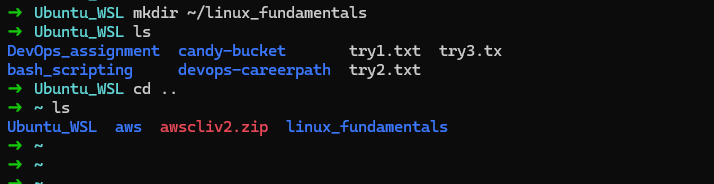
**Explanation :** mkdir creates a new directory. `~ ` indicates the home directory.

#### 2. Inside linux_fundamentals, create a subdirectory named scripts:

```bash
    mkdir ~/linux_fundamentals/scripts
    or 
    cd linux_fundamentals
    mkdir scripts
```

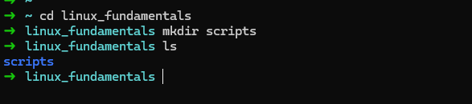

**Explanation :** This creates the scripts directory inside linux_fundamentals.

#### 3. Create an empty file named example.txt inside the linux_fundamentals directory:

**_Example :_**

```bash
    touch ~/linux_fundamentals/example.txt
```

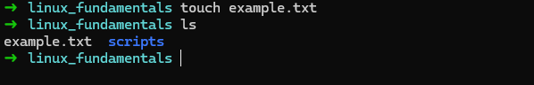
**Explanation:** touch creates an empty file if it doesn't already exist.

#### 4. Copy `example.txt` to the `scripts` directory:

**_Example :_**

```bash
cp example.txt scripts

```

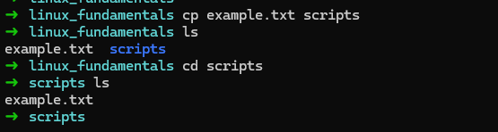
**Explanation:** `cp` copies files. Here, it copies `example.txt` to the scripts directory.

#### 5. Move `example.txt` from `linux_fundamentals` to `linux_fundamentals/backup`:

First, create the `backup` directory:

**_Example :_**

```bash
#Make dir backup
    mkdir ~/linux_fundamentals/backup
#Then move file 
     mv ~/linux_fundamentals/example.txt ~/linux_fundamentals/backup/
```


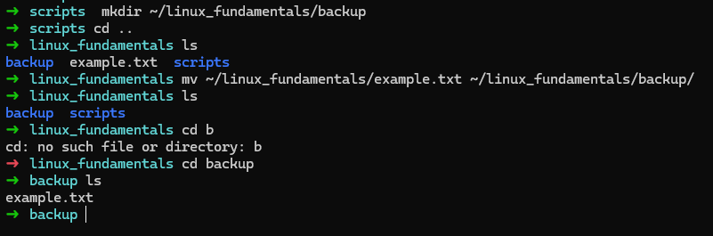

**Explanation:** `mv` moves files. This moves `example.txt` to the backup directory.

## Permissions

#### 1. Change the permissions of example.txt to read and write for the owner, and read-only for the group and others:

**_Example :_**

```bash
    chmod 644 example.txt
```


**Explanation:** `chmod 644` modifies file permissions to `rw-r--r--`. This configuration grants the owner read and write privileges (6), and restricts the group and others to read-only access (4).

#### 2. Verify the permission changes using `ls -l`:

**_Example :_**

```bash
    ls -l example.txt
```

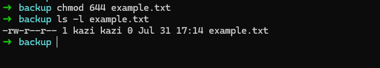
**Explanation:** `ls -l` presents detailed file information, inclusive of its permissions.


#### 1. Create a file named `example.txt` in your home directory.

**Example :**

```bash
touch ~/example.txt
```

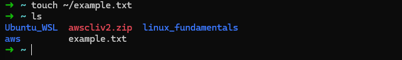

**Explanation:**

- `touch` is a command used to create an empty file if it does not exist.
- `~/` is a shorthand for the home directory of the current user.

#### 2. Change the owner of `example.txt` to a user named student

**Example :**

```bash
    sudo chown student ~/example.txt
```

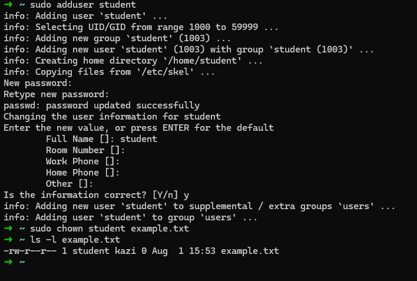

**Explanation:**

- `sudo` is used to execute a command with superuser privileges.
- `chown` stands for "change owner".
- `student` is the username of the new owner.
- `~/example.txt` is the path to the file whose ownership we are changing.

#### 3. Change the group of `example.txt` to a group named `students`

**Example :**

```bash
sudo chgrp students ~/example.txt
```

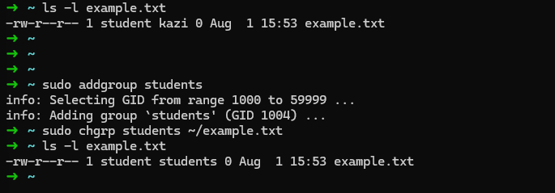

**Explanation:**.

- `sudo` is used to execute a command with superuser privileges.
- `chgrp` stands for "change group".
- `students` is the name of the new group.
- `~/example.txt` is the path to the file whose group we are changing.

#### 4. Verify the changes using appropriate commands.

**Example :**

```bash
ls -l example.txt
```
[See previous picture]


## Ownership

#### 1. Create a directory named project in your home directory.

**Example :**
```bash
mkdir ~/project

```


**Explanation:**
- `mkdir` is a command used to create a new directory.


#### 2. Create a file named report.txt inside the project directory.

**Example :**
```bash
touch ~/project/report.txt

```


**Explanation:**
- `touch` is a command used to create an empty file.
- `~/project/report.txt` is the path to the new file inside the project directory.

#### 3. Set the permissions of report.txt to read and write for the owner, and read-only for the group and others.

**Example :**
```bash
chmod 644 ~/project/report.txt

```

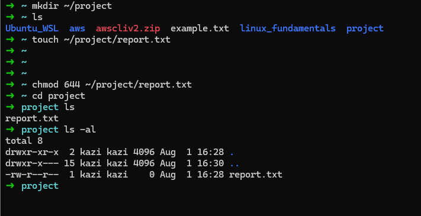

**Explanation:**
- `chmod` is used to change file permissions.
- `644` sets read and write permissions for the owner, and read-only permissions for the group and others.
- `~/project/report.txt` is the path to the file.

#### 4. Set the permissions of the project directory to read, write, and execute for the owner, and read and execute for the group and others


**Example :**
```bash
chmod 755 ~/project

```


**Explanation:**
- `chmod `is used to change file permissions.
- `755` sets read, write, and execute permissions for the owner, and read and execute permissions for the group and others.
- `~/project` is the path to the directory.

#### 5. Verify the changes using appropriate commands.

**Example :**
```bash
ls -l ~/project/report.txt
ls -ld ~/project
```

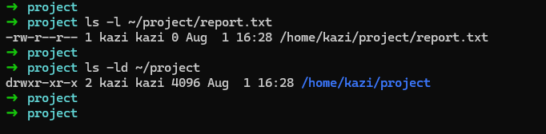

**Explanation:**
- `ls -l` lists files in long format, showing detailed information.
- `~/project/report.txt` is the path to the file to verify permissions.
- `ls -ld` lists directory information in long format.
- `~/project` is the path to the directory to verify permissions.


## User add/modify

#### 1. Create a new user named developer.

**Example :**
```bash
sudo useradd -m developer
```


**Explanation:**
- `sudo` is used to run commands with superuser privileges.
- `useradd` is the command to add a new user.
- `-m` creates the home directory if it does not exist.


#### 2. Set the home directory of the user developer to /home/developer_home.

**Example :**
```bash
sudo usermod -d /home/developer_home -m developer

```


**Explanation:**
- `sudo usermod` Runs the user modification command with superuser privileges.
- `-d /home/developer_home` Specifies the new home directory.
- `-m:` Moves the contents of the current home directory to the new home directory.
- `developer` The username to be modified.

- cat /etc/passwd    (check users)
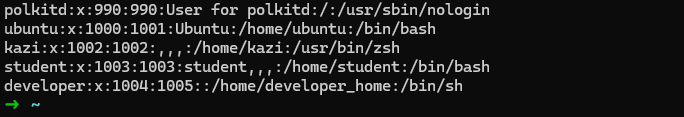

#### 3. Assign the shell /bin/sh to the user developer.

**Example :**
```bash
sudo usermod -s /bin/sh developer
```
To change the default shell of the user developer to /bin/sh, 


**Explanation:**

- ` sudo usermod` Runs the user modification command with superuser privileges.
- `-s /bin/sh ` Specifies the new shell for the user.
- `developer` The username to be modified.

- grep developer /etc/passwd


#### 4. Verify the new user's information.

**Example :**
```bash
getent passwd developer
#or
grep developer /etc/passwd
```


**Explanation:**
- `getent` passwd retrieves entries from the passwd database.
- `developer` is the username whose information is being retrieved.

#### 5. Change the username of the user developer to devuser.

**Example :**
```bash
sudo usermod -l devuser developer
```

**Explanation:**
- `sudo` is used to run commands with superuser privileges.
- `usermod` is the command to modify a user account.
- `-l` devuser changes the username to devuser.
developer is the current username.

#### 6. Add devuser to a group named devgroup.

**Example :**
```bash
sudo groupadd devgroup
sudo usermod -aG devgroup devuser
```


**Explanation:**
- `sudo groupadd devgroup` creates a new group named devgroup.
- `sudo usermod -aG devgroup devuser ` adds devuser to the group devgroup.
- `-aG` appends the user to the supplementary group(s).


#### 7. Set the password of devuser to devpass. ( hint: use passwd command. Run passwd --help to see available options)

**Example :**
```bash
sudo passwd devuser

```


#### 8. Verify the changes made to the user.

**Example :**
```bash
getent passwd devuser
getent group devgroup
```

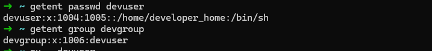


**Explanation:**
- `getent passwd devuser` retrieves entries from the passwd database for devuser.
- `getent group devgroup` retrieves entries from the group database for devgroup.


## Hard/Soft Link

#### 1. Create a file named original.txt in your home directory.

**Example :**
```bash

touch ~/original.txt
```


#### 2. Create a symbolic link named softlink.txt pointing to original.txt.

**Example :**
```bash

ln -s ~/original.txt ~/softlink.txt
```

**Explanation:**
- `ln` is the command for creating links between files. The `-s` option creates a symbolic (or soft) link.
- `~/original.txt` is the target file (the file to link to).
- `~/softlink.txt` is the symbolic link (the new link that points to original.txt).

#### 3. Verify the symbolic link and ensure it points to the correct file.

**Example :**
```bash

ls -l ~/softlink.txt
```

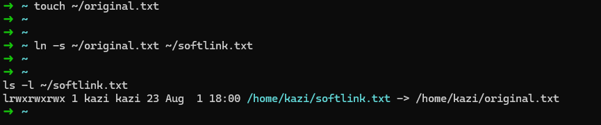

**Explanation:**
- `ls -l` lists files in long format, showing permissions, number of links, owner, group, size, and timestamp.
- `~/softlink.txt`  should show as a symbolic link (l in the beginning of the output), and it should indicate that it points to original.txt.

#### 4. Delete the original file original.txt and observe the status of the symbolic link.

**Example :**
```bash

rm ~/original.txt
ls -l ~/softlink.txt
```

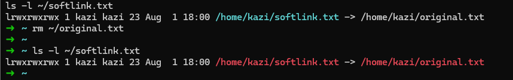

**Explanation:**

- `rm` is used to remove files.
After deleting original.txt, `ls -l ~/softlink.txt` shows that softlink.txt still exists but is 
- now a broken symbolic link because its target `(original.txt)` no longer exists.

#### 5. Create a file named datafile.txt in your home directory.

**Example :**
```bash

touch ~/datafile.txt
```

#### 6. Create a hard link named hardlink.txt pointing to datafile.txt.

**Example :**
```bash

ln ~/datafile.txt ~/hardlink.txt
```

**Explanation:**
- `ln` without the -s option creates a hard link by default.
- `~/datafile.txt` is the existing file that you want to link to.
- `~/hardlink.txt` is the new hard link that will point to datafile.txt.

#### 7. Verify the hard link and ensure it correctly points to the file.

**Example :**
```bash

ls -li ~/datafile.txt ~/hardlink.txt
```

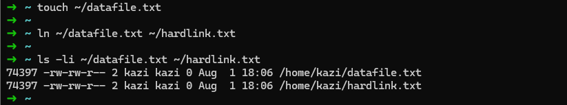

**Explanation:**
- `ls -li` lists files in long format along with their inode numbers (i option).
- Both` datafile.txt` and `hardlink.txt` will have the same inode number, indicating they are hard links pointing to the same underlying data.

#### 8. Check the inode of both datafile.txt and hardlink.txt

**Example :**
```bash

ls -i ~/datafile.txt ~/hardlink.txt
```


**Explanation:**
- `ls -i` lists the inode number of each file.
As explained earlier, both files will have identical inode numbers because they are hard links.

#### 9. Delete the original file datafile.txt and observe the status of the hard link.

**Example :**
```bash

rm ~/datafile.txt
ls -li ~/hardlink.txt
```

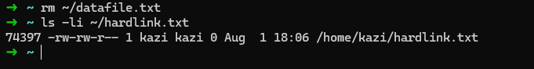

**Explanation:**

- Even after deleting `datafile.txt`, `hardlink.txt` remains because a hard link is just another name for the same inode on disk. It effectively preserves the file's data until all hard links to it are removed.

#### 10. Find all .txt files in your home directory. ( use find command. Run find --help for usage)

**Example :**
```bash

find ~/ -name "*.txt"
```


**Explanation:**
- `find` is used for searching files in a directory hierarchy.
- `~/` specifies the starting directory (home directory in this case).
- `-name "*.txt"` specifies the pattern to search for (files ending in .txt).


## Package installation

#### 1. Update repo cache using apt/apt-get

Updating the package repository cache ensures that we have the latest information about available packages.

**Example :**

```bash
sudo apt update
```


**Explanation:**
- `apt update` refreshes the local package index with the latest changes made in the repositories.

#### 2. Install a package named tree

The tree package displays directory structures in a tree-like format.

**Example :**

```bash
sudo apt install tree
```

#### 3. Install gcloud CLI tool using apt ( Follow instructions from here:

(https://cloud.google.com/sdk/docs/install#deb)

##### 1. Add the Cloud SDK distribution URI as a package source:

**Example :**

```bash
    echo "deb [signed-by=/usr/share/keyrings/cloud.google.gpg] http://packages.cloud.google.com/apt cloud-sdk main" | sudo tee -a /etc/apt/sources.list.d/google-cloud-sdk.list

```

**Explanation:**

- `echo` prints the distribution URI.
- `tee -a` appends the output to the file.
- `/etc/apt/sources.list.d/google-cloud-sdk.list` is the file where the Cloud SDK distribution URI is added.

##### 2. Import the Google Cloud public key:

**Example :**

```bash
sudo apt-get install apt-transport-https ca-certificates gnupg
curl https://packages.cloud.google.com/apt/doc/apt-key.gpg | sudo tee /usr/share/keyrings/cloud.google.gpg

```

**Explanation:**

- `apt-get install apt-transport-https ca-certificates gnupg` installs necessary packages for secure transport and key management.
- `curl` downloads the public key.
- `tee` saves the public key to the specified file.

##### 3. Update and install the Cloud SDK:

**Example :**

```bash
sudo apt-get update && sudo apt-get install google-cloud-sdk

```

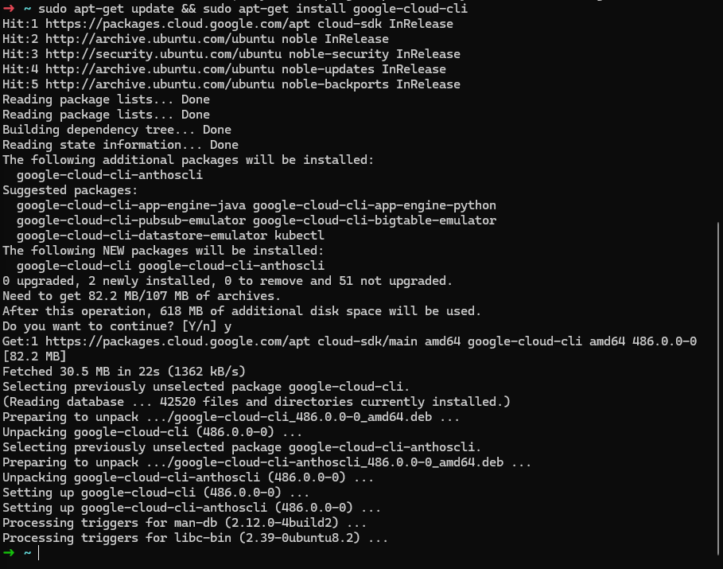


**Explanation:**
- `apt-get update` updates the package list.
- `apt-get install google-cloud-sdk `installs the Google Cloud SDK.