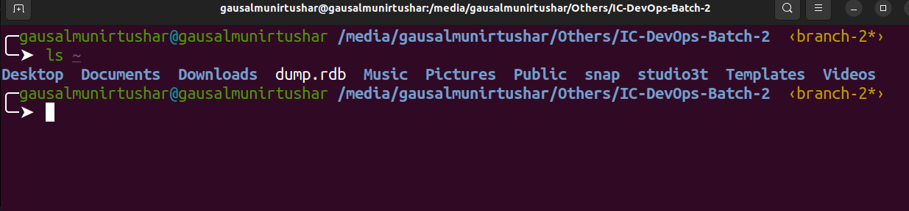
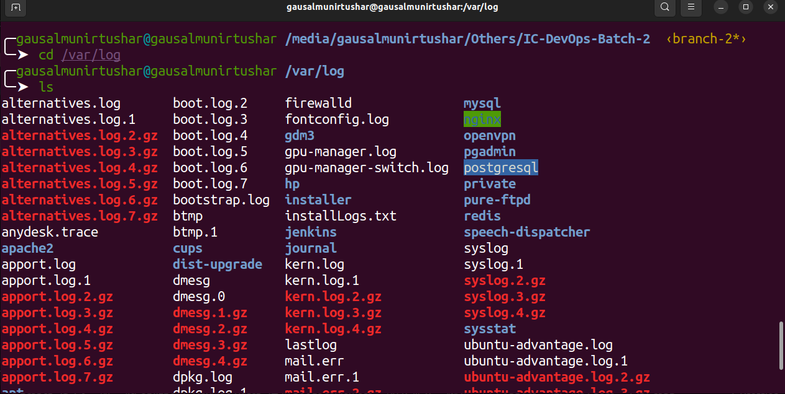
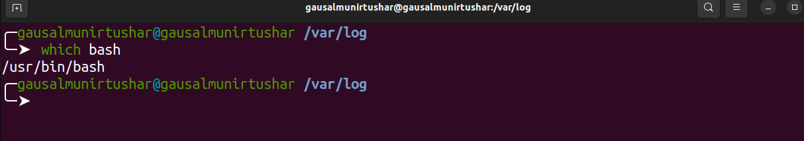
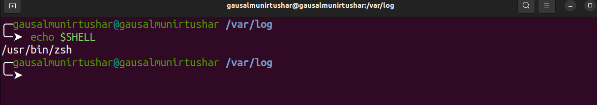
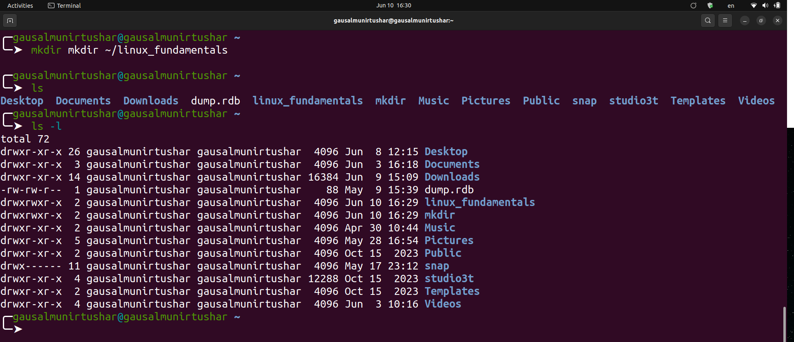
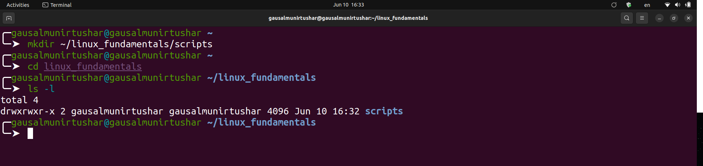
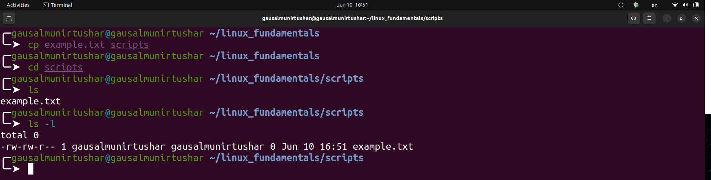
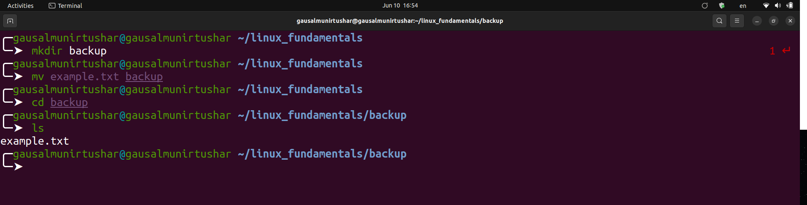
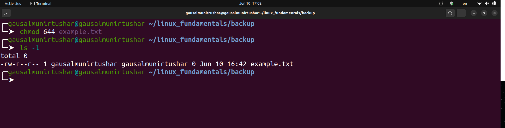

# Linux Fundamentals - Assigment

- [File System Navigation](#file-system-navigation)
- [File and Directory Operations](#file-and-directory-operations)
- [File Modification](#file-modification)
- [Ownership](#ownership)
- [User add/modify](#user-add/modify)
- [Hard/Soft Link](#hard/soft-link)
- [Package installation](#package-installation)

## File System Navigation

##### 1. List the contents of the home directory:

To list the contents of the home directory, use the `ls` command:

**_Example :_**

```bash
    ls ~
```



**Explanation:** The ~ symbol represents the home directory of the current user.

##### 2. Change the current directory to `/var/log` and list its contents.

First, change the directory using `cd`, then list the contents using `ls` :

**_Example :_**

```bash
    cd /var/log
    ls
```



**Explanation:** `cd` changes the current directory to `/var/log`, and `ls` lists the contents of this directory.

##### 3. Find and display the path to the bash executable using the `which` command:

**_Example :_**

```bash
    which bash
```


**Explanation:** The `which` command shows the full path of shell commands, in this case, `bash`.

##### 4. Find the current shell:

**_Example :_**

```bash
    echo $SHELL
```


**Explanation:** The `$SHELL` environment variable contains the path to the current shell.

## File and Directory Operations

#### 1. Create a directory named `linux_fundamentals` in your home directory:

**_Example :_**

```bash
    mkdir ~/linux_fundamentals
```


**Explanation :** mkdir creates a new directory. `~ ` indicates the home directory.

#### 2. Inside linux_fundamentals, create a subdirectory named scripts:

```bash
    mkdir ~/linux_fundamentals/scripts
```



**Explanation :** This creates the scripts directory inside linux_fundamentals.

#### 3. Create an empty file named example.txt inside the linux_fundamentals directory:

**_Example :_**

```bash
    touch ~/linux_fundamentals/example.txt
```


**Explanation:** touch creates an empty file if it doesn't already exist.

#### 4. Copy `example.txt` to the `scripts` directory:

**_Example :_**

```bash
cp example.txt scripts

```


**Explanation:** `cp` copies files. Here, it copies `example.txt` to the scripts directory.

#### 5. Move `example.txt` from `linux_fundamentals` to `linux_fundamentals/backup`:

First, create the `backup` directory:

**_Example :_**

```bash
    mkdir ~/linux_fundamentals/backup
```

Then move the file:

```bash
    mv ~/linux_fundamentals/example.txt ~/linux_fundamentals/backup/
```



**Explanation:** `mv` moves files. This moves `example.txt` to the backup directory.

#### 6. Change the permissions of example.txt to read and write for the owner, and read-only for the group and others:

**_Example :_**

```bash
    chmod 644 example.txt
```



**Explanation:** `chmod 644` changes the file permissions to `rw-r--r--.` This means the owner has read and write permissions (6), and the group and others have read-only permissions (4).

#### 7. Verify the permission changes using `ls -l`:

**_Example :_**

```bash
    ls -l example.txt
```


**Explanation:** `ls -l` displays detailed information about the file, including its permissions.

## File Modification

#### 1. Create a file named `example.txt` in your home directory.


**Example :**
```bash
touch ~/example.txt
```


**Explanation:**
- `touch` is a command used to create an empty file if it does not exist.
- `~/` is a shorthand for the home directory of the current user.


#### 2. Change the owner of `example.txt` to a user named student

**Example :**
```bash
    sudo chown student ~/example.txt
```


**Explanation:**
- `sudo` is used to execute a command with superuser privileges.
- `chown` stands for "change owner".
- `student` is the username of the new owner.
- `~/example.txt` is the path to the file whose ownership we are changing.

#### 3. Change the group of `example.txt` to a group named `students`
**Example :**
```bash
sudo chgrp students ~/example.txt
```


**Explanation:**.
- `sudo` is used to execute a command with superuser privileges.
- `chgrp` stands for "change group".
- `students` is the name of the new group.
- `~/example.txt` is the path to the file whose group we are changing.

#### 4. Verify the changes using appropriate commands.
**Example :**
```bash

```


## Ownership

## User add/modify

## Hard/Soft Link

## Package installation