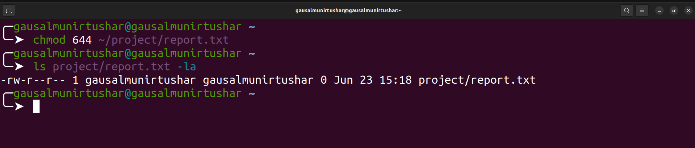
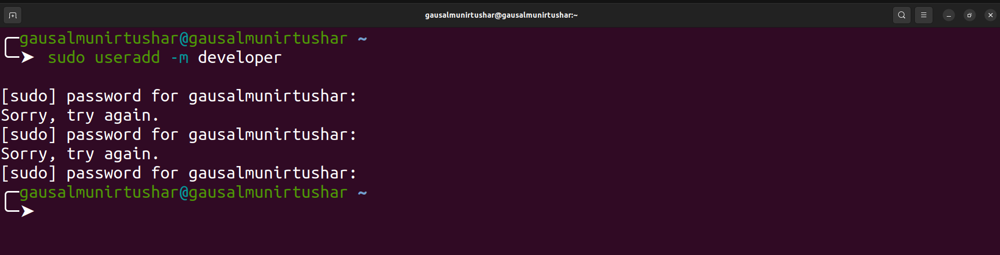

# Linux Fundamentals - Assigment

- [File System Navigation](#file-system-navigation)
- [File and Directory Operations](#file-and-directory-operations)
- [File Modification](#file-modification)
- [Ownership](#ownership)
- [User add/modify](#user-add/modify)
- [Hard/Soft Link](#hard/soft-link)
- [Package installation](#package-installation)

## File System Navigation

##### 1. List the contents of the home directory:

To list the contents of the home directory, use the `ls` command:

**_Example :_**

```bash
    ls ~
```


**Explanation:** The ~ symbol represents the home directory of the current user.

##### 2. Change the current directory to `/var/log` and list its contents.

First, change the directory using `cd`, then list the contents using `ls` :

**_Example :_**

```bash
    cd /var/log
    ls
```


**Explanation:** `cd` changes the current directory to `/var/log`, and `ls` lists the contents of this directory.

##### 3. Find and display the path to the bash executable using the `which` command:

**_Example :_**

```bash
    which bash
```


**Explanation:** The `which` command shows the full path of shell commands, in this case, `bash`.

##### 4. Find the current shell:

**_Example :_**

```bash
    echo $SHELL
```


**Explanation:** The `$SHELL` environment variable contains the path to the current shell.

## File and Directory Operations

#### 1. Create a directory named `linux_fundamentals` in your home directory:

**_Example :_**

```bash
    mkdir ~/linux_fundamentals
```


**Explanation :** mkdir creates a new directory. `~ ` indicates the home directory.

#### 2. Inside linux_fundamentals, create a subdirectory named scripts:

```bash
    mkdir ~/linux_fundamentals/scripts
```


**Explanation :** This creates the scripts directory inside linux_fundamentals.

#### 3. Create an empty file named example.txt inside the linux_fundamentals directory:

**_Example :_**

```bash
    touch ~/linux_fundamentals/example.txt
```


**Explanation:** touch creates an empty file if it doesn't already exist.

#### 4. Copy `example.txt` to the `scripts` directory:

**_Example :_**

```bash
cp example.txt scripts

```


**Explanation:** `cp` copies files. Here, it copies `example.txt` to the scripts directory.

#### 5. Move `example.txt` from `linux_fundamentals` to `linux_fundamentals/backup`:

First, create the `backup` directory:

**_Example :_**

```bash
    mkdir ~/linux_fundamentals/backup
```

Then move the file:

```bash
    mv ~/linux_fundamentals/example.txt ~/linux_fundamentals/backup/
```


**Explanation:** `mv` moves files. This moves `example.txt` to the backup directory.

#### 6. Change the permissions of example.txt to read and write for the owner, and read-only for the group and others:

**_Example :_**

```bash
    chmod 644 example.txt
```


**Explanation:** `chmod 644` changes the file permissions to `rw-r--r--.` This means the owner has read and write permissions (6), and the group and others have read-only permissions (4).

#### 7. Verify the permission changes using `ls -l`:

**_Example :_**

```bash
    ls -l example.txt
```


**Explanation:** `ls -l` displays detailed information about the file, including its permissions.

## File Modification

#### 1. Create a file named `example.txt` in your home directory.

**Example :**

```bash
touch ~/example.txt
```


**Explanation:**

- `touch` is a command used to create an empty file if it does not exist.
- `~/` is a shorthand for the home directory of the current user.

#### 2. Change the owner of `example.txt` to a user named student

**Example :**

```bash
    sudo chown student ~/example.txt
```


**Explanation:**

- `sudo` is used to execute a command with superuser privileges.
- `chown` stands for "change owner".
- `student` is the username of the new owner.
- `~/example.txt` is the path to the file whose ownership we are changing.

#### 3. Change the group of `example.txt` to a group named `students`

**Example :**

```bash
sudo chgrp students ~/example.txt
```


**Explanation:**.

- `sudo` is used to execute a command with superuser privileges.
- `chgrp` stands for "change group".
- `students` is the name of the new group.
- `~/example.txt` is the path to the file whose group we are changing.

#### 4. Verify the changes using appropriate commands.

**Example :**

```bash
ls -l example.txt
```


## Ownership

#### 1. Create a directory named project in your home directory.

**Example :**
```bash
mkdir ~/project

```


**Explanation:**
- `mkdir` is a command used to create a new directory.
- `~/project ` is the path where the directory will be created.


#### 2. Create a file named report.txt inside the project directory.

**Example :**
```bash
touch ~/project/report.txt

```


**Explanation:**
- `touch` is a command used to create an empty file.
- `~/project/report.txt` is the path to the new file inside the project directory.

#### 3. Set the permissions of report.txt to read and write for the owner, and read-only for the group and others.

**Example :**
```bash
chmod 644 ~/project/report.txt

```



**Explanation:**
- `chmod` is used to change file permissions.
- `644` sets read and write permissions for the owner, and read-only permissions for the group and others.
- `~/project/report.txt` is the path to the file.

#### 4. Set the permissions of the project directory to read, write, and execute for the owner, and read and execute for the group and others


**Example :**
```bash
chmod 755 ~/project

```


**Explanation:**
- `chmod `is used to change file permissions.
- `755` sets read, write, and execute permissions for the owner, and read and execute permissions for the group and others.
- `~/project` is the path to the directory.

#### 5. Verify the changes using appropriate commands.

**Example :**
```bash
ls -l ~/project/report.txt
ls -ld ~/project
```


**Explanation:**
- `ls -l` lists files in long format, showing detailed information.
- `~/project/report.txt` is the path to the file to verify permissions.
- `ls -ld` lists directory information in long format.
- `~/project` is the path to the directory to verify permissions.


## User add/modify

#### 1. Create a new user named developer.

**Example :**
```bash
sudo useradd -m developer
```




**Explanation:**
- `sudo` is used to run commands with superuser privileges.
- `useradd` is the command to add a new user.
- `-m` creates the home directory if it does not exist.


#### 2. Set the home directory of the user developer to /home/developer_home.

**Example :**
```bash
sudo usermod -d /home/developer_home -m developer

```


**Explanation:**
- `sudo usermod` Runs the user modification command with superuser privileges.
- `-d /home/developer_home` Specifies the new home directory.
- `-m:` Moves the contents of the current home directory to the new home directory.
- `developer` The username to be modified.

#### 3. Assign the shell /bin/sh to the user developer.

**Example :**
```bash
sudo usermod -s /bin/sh developer

```


**Explanation:**

- ` sudo usermod` Runs the user modification command with superuser privileges.
- `-s /bin/sh ` Specifies the new shell for the user.
- `developer` The username to be modified.

#### 4. Verify the new user's information.

**Example :**
```bash
getent passwd developer
```


**Explanation:**
- `getent` passwd retrieves entries from the passwd database.
- `developer` is the username whose information is being retrieved.

#### 5. Change the username of the user developer to devuser.

**Example :**
```bash
sudo usermod -l devuser developer
```


**Explanation:**
- `sudo` is used to run commands with superuser privileges.
- `usermod` is the command to modify a user account.
- `-l` devuser changes the username to devuser.
developer is the current username.

#### 6. Add devuser to a group named devgroup.

**Example :**
```bash
sudo groupadd devgroup
sudo usermod -aG devgroup devuser
```


**Explanation:**
- `sudo groupadd devgroup` creates a new group named devgroup.
- `sudo usermod -aG devgroup devuser ` adds devuser to the group devgroup.
- `-aG` appends the user to the supplementary group(s).


#### 7. Set the password of devuser to devpass. ( hint: use passwd command. Run passwd --help to see available options)

**Example :**
```bash
echo "devuser:devpass" | sudo chpasswd

```


**Explanation:**
- `echo "devuser:devpass" ` creates a string with the username and password.
- `sudo chpasswd ` updates the user's password using the provided input.

#### 8. Verify the changes made to the user.

**Example :**
```bash
getent passwd devuser
getent group devgroup
```


**Explanation:**
- `getent passwd devuser` retrieves entries from the passwd database for devuser.
- `getent group devgroup` retrieves entries from the group database for devgroup.


## Hard/Soft Link

## Package installation

#### 1. Update repo cache using apt/apt-get

Updating the package repository cache ensures that we have the latest information about available packages.

**Example :**

```bash
sudo apt update
```


**Explanation:**

- `sudo` is used to execute the command with superuser privileges.
- `apt update` refreshes the local package index with the latest changes made in the repositories.

#### 2. Install a package named tree

The tree package displays directory structures in a tree-like format.

**Example :**

```bash
sudo apt install tree
```


**Explanation:**

- `sudo` is used to execute the command with superuser privileges.
- `apt install tree` installs the tree package.

#### 3. Install gcloud CLI tool using apt ( Follow instructions from here:

(https://cloud.google.com/sdk/docs/install#deb)

##### 1. Add the Cloud SDK distribution URI as a package source:

**Example :**

```bash
    echo "deb [signed-by=/usr/share/keyrings/cloud.google.gpg] http://packages.cloud.google.com/apt cloud-sdk main" | sudo tee -a /etc/apt/sources.list.d/google-cloud-sdk.list

```


**Explanation:**

- `echo` prints the distribution URI.
- `tee -a` appends the output to the file.
- `/etc/apt/sources.list.d/google-cloud-sdk.list` is the file where the Cloud SDK distribution URI is added.

##### 2. Import the Google Cloud public key:

**Example :**

```bash
sudo apt-get install apt-transport-https ca-certificates gnupg
curl https://packages.cloud.google.com/apt/doc/apt-key.gpg | sudo tee /usr/share/keyrings/cloud.google.gpg

```


**Explanation:**

- `apt-get install apt-transport-https ca-certificates gnupg` installs necessary packages for secure transport and key management.
- `curl` downloads the public key.
- `tee` saves the public key to the specified file.

##### 3. Update and install the Cloud SDK:

**Example :**

```bash
sudo apt-get update && sudo apt-get install google-cloud-sdk

sudo apt-get install google-cloud-cli
```


**Explanation:**
- `apt-get update` updates the package list.
- `apt-get install google-cloud-sdk `installs the Google Cloud SDK.