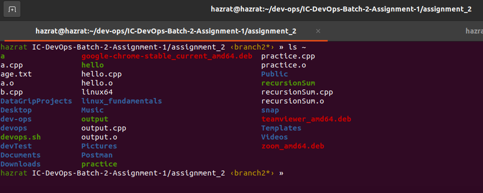
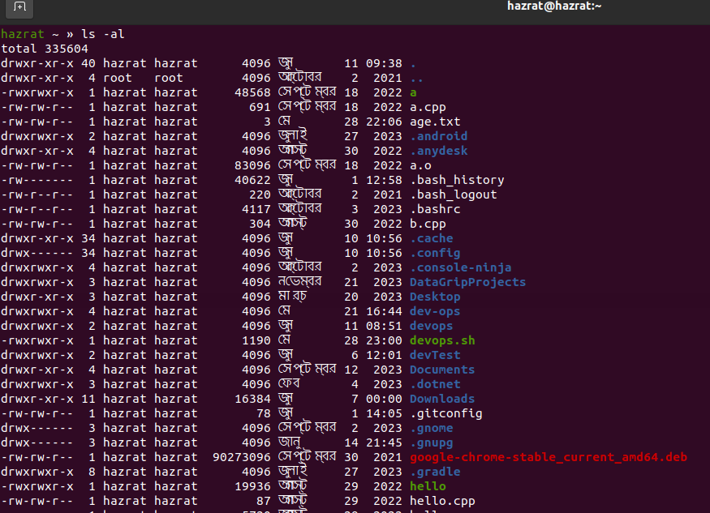
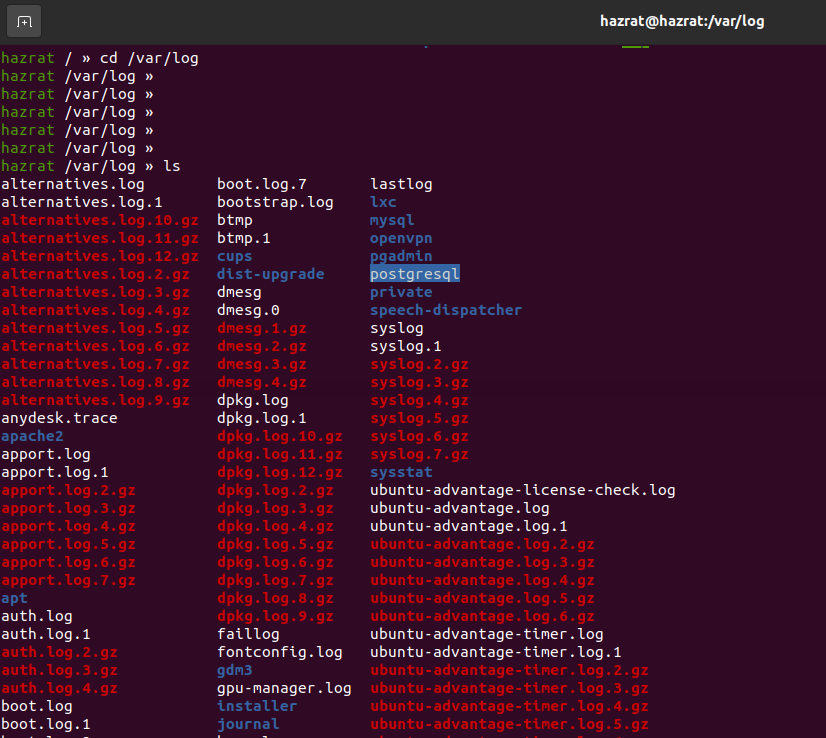
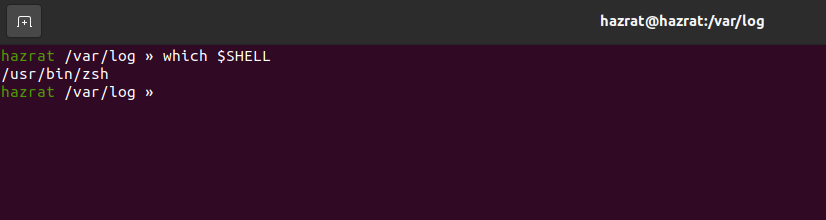
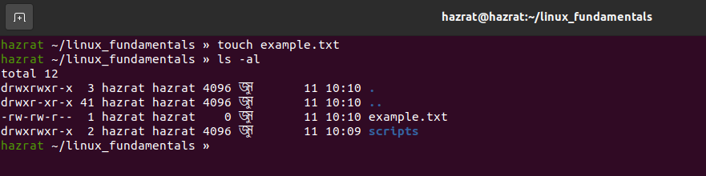

# Linux Fundamentals - Assigment

- [File System Navigation](#file-system-navigation)
- [File and Directory Operations](#file-and-directory-operations)
- [Permissions](#permissions)

## File System Navigation

##### 1. List the contents of the home directory:

To view the contents of the home directory, employ the ls command:

**_Example :_**

```bash
    ls ~
```



**Explanation:** The ~ symbol denotes the home directory of the current user.

Alternatively, you can navigate to the home directory and then list its contents:

**_Example :_**

```bash
    ls -al
```



**Explanation:** The `-al` flag reveals all contents within the current directory.

##### 2. Change the current directory to `/var/log` and list its contents.

Initiate the directory switch using `cd`, followed by listing its contents with `ls`:

**_Example :_**

```bash
    cd /var/log
    ls
```



**Explanation:** `cd` alters the current directory to `/var/log`, while `ls` displays its contents.

##### 3. Find and display the path to the bash executable using the `which` command:

**_Example :_**

```bash
    which bash
```


**Explanation:** The `which` command divulges the full path of shell commands, such as `bash`.

##### 4. Find the current shell:

**_Example :_**

```bash
    echo $SHELL
```


**Explanation:** The `$SHELL` environment variable holds the path to the current shell.

## File and Directory Operations

#### 1. Create a directory named `linux_fundamentals` in your home directory:

**_Example :_**

```bash
    mkdir ~/linux_fundamentals
```


**Explanation :** mkdir creates a new directory. `~ ` indicates the home directory.

#### 2. Inside linux_fundamentals, create a subdirectory named scripts:

```bash
    mkdir ~/linux_fundamentals/scripts
```


**Explanation :** This creates the scripts directory inside linux_fundamentals.

#### 3. Create an empty file named example.txt inside the linux_fundamentals directory:

**_Example :_**

```bash
    touch ~/linux_fundamentals/example.txt
```


**Explanation:** touch creates an empty file if it doesn't already exist.

#### 4. Copy `example.txt` to the `scripts` directory:

**_Example :_**

```bash
cp example.txt scripts

```


**Explanation:** `cp` copies files. Here, it copies `example.txt` to the scripts directory.

#### 5. Move `example.txt` from `linux_fundamentals` to `linux_fundamentals/backup`:

First, create the `backup` directory:

**_Example :_**

```bash
    mkdir ~/linux_fundamentals/backup
```

Then move the file:

```bash
    mv ~/linux_fundamentals/example.txt ~/linux_fundamentals/backup/
```


**Explanation:** `mv` moves files. This moves `example.txt` to the backup directory.

## Permissions

#### 1. Change the permissions of example.txt to read and write for the owner, and read-only for the group and others:

**_Example :_**

```bash
    chmod 644 example.txt
```


**Explanation:** `chmod 644` modifies file permissions to `rw-r--r--`. This configuration grants the owner read and write privileges (6), and restricts the group and others to read-only access (4).

#### 2. Verify the permission changes using `ls -l`:

**_Example :_**

```bash
    ls -l example.txt
```


**Explanation:** `ls -l` presents detailed file information, inclusive of its permissions.
