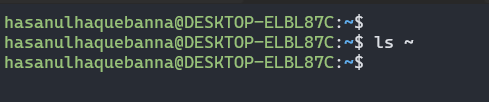
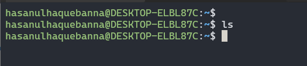
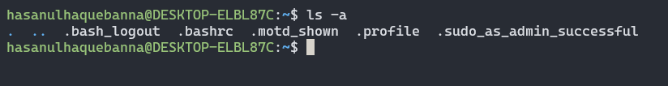
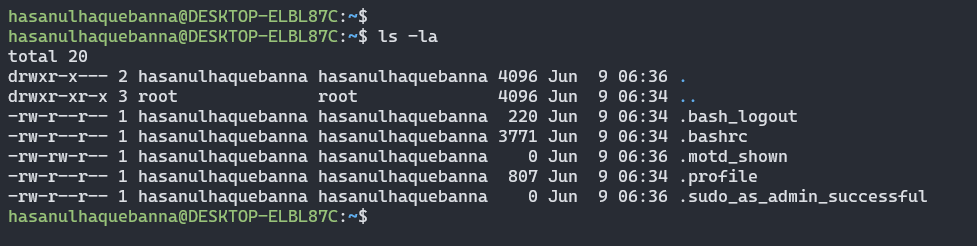
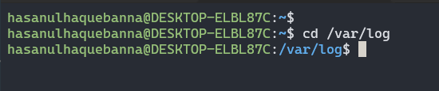
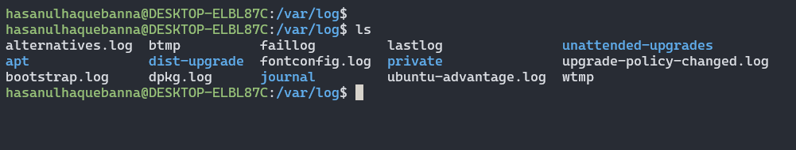
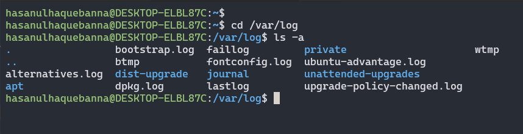
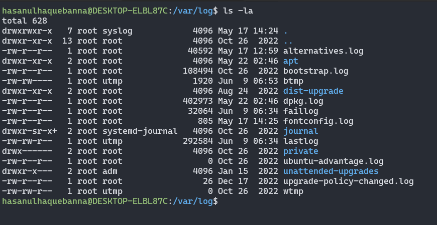

# File System Navigation

This guide provides instructions for basic file system navigation and shell commands in a Unix-like operating system.

### 1. List the contents of the home directory

**Result 1:**

Using this `ls ~` command we will get the following results:

- The `~` symbol is a shorthand for the current user's home directory
- Lists the files and directories in the user's home directory.
   

**Result 2:**

Using this `ls` command we will get the following results:

- Lists the files and directories in the current directory.
- By default, it does not show hidden files (those starting with a dot)

 

**Result 3:**

Using this `ls -a` command we will get the following results:

- Lists all files and directories, including hidden ones (those starting with a dot).
   

**Result 4:**

Using this `ls -la` command we will get the following results:

- Combining the options `-l` meaning long listing format and `-a` meaning show all files including hidden ones (Long listing format provides detailed information about each file as well directories, such as permissions, number of links, owner, group, size and modification time and more).

   

### 2. Change the current directory to /var/log and list its contents

**Result 1:**

Using this `cd /var/log` command we will get the following results:

- The command changes the directory to /var/log.
   

**Result 2:**

Using this `ls` command we will get the following results:

- Lists the files and directories in the current directory.
- By default, it does not show hidden files (those starting with a dot)
   

**Result 3:**

Using this `ls -a` command we will get the following results:

- Lists all files and directories, including hidden ones (those starting with a dot).
   

**Result 4:**

Using this `ls -la` command we will get the following results of the `/var/log` directory :

- Combining the options `-l` meaning long listing format and `-a` meaning show all files including hidden ones (Long listing format provides detailed information about each file as well directories, such as permissions, number of links, owner, group, size and modification time and more).

### 3. Find and display the path to the bash executable using the which command

**Result 1:**

Using this `which bash` command we will get the following results:

- This command locates the executable file, in this case we got`/usr/bin/bash`.
   

**Result 2:**

Using this `echo $SHELL` command we will get the following results:

- This command prints the path of the shell, in this case we got`/bin/bash`.
   
