# File System Navigation

This guide provides instructions for basic file system navigation and shell commands in a Unix operating system (Ubuntu).

#### 1. List the contents of the home directory

**Result 1:**

Using this `ls ~` command we will get the following results:

- The `~` symbol is a shorthand for the current user's home directory
- Lists the files and directories in the user's home directory.
   

**Result 2:**

Using this `ls` command we will get the following results:

- Lists the files and directories in the current directory.
- By default, it does not show hidden files (those starting with a dot)
   

**Result 3:**

Using this `ls -a` command we will get the following results:

- Lists all files and directories, including hidden ones (those starting with a dot).
   

**Result 4:**

Using this `ls -la` command we will get the following results:

- Combining the options `-l` meaning long listing format and `-a` meaning show all files including hidden ones (Long listing format provides detailed information about each file as well directories, such as permissions, number of links, owner, group, size and modification time and more).
     

#### 2. Change the current directory to /var/log and list its contents

**Result 1:**

Using this `cd /var/log` command we will get the following results:

- The command changes the directory to /var/log.
   

**Result 2:**

Using this `ls` command we will get the following results:

- Lists the files and directories in the current directory.
- By default, it does not show hidden files (those starting with a dot)
   

**Result 3:**

Using this `ls -a` command we will get the following results:

- Lists all files and directories, including hidden ones (those starting with a dot).
   

**Result 4:**

Using this `ls -la` command we will get the following results of the `/var/log` directory :

- Combining the options `-l` meaning long listing format and `-a` meaning show all files including hidden ones (Long listing format provides detailed information about each file as well directories, such as permissions, number of links, owner, group, size and modification time and more).
   

#### 3. Find and display the path to the bash executable using the which command

**Result 1:**

Using this `which bash` command we will get the following results:

- This command locates the executable file, in this case we got`/usr/bin/bash`.
   

**Result 2:**

Using this `echo $SHELL` command we will get the following results:

- This command prints the path of the shell, in this case we got `/bin/bash`.
     

# File and Directory Operations

This guide provides instructions for basic file and directory operations in a Unix operating system (Ubuntu).

#### 1. Create a directory named `linux_fundamentals` in your home directory

**Result:**

Using this `mkdir ~/linux_fundamentals
` command we will get the following results:

- The `mkdir` command is used to create directories.
- And finally the command creates a directory named `linux_fundamentals` in the user's home directory, in this case `hasanulhaquebanna@DESKTOP-ELBL87C`.
   

#### 2. Inside `linux_fundamentals` create a subdirectory named `scripts`

**Result:**

Using this `mkdir ~/linux_fundamentals
` command we will get the following results:

- The `mkdir` command is used to create directories.
- And finally the command creates a directory named `linux_fundamentals` in the user's home directory, in this case `hasanulhaquebanna@DESKTOP-ELBL87C`.
   

#### 3. Create an empty file named `example.txt` inside the `linux_fundamentals` directory

**Result:**

Using this `touch ~/linux_fundamentals/example.txt` command we will get the following results:

- In here the `touch` command is used to create an empty file.
- This command creates an empty file named `example.txt` inside the `linux_fundamentals` directory.
   

#### 4. Copy `example.txt` to the `scripts` directory

**Result:**

Using this `cp ~/linux_fundamentals/example.txt ~/linux_fundamentals/scripts/
` command we will get the following results:

- The `cp` command is used to copy files and directories.
- This command copies the `example.txt` file from `linux_fundamentals` to the `scripts` subdirectory.
   

#### 5. Move `example.txt` from `linux_fundamentals` to `linux_fundamentals/backup`

**Result:**

Using these command we will get the following results:

- The `mkdir` command is used to make directory and that's why first we need to create a dierectory named `backup` under `linux_fundamentlas.`
- The `mv` command moves the `example.txt` file from `linux_fundamentals` to the `backup` subdirectory.
     

# Permissions

This guide provides instructions for changing file permissions in a Unix operating system (Ubuntu).

#### 1. Change the permissions of `example.txt` to read and write for the owner, and read-only for the group and others

**Result:**

Using these command we will get the following results:

- The `u=rw:` command Sets read and write permissions for the owner (`u` stands for user)
- `g=r:` Sets read-only permissions for the group (`g` stands for group)
- `o=r:` Sets read-only permissions for others (`o` stands for others).
   

#### 2. Verify the permission changes using `ls -l`

**Result:**

Using these command we will get the following results:

- The `ls -l` command lists files and directories with detailed information, including permissions.
- This command verifies the permissions of `example.txt`.
     

# File Modification

This guide provides instructions for file modification operations in a Unix operating system (Ubuntu).

#### 1. Create a file named `example.txt` in your home directory

**Result:**

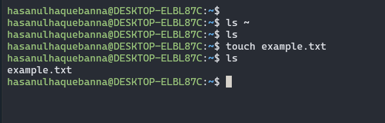

Using this touch `~/example.txt` command we will get the following results:

- The `touch` command is used to create an empty file.
- This command creates an empty file named `example.txt` in the user's home directory, in this case `hasanulhaquebanna@DESKTOP-ELBL87C`.
   

#### 2. Change the owner of `example.txt` to a user named student

**Result:**

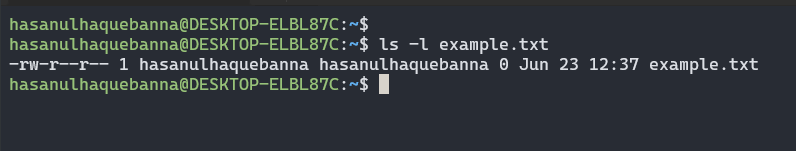
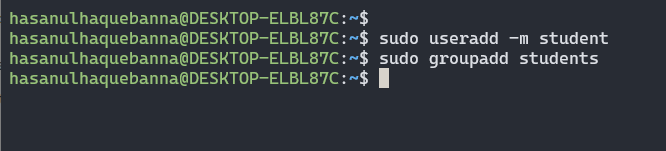
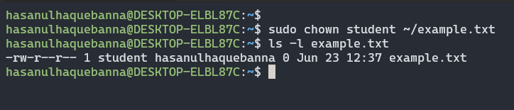

Using this `sudo useradd student` command we will get the following results:

- Before assigning the file we created a student user using `sudo useradd -m student` command.
- The `useradd` command is used to create a new user in this case `student`.
- This command creates a user named student.
   

#### 3. Change the group of `example.txt` to a group named `students`.

**Result:**

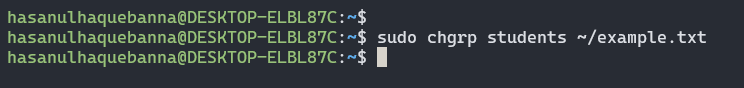
Using this `sudo chgrp students ~/example.txt` command we will get the following results:

- Before assigning the file we created a student user using `sudo groupadd students` command.
- The chgrp command is used to change the group ownership of a file.
- This command changes the group of example.txt to students.
   

#### 4. Verify the changes using appropriate commands.

**Result:**

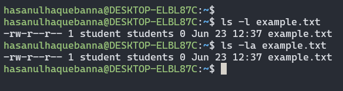

Using the `ls -l example.txt` or `ls -la example.txt` command we will get the following results:

- Before assigning the file we created a student user using `sudo groupadd students` command.
- The chgrp command is used to change the group ownership of a file.
- This command changes the group of example.txt to students.
     

# Ownership

This guide provides instructions for basic ownership and permission operations in a Unix operating system (Ubuntu).

#### 1. Create a directory named project in your home directory.

**Result:**

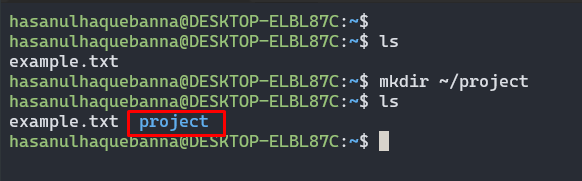

Using the `mkdir ~/project` command we will get the following results:

- The mkdir command is used to create a new directory in this case `project`.
- This command creates a directory named project in the user's home directory.
   

#### 2. Create a file named `report.txt` inside the `project` directory

**Result:**

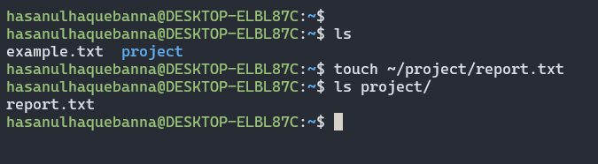

Using the touch `~/project/report.txt` command we will get the following results:

- The `touch` command is used to create an empty file.
- This command creates an empty file named `report.txt` inside the project directory.
   

#### 3. Set the permissions of `report.txt` to read and write for the owner, and read-only for the group and others

**Result:**

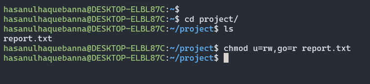

Using the `chmod u=rw,go=r ~/project/report.txt` command we will get the following results:

- The `chmod` command changes the file permissions.
- This command sets the permissions of `report.txt` to read and write for the owner, and read-only for the group and others.
   

#### 4. Set the permissions of the project directory to read, write, and execute for the owner, and read and execute for the group and others

**Result:**
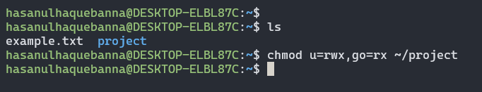

Using the `chmod u=rwx,go=rx ~/project` command we will get the following results:

- The `chmod` command changes the directory permissions.
- This command sets the permissions of the project directory to read, write, and execute for the owner, and read and execute for the group and others.
   

#### 5. Verify the changes using appropriate commands

**Result:**

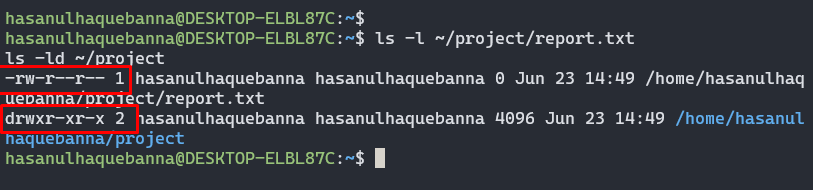

Using the `ls -l ~/project/report.txt` and `ls -ld ~/project` commands:

- The `ls -l` command displays detailed information about the file, showing the updated permissions for `report.txt`.
- The `ls -ld` command displays detailed information about the directory, showing the updated permissions for the `project` directory.
     

# User add/modify

This guide provides instructions for User add/modify operations in a Unix operating system (Ubuntu).

#### 1. Create a new user named developer

**Result:**

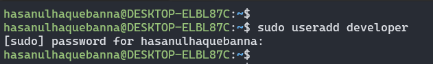

Using the `sudo useradd developer` we will get the following results:

- The command will create a new user after succesfully provide the root user password
- The command will create a user in this case `developer`.
   

#### 2. Set the home directory of the user developer to /home/developer_home

**Result:**

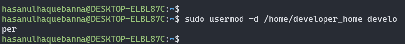

Using the `sudo usermod -d /home/developer_home developer` command we will get the following results:

- The `-d` option for `usermod` is used to change the home directory of the specified user (`developer`) to `/home/developer_home`.
- This command updates the home directory for the user `developer` to `/home/developer_home`.
   

#### 3. Assign the shell `/bin/sh` to the user developer

**Result:**

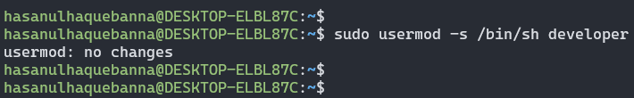

Using the `sudo usermod -s /bin/sh developer` command we will get the following results:

- The `-s` option for `usermod` is used to change the default shell of the specified user (`developer`) to `/bin/sh`.
- This command updates the shell for the user `developer` to `/bin/sh`.
   

#### 4. Verify the new user's information

**Result:**

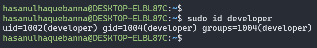

Using the `sudo id developer` command we will get the following results:

- This command verifies the user information for `developer`, confirming its UID, GID, and groups.
   

#### 5. Change the username of the user developer to devuser

**Result:**

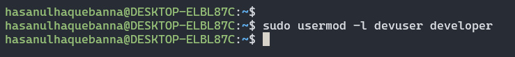

It changes the username of `developer` to `devuser`.
 

#### 6. Add devuser to a group named devgroup

**Result:**

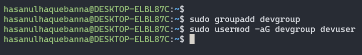

Using the `sudo usermod -aG devgroup devuser` command we will get the following results:

- Before assigning the command first we need to create a group named `devgroup` using `sudo groupadd devgroup` command.
- The command set the `devuser` to a group named `devgroup`
   

#### 7. Add devuser to a group named devgroup

**Result:**

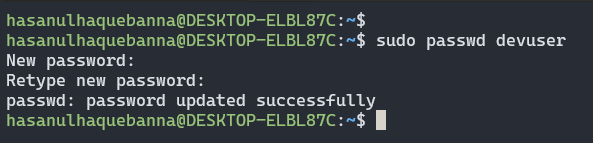

Using the `sudo passwd devuser` command we will get the following results:

- This command prompted to enter and confirm the new password for `devuser`.
   

#### 8. Verify the changes made to the user

**Result:**

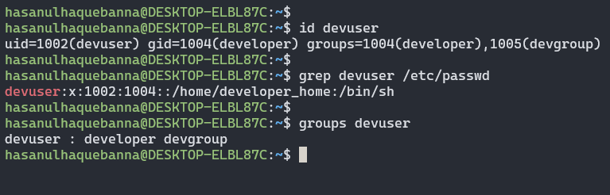

Using the `id devuser`, `grep devuser /etc/passwd` and `groups devuser` commands we will get the following results:

- The command `id devuser` should show the UID, GID, and groups of `devuser`.
- The command `grep devuser /etc/passwd` should display the entry for `devuser` confirming its username and home directory.
- The command `groups devuser` show list the groups `devuser` belongs to, including `devgroup`
       

# Hard/Soft Link

This guide provides instructions for Hard/Soft Link operations in a Unix operating system (Ubuntu).

#### 1. Create a file named original.txt in your home directory

**Result:**

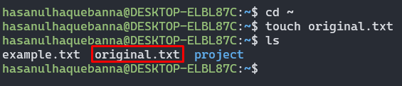

Using the command `original.txt`, we will get the following results:

- The command creates a file named `original.txt` with the specified content in the `home` directory.
   

#### 2. Create a symbolic link named `softlink.txt` pointing to `original.txt`

**Result:**

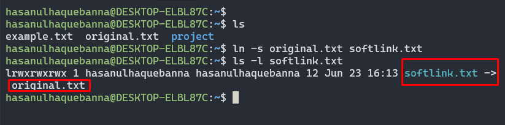

Using the command `ln -s original.txt softlink.txt`, we will get the following results:

- The command creates a symbolic link `softlink.txt` that points to `original.txt`
   

#### 3. Verify the symbolic link and ensure it points to the correct file

**Result:**

Using the command `ls -l softlink.txt`, we will get the following results:

- The symbolic link `softlink.txt` points to `original.txt`
   

#### 4. Delete the original file original.txt and observe the status of the symbolic link

**Result:**

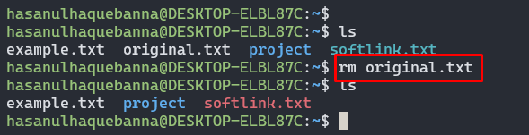
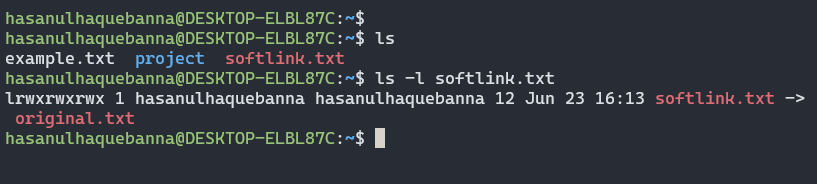

Using `rm original.txt` and `ls -l softlink.txt` commands, we will get the following results:

- The command `rm original.txt` will delete `original.txt` file.
- The command `ls -l softlink.txt` will verify the `softlink.txt` to `original.txt`
- After deleting `original.txt`, `softlink.txt` will still appear in the directory listing, but attempting to open `softlink.txt` will result in an error since the target file no longer exists.
   

#### 5. Create a file named datafile.txt in your home directory

**Result:**

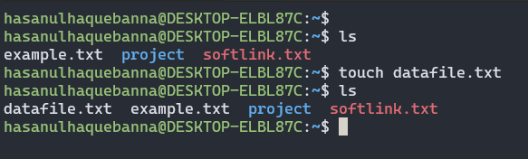

Using the command `touch datafile.txt`, we will get the following results:

- The command creates a file named `datafile.txt` with the specified content in the `home` directory.
   

#### 6. Create a hard link named `hardlink.txt` pointing to `datafile.txt`

**Result:**

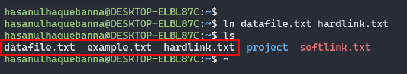

Using the command `ln datafile.txt hardlink.txt`, we will get the following results:

- The command creates a hard link `hardlink.txt` that points to `datafile.txt`.
   

#### 7. Verify the hard link and ensure it correctly points to the file

**Result:**

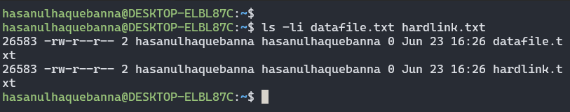

Using the command `ls -li datafile.txt hardlink.txt`, we will get the following results:

- Both `datafile.txt` and `hardlink.txt` share the same inode number, indicating they are hard links to the same data.
   

#### 8. Check the inode of both `datafile.txt` and `hardlink.txt`

**Result:**

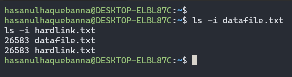

Using `ls -i datafile.txt` and `ls -i hardlink.txt`, we will get the following results:

- Both the inode numbers for `datafile.txt` and `hardlink.txt` are identical.
-  

#### 9. Delete the original file `datafile.txt` and observe the status of the hard link

**Result:**

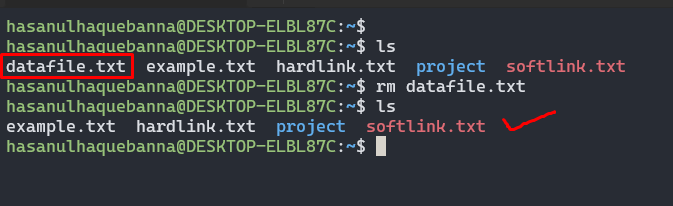
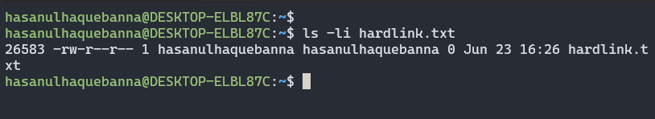

Using the commands `rm datafile.txt` and `ls -li hardlink.txt`, we will get the following results:

- Even after deleting `datafile.txt`, `hardlink.txt` remains and can still be accessed.
-  

#### 10. Find all `.txt` files in your home directory

**Result:**

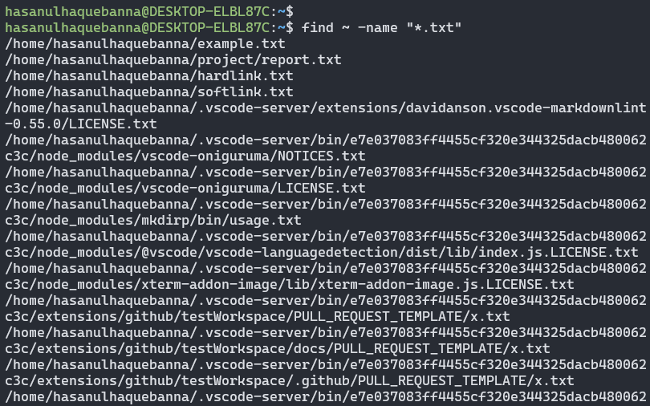

Using the command `find ~ -name "*.txt`, we will get the following results:

- The command finds all `.txt` files in the home directory.

   

# Package Installation

This guide provides instructions for Package Installation operations in a Unix operating system (Ubuntu)

#### 1. Update repository cache using `apt/apt-get`

**Result:**

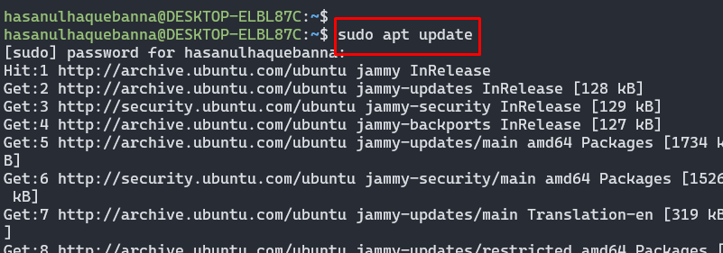

Using the command `sudo apt update`, we will get the following results:

- This command update the repository cache to ensure we have the latest information about available packages.
- his command updates the local database of available packages from the repositories configured on your system.
   

#### 2. Install a package named `tree`

**Result:**

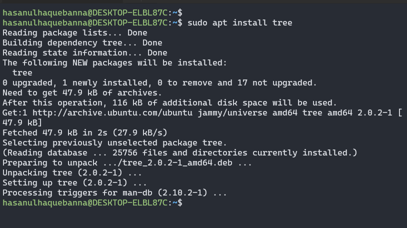

Using the command `sudo apt install tree`, we will get the following results:

- This command will install the tree package, which is a utility for displaying directory structures.
- This command installs the `tree` package and along with some its dependencies.
   

#### 3. Install `gcloud` CLI tool using apt

**Result:**

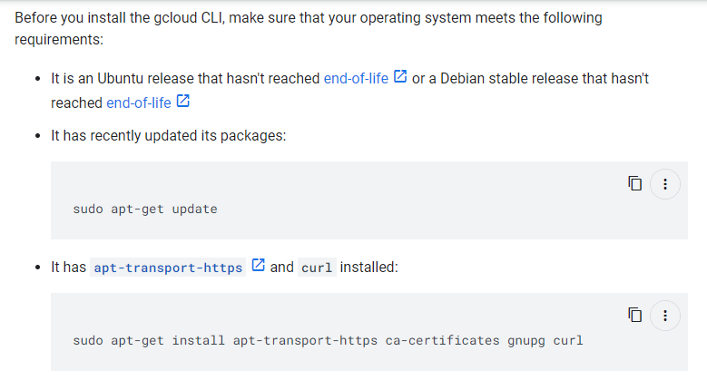
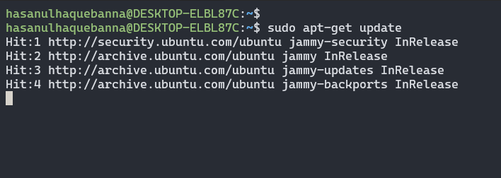
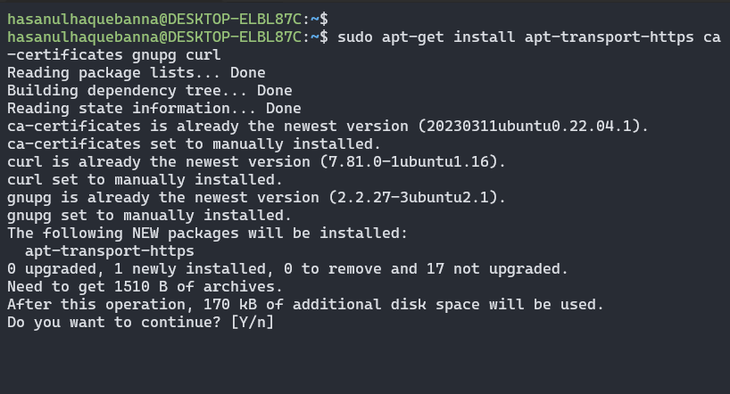
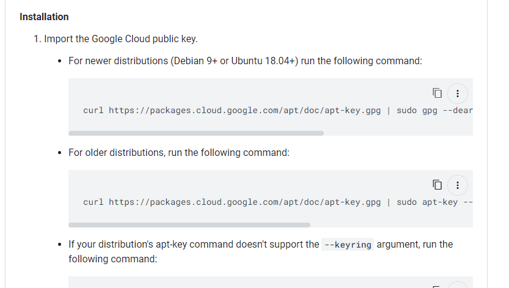
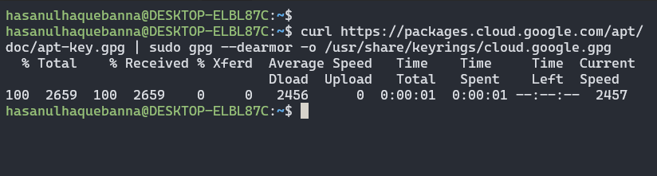
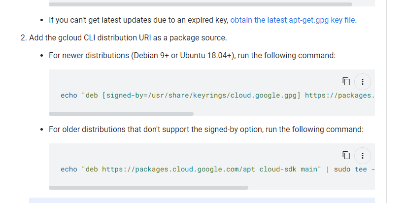

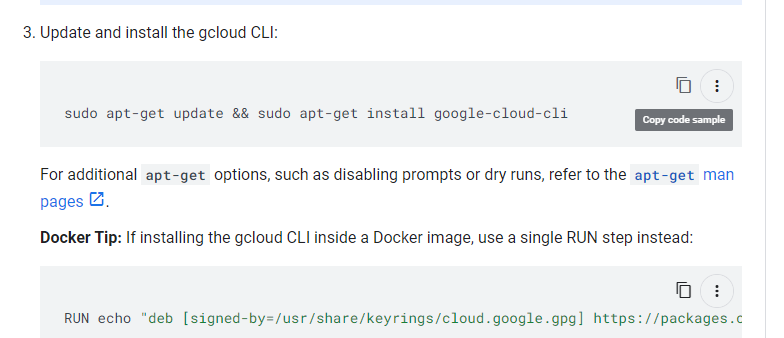

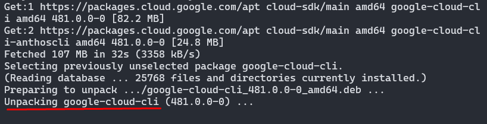
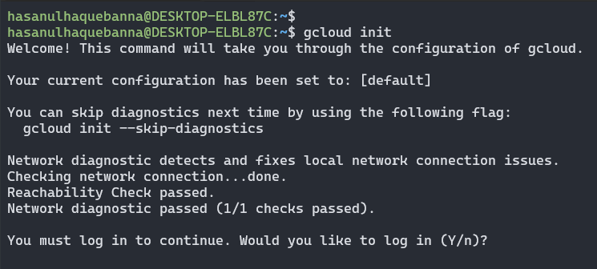

