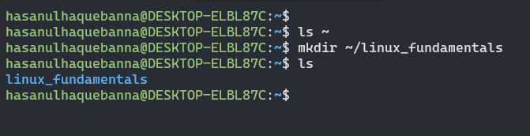
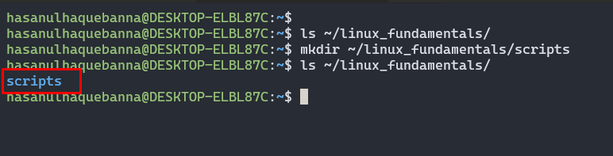
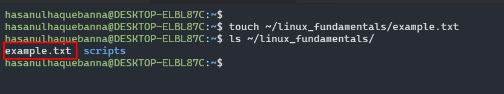
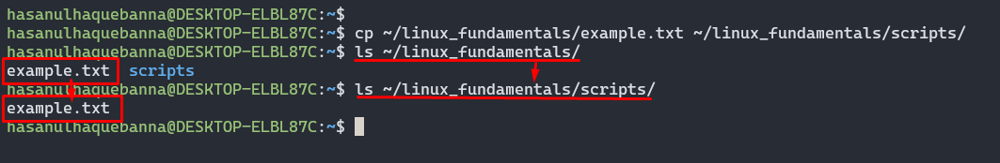
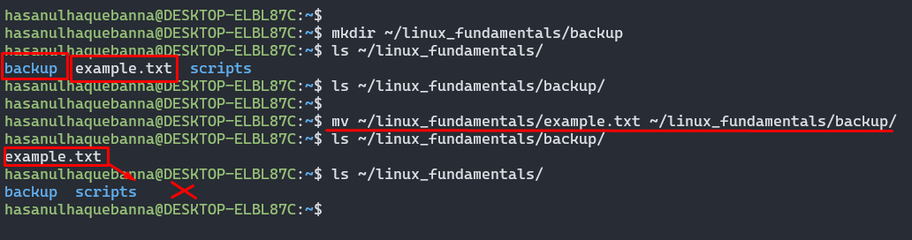
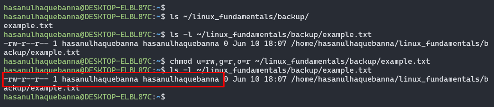
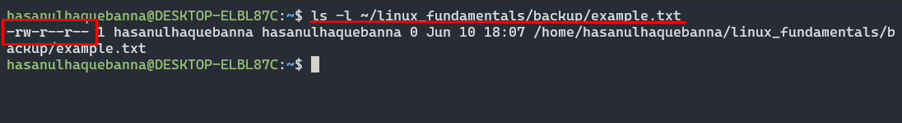

# File System Navigation

This guide provides instructions for basic file system navigation and shell commands in a Unix operating system (Ubuntu).

#### 1. List the contents of the home directory

**Result 1:**

Using this `ls ~` command we will get the following results:

- The `~` symbol is a shorthand for the current user's home directory
- Lists the files and directories in the user's home directory.
   

**Result 2:**

Using this `ls` command we will get the following results:

- Lists the files and directories in the current directory.
- By default, it does not show hidden files (those starting with a dot)
   

**Result 3:**

Using this `ls -a` command we will get the following results:

- Lists all files and directories, including hidden ones (those starting with a dot).
   

**Result 4:**

Using this `ls -la` command we will get the following results:

- Combining the options `-l` meaning long listing format and `-a` meaning show all files including hidden ones (Long listing format provides detailed information about each file as well directories, such as permissions, number of links, owner, group, size and modification time and more).
     

#### 2. Change the current directory to /var/log and list its contents

**Result 1:**

Using this `cd /var/log` command we will get the following results:

- The command changes the directory to /var/log.
   

**Result 2:**

Using this `ls` command we will get the following results:

- Lists the files and directories in the current directory.
- By default, it does not show hidden files (those starting with a dot)
   

**Result 3:**

Using this `ls -a` command we will get the following results:

- Lists all files and directories, including hidden ones (those starting with a dot).
   

**Result 4:**

Using this `ls -la` command we will get the following results of the `/var/log` directory :

- Combining the options `-l` meaning long listing format and `-a` meaning show all files including hidden ones (Long listing format provides detailed information about each file as well directories, such as permissions, number of links, owner, group, size and modification time and more).
   

#### 3. Find and display the path to the bash executable using the which command

**Result 1:**

Using this `which bash` command we will get the following results:

- This command locates the executable file, in this case we got`/usr/bin/bash`.
   

**Result 2:**

Using this `echo $SHELL` command we will get the following results:

- This command prints the path of the shell, in this case we got `/bin/bash`.
     

# File and Directory Operations

This guide provides instructions for basic file and directory operations in a Unix operating system (Ubuntu).

#### 1. Create a directory named `linux_fundamentals` in your home directory

**Result:**

Using this `mkdir ~/linux_fundamentals
` command we will get the following results:

- The `mkdir` command is used to create directories.
- And finally the command creates a directory named `linux_fundamentals` in the user's home directory, in this case `hasanulhaquebanna@DESKTOP-ELBL87C`.
   

#### 2. Inside `linux_fundamentals` create a subdirectory named `scripts`

**Result:**

Using this `mkdir ~/linux_fundamentals
` command we will get the following results:

- The `mkdir` command is used to create directories.
- And finally the command creates a directory named `linux_fundamentals` in the user's home directory, in this case `hasanulhaquebanna@DESKTOP-ELBL87C`.
   

#### 3. Create an empty file named `example.txt` inside the `linux_fundamentals` directory

**Result:**

Using this `touch ~/linux_fundamentals/example.txt` command we will get the following results:

- In here the `touch` command is used to create an empty file.
- This command creates an empty file named `example.txt` inside the `linux_fundamentals` directory.
   

#### 4. Copy `example.txt` to the `scripts` directory

**Result:**

Using this `cp ~/linux_fundamentals/example.txt ~/linux_fundamentals/scripts/
` command we will get the following results:

- The `cp` command is used to copy files and directories.
- This command copies the `example.txt` file from `linux_fundamentals` to the `scripts` subdirectory.
   

#### 5. Move `example.txt` from `linux_fundamentals` to `linux_fundamentals/backup`

**Result:**

Using these command we will get the following results:

- The `mkdir` command is used to make directory and that's why first we need to create a dierectory named `backup` under `linux_fundamentlas.`
- The `mv` command moves the `example.txt` file from `linux_fundamentals` to the `backup` subdirectory.
     

# Permissions

This guide provides instructions for changing file permissions in a Unix operating system (Ubuntu).

#### 1. Change the permissions of `example.txt` to read and write for the owner, and read-only for the group and others

**Result:**

Using these command we will get the following results:

- The `u=rw:` command Sets read and write permissions for the owner (`u` stands for user)
- `g=r:` Sets read-only permissions for the group (`g` stands for group)
- `o=r:` Sets read-only permissions for others (`o` stands for others).
   

#### 2. Verify the permission changes using `ls -l`

**Result:**

Using these command we will get the following results:

- The `ls -l` command lists files and directories with detailed information, including permissions.
- This command verifies the permissions of `example.txt`.
