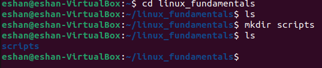
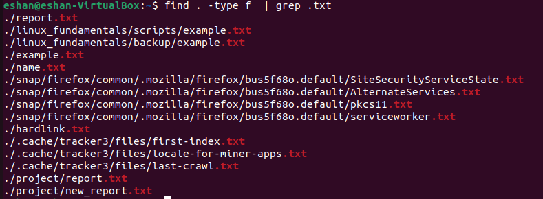

<h1 align="center"> Linux Fundamentals </h1> 

### Table of Contents : 
1. [File System Navigation](#file-system-navigation)
2. [File and Directory Operations](#file-and-directory-operations)
3. [Permissions](#permissions)
4. [File Modification](#file-modification)
5. [Ownership](#ownership)
6. [User add modify](#user-add-modify)
7. [Hard Soft Link](#Hard-Soft-link)
8. [Package installation](#package-installation)

## File System Navigation: 

- List the contents of the home directory.
```bash
   ls –al
```


- Change the current directory to /var/log and list its contents.
```bash
   cd /var/log
   ls
```


- Find and display the path to the bash executable using the which command.
```bash
   which bash
```


- Find current shell
```bash
   ps p $$
```


## File and Directory Operations

- Create a directory named linux_fundamentals in your home directory.
```bash
   mkdir linux_fundamentals
```


- Inside linux_fundamentals, create a subdirectory named scripts.
```bash
   cd linux_fundamentals
   mkdir scripts
```

- Create an empty file named example.txt inside the linux_fundamentals directory.
```bash
   touch example.txt
```

- Copy example.txt to the scripts directory.
```bash
   cp example.txt scripts
```

- Move example.txt from linux_fundamentals to linux_fundamentals/backup.
```bash
   mkdir backup
   mv example.txt backup
```


## Permissions

- Change the permissions of example.txt to read and write for the owner, and read-only for the group and others.
```bash
   sudo chmod u=rw,g=r,o=r example.txt
```
- Verify the permission changes using ls -l


## File Modification

- Create a file named example.txt in your home directory.
```bash
   touch example.txt
```


- Change the owner of example.txt to a user named student
```bash
   sudo useradd student
   sudo chown student:eshan example.txt
```

- Change the group of example.txt to a group named students.
```bash
   sudo chown student:student example.txt
```

- Verify the changes using appropriate commands.
```bash
  ls -l example.txt
```


## Ownership

- Create a directory named project in your home directory.
```bash
  mkdir project
```


- Create a file named report.txt inside the project directory.
```bash
  cd project
  touch report.txt

```
- Set the permissions of report.txt to read and write for the owner, and read-only for the group and others.
```bash
  sudo chmod u=rw,g=r,o=r report.txt
```


- Set the permissions of the project directory to read, write, and execute for the owner, and read and execute for the group and others
```bash
  sudo chmod u=rwx,g=rx,o=rx project
```


- Verify the changes using appropriate commands.
```bash
  sudo usermod –aG eshan student
```

```bash
  echo “hello text” >> report.txt
  cat report.tx
```

```bash
  sudo su student
  echo “hello txt 2” >> report.txt

```


```bash
  touch new_report.txt
  tudo su student
  touch new_report2.txt
```


## User add modify

- Create a new user named developer.
```bash
  sudo useradd developer

```


- Set the home directory of the user developer to /home/developer_home.
```bash
  sudo usermod –d /home/developer_home developer

```


- Assign the shell /bin/sh to the user developer.

- Verify the new user's information.
```bash
  cat /etc/passwd | grep developer
```


- Change the username of the user developer to devuser.
```bash
  sudo usermod –l devuser developer
```


- Add devuser to a group named devgroup.
```bash
  sudo addgroup devgroup
  sudo usermod –aG devgroup devuser
```


- Set the password of devuser to devpass. ( hint: use passwd command. Run passwd --help to see available options)
```bash
   sudo passwd devuser
```


- Verify the changes made to the user.
```bash
  su devuser
```


## Hard Soft Link

- Create a file named original.txt in your home directory.
```bash
  touch original.txt
```
- Create a symbolic link named softlink.txt pointing to original.txt.
```bash
  ln –s original.txt softlink.txt
```
- Verify the symbolic link and ensure it points to the correct file.
```bash
  echo “hello world” >> original.txt
  cat softlink.txt
```


- Delete the original file original.txt and observe the status of the symbolic link.
```bash
  rm –rf original.txt
  ls –l | grep original

```


- Create a file named datafile.txt in your home directory.
```bash
  touch datafile.txt
```

- Create a hard link named hardlink.txt pointing to datafile.txt.
```bash
  ln datafile.txt hardlink.txt
```

- Verify the hard link and ensure it correctly points to the file.
```bash
  echo "hello world" >> datafile.txt
  cat hardlink.txt
```


- Check the inode of both datafile.txt and hardlink.txt.
```bash
  ls -li datafile.txt hardlink.txt
```


- Delete the original file datafile.txt and observe the status of the hard link.
```bash
  rm –rf datafile.txt
```


- Find all .txt files in your home directory. ( use find command. Run find --help for usage)
```bash
  find . –type f | grep .txt
```


## Package installation

- Update repo cache using apt/apt-get
```bash
  sudo apt update
```
- Install a package named tree
```bash
  sudo apt install tree
```
- Install gcloud CLI tool using apt ( Follow instructions from here: https://cloud.google.com/sdk/docs/install#deb )
```bash
  sudo apt-get update && sudo apt-get install google-cloud-cli
```