# File System Navigation

List the contents of the home directory.
```
ls -a ~
```
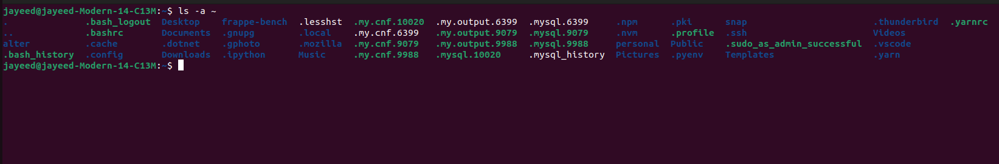

Change the current directory to /var/log and list its contents.
```
cd /var/log \
ls -a
```
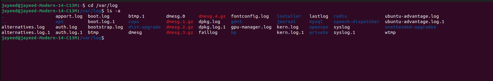

Find and display the path to the bash executable using the which command. Find current shell
```
which bash
echo $SHELL
```
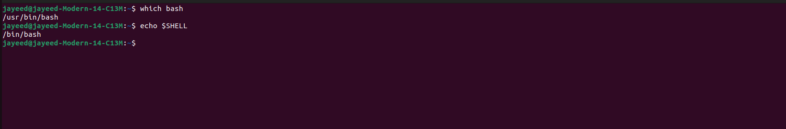

# File and Directory Operations

Create a directory named linux_fundamentals in your home directory.
Inside linux_fundamentals, create a subdirectory named scripts.
Create an empty file named example.txt inside the linux_fundamentals directory.
Copy example.txt to the scripts directory.
Move example.txt from linux_fundamentals to linux_fundamentals/backup.

```
cd ~
mkdir linux_fundamentals
mkdir linux_fundamentals/scripts
touch linux_fundamentals/example.txt
cp linux_fundamentals/example.txt linux_fundamentals/scripts/
mkdir linux_fundamentals/backup && mv ~/linux_fundamentals/example.txt ~/linux_fundamentals/backup
```
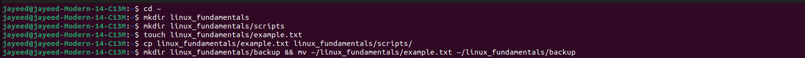

# Permissions

Change the permissions of example.txt to read and write for the owner, and read-only for the group and others. Verify the permission changes using ls -l

```
ls -l linux_fundamentals/scripts/example.txt
chmod 644 linux_fundamentals/scripts/example.txt
ls -l linux_fundamentals/scripts/example.txt
```
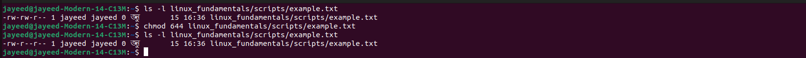

# File Modification

Create a file named example.txt in your home directory.
Change the owner of example.txt to a user named student
Change the group of example.txt to a group named students.
Verify the changes using appropriate commands.

```
cd ~
touch example.txt
ls -l example.txt
sudo useradd student
sudo chown student ~/example.txt
ls -l example.txt
sudo groupadd students
sudo chgrp students ~/example.txt
ls -l example.txt
```

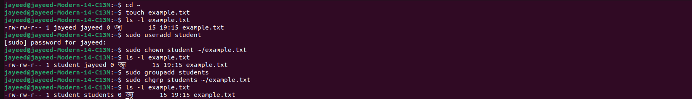

# Ownership

Create a directory named project in your home directory.
Create a file named report.txt inside the project directory.
Set the permissions of report.txt to read and write for the owner, and read-only for the group and others.

```
cd ~
mkdir project
touch project/report.txt
cd project
chmod u=rw,g=r,o=r report.txt
ls -l report.txt
```
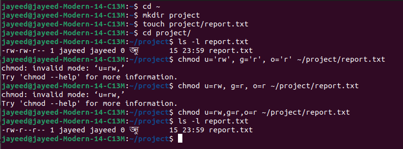

Set the permissions of the project directory to read, write, and execute for the owner, and read and execute for the group and others. Verify the changes using appropriate commands.

```
ls -ld ~/project
chmod u=rwx,g=rx,o=rx ~/project
ls -ld ~/project
```
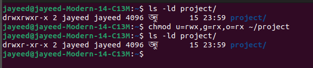

# User Add/Modify

Create a new user named developer. Set the home directory of the user developer to /home/developer_home. Assign the shell /bin/sh to the user developer. Verify the new user's information.

```
sudo useradd -m -d /home/developer_home -s /bin/sh developer
id developer
grep developer /etc/passwd
```
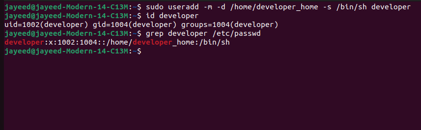


Change the username of the user developer to devuser. Add devuser to a group named devgroup.
```
id developer
sudo usermod -l devuser developer
id developer # user will not be found
id devuser
sudo groupadd devgroup
sudo usermod -aG devgroup devuser
groups devuser
```
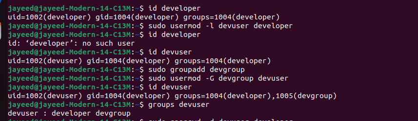

Set the password of devuser to devpass. Verify the changes made to the user.
```
sudo grep devuser /etc/shadow
su devuser # will not require pass
sudo passwd devuser
sudo grep devuser /etc/shadow # will show encrypted password
su devuser # will require password now
```
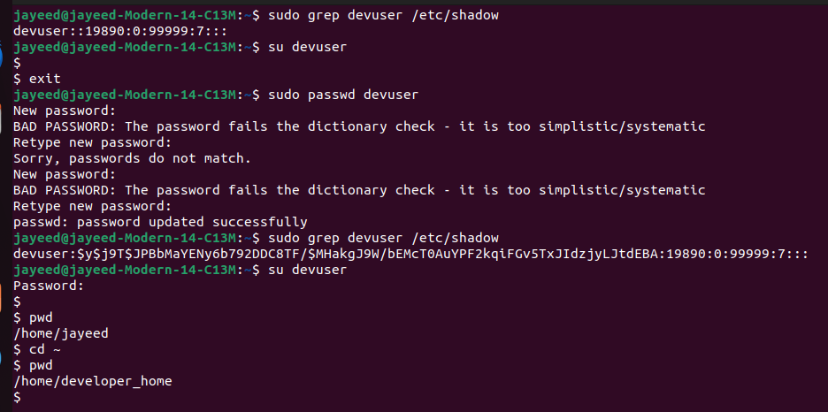

# Hard/Soft link

Create a file named original.txt in your home directory. Create a symbolic link named softlink.txt pointing to original.txt. Verify the symbolic link and ensure it points to the correct file. Delete the original file original.txt and observe the status of the symbolic link.
```
cd ~
touch original.txt
ls -l original.txt
ln -s original.txt softlink.txt
ls -l softlink.txt # checking the link
rm original.txt
ls -l softlink.txt
```
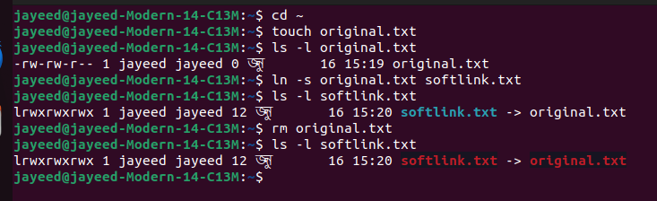


Create a file named datafile.txt in your home directory. Create a hard link named hardlink.txt pointing to datafile.txt. Verify the hard link and ensure it correctly points to the file. Check the inode of both datafile.txt and hardlink.txt. Delete the original file datafile.txt and observe the status of the hard link.
```
cd ~
touch datafile.txt
ls -li datafile.txt
ln datafile.txt hardlink.txt
ls -li hardlink.txt
echo "this is a verification" >> datafile.txt
cat hardlink.txt # same text as orignal datafile
rm datafile.txt
ls -li hardlink.txt # link exists with inode number and number of links as 1
```
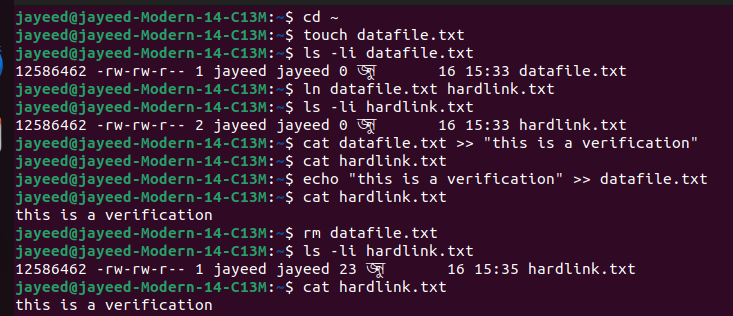

Find all .txt files in your home directory.
```
pwd
find . -type f -name "*.txt"
```
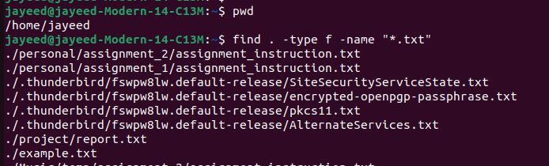

# Package installation
Update repo cache using apt/apt-get
```
sudo apt update
```
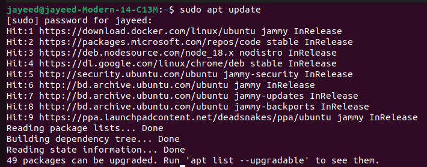

Install a package named tree

```
sudo apt install tree
```
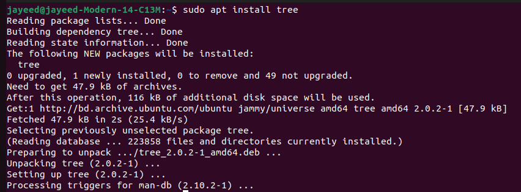

Install gcloud CLI tool using apt 
```
sudo apt update
sudo apt install apt-transport-https ca-certificates gnupg curl
curl https://packages.cloud.google.com/apt/doc/apt-key.gpg | sudo gpg --dearmor -o /usr/share/keyrings/cloud.google.gpg
echo "deb [signed-by=/usr/share/keyrings/cloud.google.gpg] https://packages.cloud.google.com/apt cloud-sdk main" | sudo tee -a /etc/apt/sources.list.d/google-cloud-sdk.list
sudo apt update && sudo apt install google-cloud-cli
```
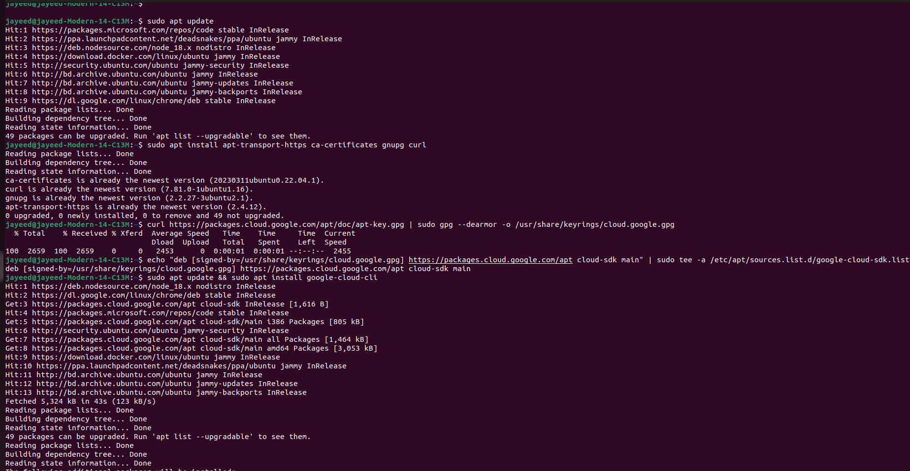
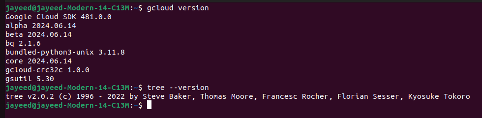