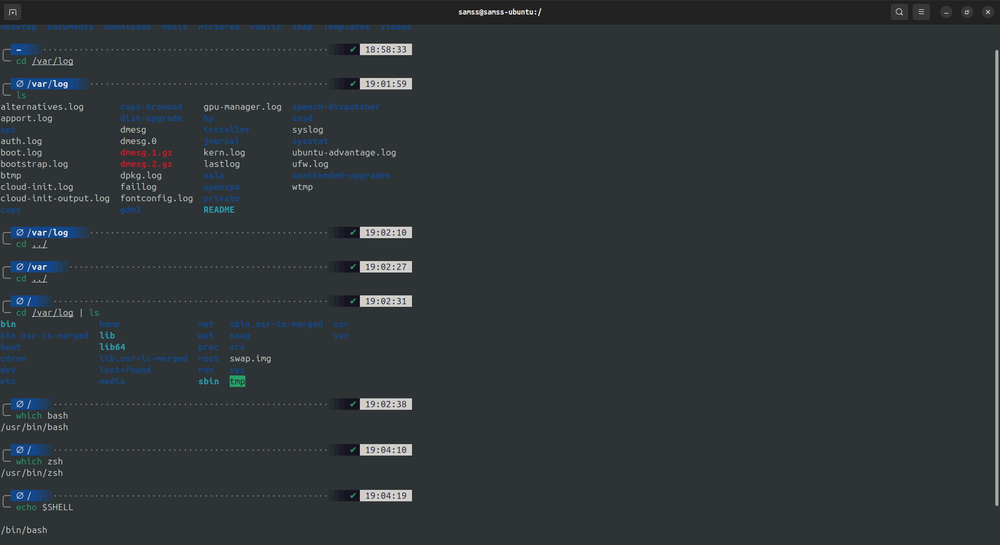
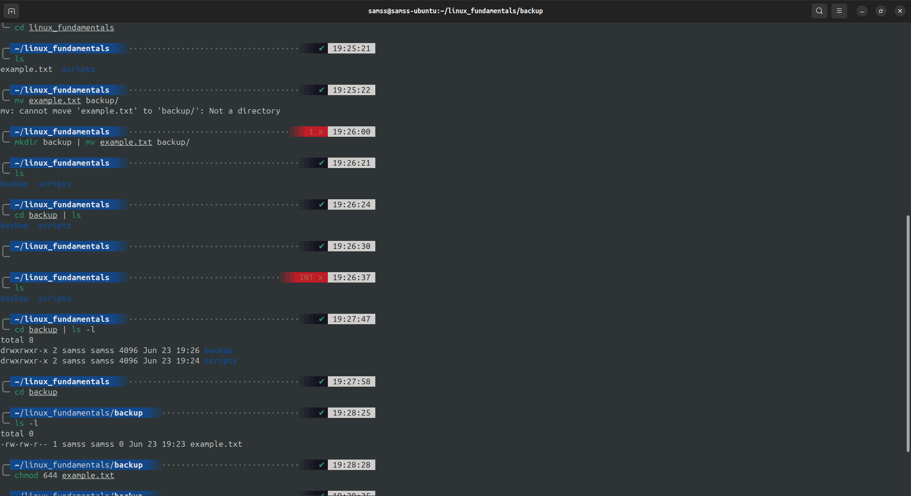
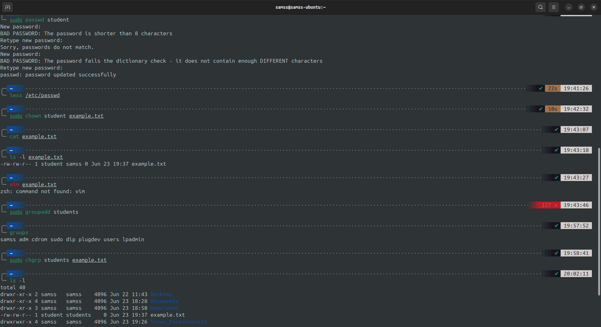
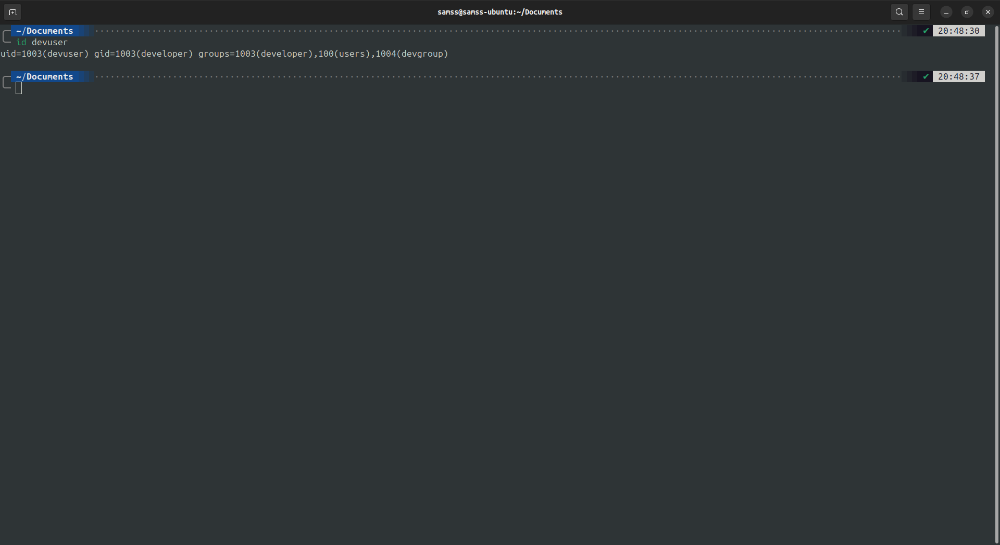
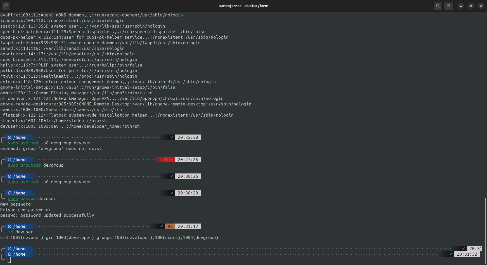
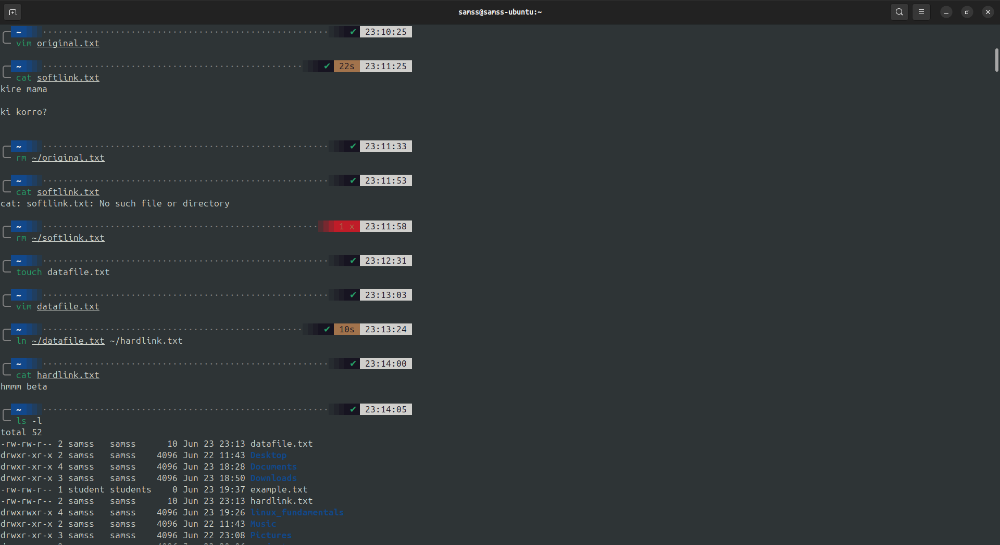
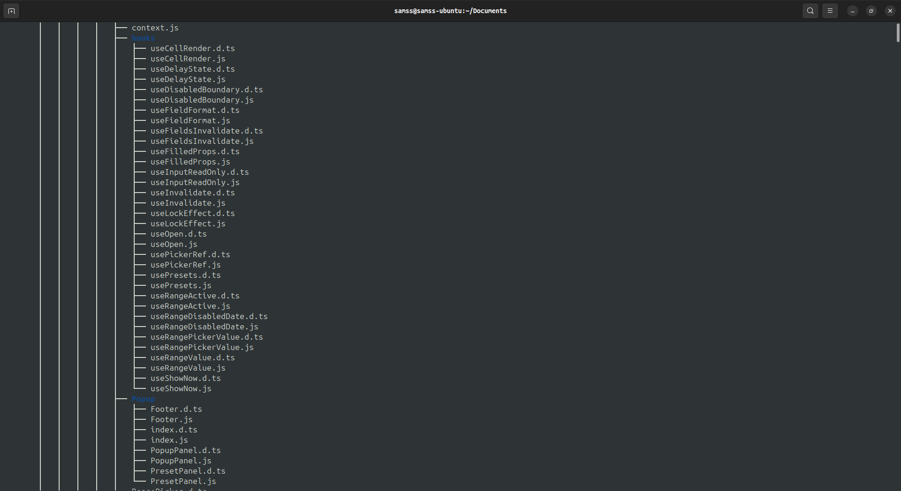

# File System Navigation

## Samss Jubair (ID: ICDB2_109)


### File System Navigation

#### List the contents of the home directory.
```
cd /
```

#### Change the current directory to /var/log and list its contents.
```
cd /var/log | ls
```

#### Find and display the path to the bash executable using the which command.
```
which bash
```

#### Find current shell
```
echo $SHELL
```




### File and Directory Operations

#### Create a directory named linux_fundamentals in your home directory.

```
mkdir ~/linux_fundamentals
```

#### Inside linux_fundamentals, create a subdirectory named scripts.
```
cd linux_fundamentals && mkdir scripts
```

#### Create an empty file named example.txt inside the linux_fundamentals directory.
```
touch example.txt
```

#### Copy example.txt to the scripts directory.
```
cp example.txt scripts/
```

#### Move example.txt from linux_fundamentals to linux_fundamentals/backup.
```
mkdir backup | mv example.txt backup/
```

#### Change the permissions of example.txt to read and write for the owner, and read-only for the group and others.
```
chmod 644 example.txt
```

#### Verify the permission changes using ls -l
```
ls -l
```




### File Modification

#### Create a file named example.txt in your home directory.
```
touch ~/example.txt
```

#### Change the owner of example.txt to a user named student
```
sudo chown student ~/example.txt
```

#### Change the group of example.txt to a group named students.
```
sudo chgrp students ~/example.txt
```

#### Verify the changes using appropriate commands.
```
ls -l
```



### Ownership

#### Create a directory named project in your home directory.
```
mkdir ~/project
```

#### Create a file named report.txt inside the project directory.
```
cd project | touch report.txt
```

#### Set the permissions of report.txt to read and write for the owner, and read-only for the group and others.
```
chmod 644 report.txt
```

#### Set the permissions of the project directory to read, write, and execute for the owner, and read and execute for the group and others
```
chmod 755 project
```

#### Verify the changes using appropriate commands.
```
ls -l
```


### User add/modify

#### Create a new user named developer.
```
sudo adduser developer
```

#### Set the home directory of the user developer to /home/developer_home.
```
sudo usermod -d /home/developer_home developer
```

#### Assign the shell /bin/sh to the user developer.
```
sudo usermod -s /bin/sh developer
```

#### Verify the new user's information.
```
id developer
```


#### Change the username of the user developer to devuser.
```
sudo usermod -l devuser developer
```

#### Add devuser to a group named devgroup.
```
sudo usermod -aG devgroup devuser
```

#### Set the password of devuser to devpass.
``` 
sudo passwd devuser
```

#### Verify the changes made to the user.
```
id devuser
```




### Hard/Soft Link

#### Create a file named original.txt in your home directory.
```
touch ~/original.txt
```

#### Create a symbolic link named softlink.txt pointing to original.txt.
```
ln -s ~/original.txt ~/softlink.txt
```

#### Verify the symbolic link and ensure it points to the correct file.
```
ls -l
```

#### Delete the original file original.txt and observe the status of the symbolic link.
```
rm ~/original.txt
```

#### Create a file named datafile.txt in your home directory.
```
touch ~/datafile.txt
```

#### Create a hard link named hardlink.txt pointing to datafile.txt.
```
ln ~/datafile.txt ~/hardlink.txt
```

#### Verify the hard link and ensure it correctly points to the file.
```
ls -l
```

#### Check the inode of both datafile.txt and hardlink.txt
```
ls -i
```

#### Delete the original file datafile.txt and observe the status of the hard link.
```
rm ~/datafile.txt
```

#### Find all .txt files in your home directory. ( use find command. Run find --help for usage)
```
find ~ -name "*.txt"
```




### Package Installation

#### Update the repository cache using apt.
```
sudo apt update
```

#### Install a package named tree.
```
sudo apt install tree
```

#### Install the gcloud CLI tool using apt.
```
sudo apt-get install apt-transport-https ca-certificates gnupg curl

curl https://packages.cloud.google.com/apt/doc/apt-key.gpg | sudo gpg --dearmor -o /usr/share/keyrings/cloud.google.gpg

echo "deb [signed-by=/usr/share/keyrings/cloud.google.gpg] https://packages.cloud.google.com/apt cloud-sdk main" | sudo tee -a /etc/apt/sources.list.d/google-cloud-sdk.list

sudo apt-get update && sudo apt-get install google-cloud-cli

sudo apt-get install google-cloud-cli-app-engine-java

gcloud init
```

