<div style="text-align: center;">


<!-- br -->

# Linux Fundamentals

> Here listed some necessary Linux commands. It's help a developer to find linux commands easily.

<!-- br -->

#### By

## <a href="https://github.com/msicse" > Md Sumon Islam</a>

</div>

## Table of contents

- [File System Navigation](#file-system-navigation)
- [File and Directory Operations](#file-and-directory-operations)
- [File Modification](#file-modification)
- [Ownership](#ownership)
- [User add/modify](#user-addmodify)
- [Hard/Soft Link](#hardsoft-link)
- [Package installation](#package-installation)


## File System Navigation

#### List the contents of the home directory.
```
ls -al
```
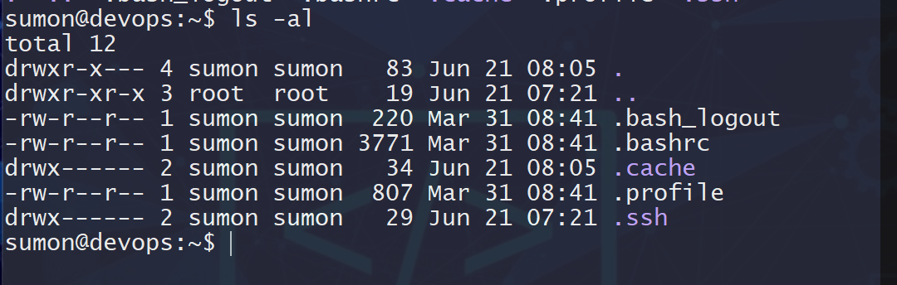

#### Change the current directory to /var/log and list its contents.
```
cd /var/log
ls -al
```


#### Find and display the path to the bash executable using the which command.
```
which bash
```
#### Find current shell
```
echo $SHELL
```
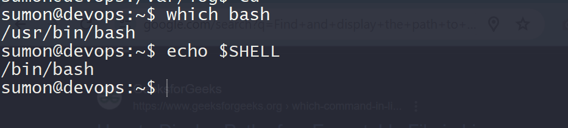

## File and Directory Operations
#### Create a directory named linux_fundamentals in your home directory.
```
mkdir linux_fundamentals
```
#### Inside linux_fundamentals, create a subdirectory named scripts.
```
mkdir linux_fundamentals/scripts
```
#### Create an empty file named example.txt inside the linux_fundamentals directory.
```
touch linux_fundamentals/example.txt
```
#### Copy example.txt to the scripts directory.
```
cp linux_fundamentals/example.txt linux_fundamentals/scripts
```
#### Move example.txt from linux_fundamentals to linux_fundamentals/backup.
```
mkdir linux_fundamentals/backup && mv linux_fundamentals/example.txt linux_fundamentals/backup
```
### Permissions
#### Change the permissions of example.txt to read and write for the owner, and read-only for the group and others.
```
sudo chmod 644 linux_fundamentals/backup/example.txt
```

#### Verify the permission changes using ls -l
```
ls -l linux_fundamentals/backup/example.txt
```
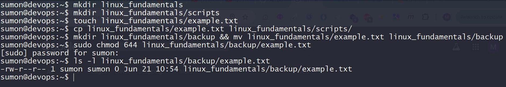
## File Modification
#### Create a file named example.txt in your home directory.
```
touch example.txt
```
#### Change the owner of example.txt to a user named student
```
sudo useradd student
sudo chown student example.txt
```
#### Change the group of example.txt to a group named students.
```
sudo groupadd students
sudo chgrp students example.txt
```

#### Verify the changes using appropriate commands.
```
ls -l example.txt
```

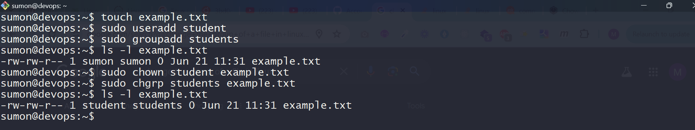
## Ownership
#### Create a directory named project in your home directory.
```
mkdir project
```
#### Create a file named report.txt inside the project directory.
```
touch project/report.txt
```
#### Set the permissions of report.txt to read and write for the owner, and read-only for the group and others.
```
chmod 644 project/report.txt
```
#### Set the permissions of the project directory to read, write, and execute for the owner, and read and execute for the group and others
```
chmod 755 project/report.txt
```
#### Verify the changes using appropriate commands.
```
ls -l project/report.txt
ls -l
```
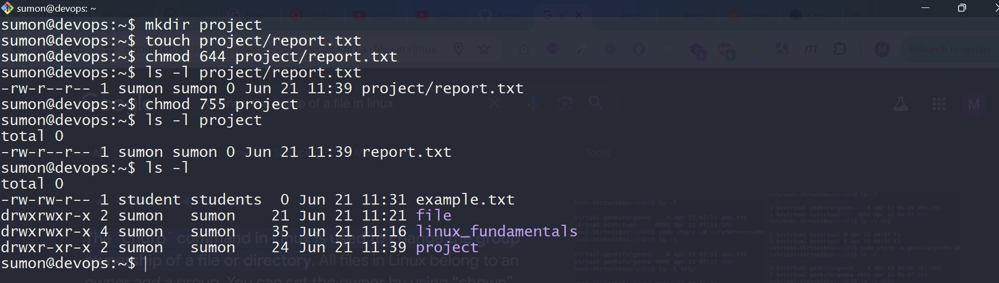

## User add/modify
### User add
#### Create a new user named developer.
```
sudo useradd developer
```
#### Set the home directory of the user developer to /home/developer_home.
```
sudo mkdir /home/developer_home && sudo usermod -d /home/developer_home developer
```
#### Assign the shell /bin/sh to the user developer.
```
sudo usermod -s /bin/sh developer
```
#### Verify the new user's information.
```
getent passwd developer
```
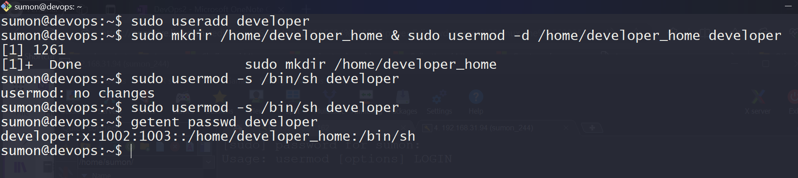
### User modify
#### Change the username of the user developer to devuser.
```
sudo usermod -l devuser developer
```
#### Add devuser to a group named devgroup.
```
sudo groupadd devgroup
sudo usermod -g devgroup devuser
```
#### Set the password of devuser to devpass. ( hint: use passwd command. Run passwd --help to see available options)
```
sudo passwd devuser
```
#### Verify the changes made to the user.
```
getent passwd devuser
groups devuser

```
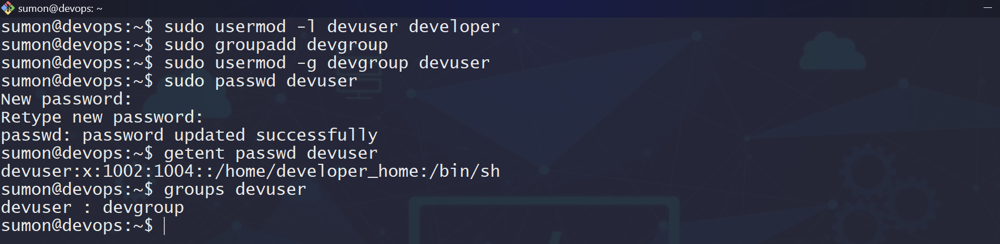

## Hard/Soft Link
#### Create a file named original.txt in your home directory.
```
touch original.txt
```
#### Create a symbolic link named softlink.txt pointing to original.txt.
```
ln -s original.txt softlink.txt
```
#### Verify the symbolic link and ensure it points to the correct file.
```
ls -il softlink.txt
```
#### Delete the original file original.txt and observe the status of the symbolic link.
```
rm original.txt
ls -il softlink.txt

```


#### Create a file named datafile.txt in your home directory.
```
 touch datafile.txt

```
#### Create a hard link named hardlink.txt pointing to datafile.txt.
```
 ln datafile.txt hardlink.txt

```
#### Verify the hard link and ensure it correctly points to the file.
```
vi datafile.txt
cat datafile.txt
cat hardlink.txt

```
#### Check the inode of both datafile.txt and hardlink.txt
```
ls -il datafile.txt
ls -il hardlink.txt
```
#### Delete the original file datafile.txt and observe the status of the hard link.
```
rm datafile.txt
```
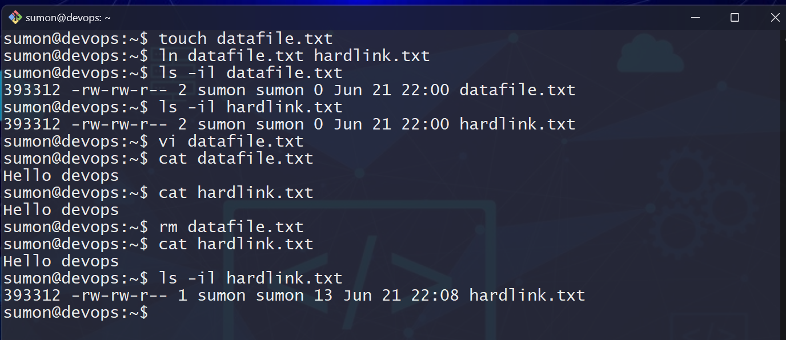

#### Find all .txt files in your home directory. ( use find command. Run find --help for usage)
```
find . -type f -name "*.txt"
```

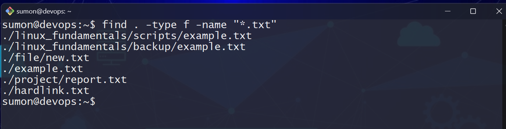


## Package installation

#### Update repo cache using apt/apt-get
```
sudo apt update
```
#### Install a package named tree
```
sudo apt install tree
```
#### Install gcloud CLI tool using apt ( Follow instructions from here: https://cloud.google.com/sdk/docs/install#deb )
```
sudo apt-get update
sudo apt-get install apt-transport-https ca-certificates gnupg curl
curl https://packages.cloud.google.com/apt/doc/apt-key.gpg | sudo gpg --dearmor -o /usr/share/keyrings/cloud.google.gpg
echo "deb [signed-by=/usr/share/keyrings/cloud.google.gpg] https://packages.cloud.google.com/apt cloud-sdk main" | sudo tee -a /etc/apt/sources.list.d/google-cloud-sdk.list
sudo apt-get update && sudo apt-get install google-cloud-cli

```

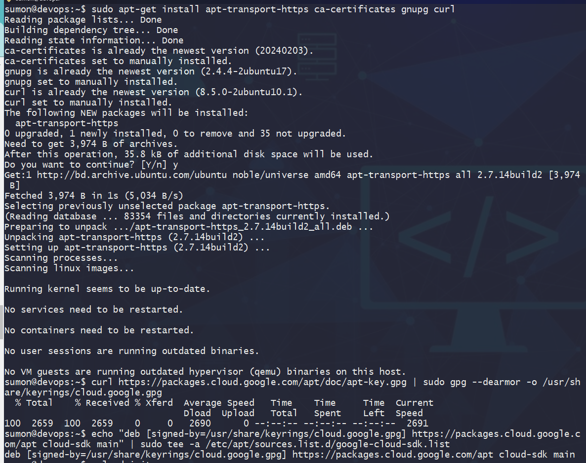
<br > 
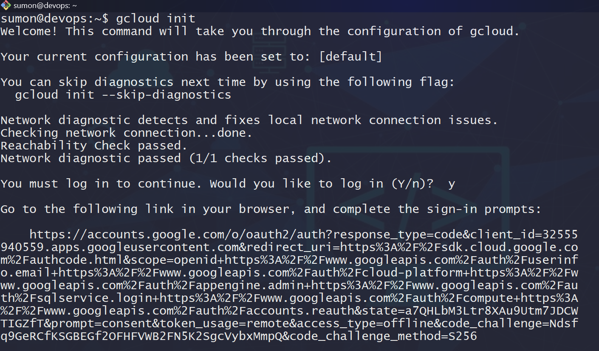
<br>
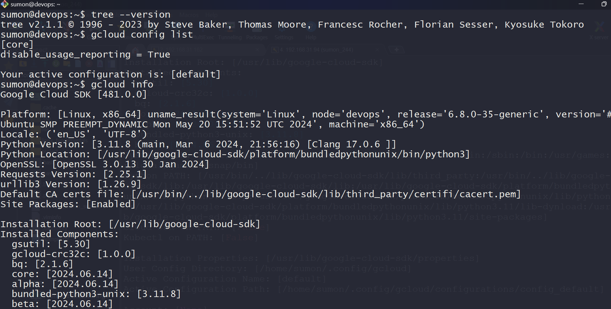


