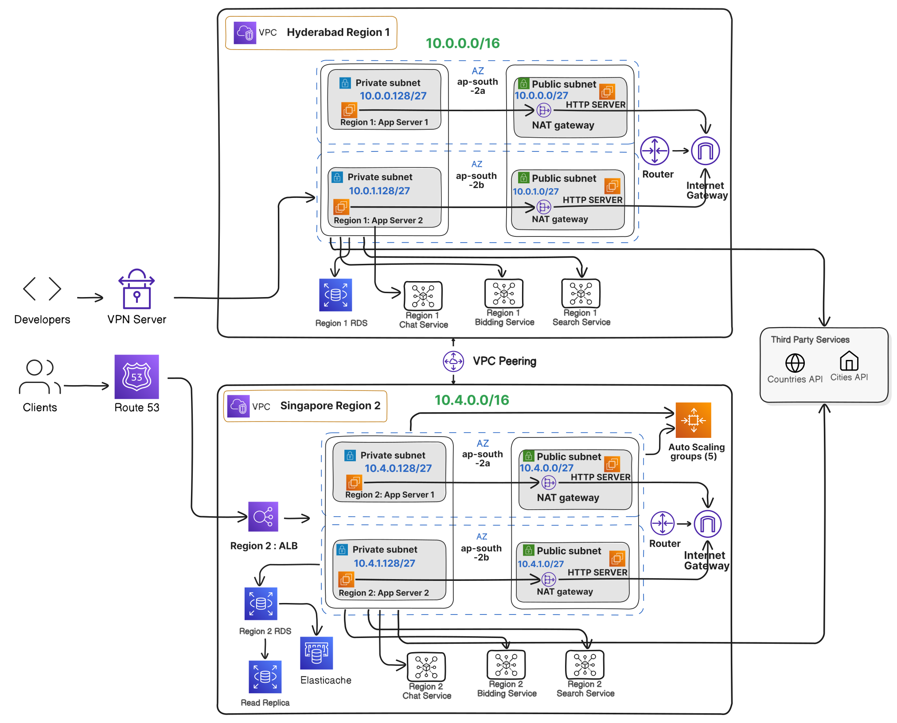

# Design a Network Architecture

## Project Requirements:

Design a network architecture for a platform that will serve as a real estate finder. People will come and search for houses, bid on them, chat with the buyer/seller. The platform will fetch data from many 3rd party services for different countries and cities. The networking architecture must support 2 regions and 2 availability zones. Developers will be using the network to do development work as well

## Key checkpoints:

1. Design the diagram using any free online tools like draw.io, lucid chart, excalidraw. The diagram must be added as a picture in the readme file in the PR

2. List all assumptions you are making for the design

3. Write a detailed 200–500-word summary with the following 4 sections: project details, architecture decisions, reasoning and networking components used and their use case.

4. Make cost estimates for different number of users (concurrent 100, 10000, 100000 user, monthly 1 lac, 10 lacs and 100 million user) and data component wise. There should be a table.

## Solution:

### Project Details:

The real estate finder platform is designed to allow users to search for houses, place bids, and communicate with buyers/sellers. It integrates data from multiple third-party services across different countries and cities. The platform is structured across two regions: Region 1 is dedicated to development, while Region 2 hosts the production environment. The production environment in region 2 is designed to support high availability, scalability, and fault tolerance across two availability zones, ensuring robust performance and reliability for end-users.

### Assumptions:

- The cloud-based platform will be AWS.
- This project will run in Asia region.
- Concurrently 100 users can use the application daily.
- A total of 10 GB of data will be processed per day.
- There will be 2 multi-region VPCs. Region 1 will be in Hyderabad and Region 2 will be in Singapore.
- Each VPC will have two Availability Zones (AZs), and each AZ will have a private and a public subnet.
- VPC Peering will be established between the two VPCs.
- Region 1 will be the development server and Region 2 will be the production server.
- The developers will connect to region 1 (Development Server) through VPN.
- There will be a total of four NAT Gateways in each Azs.
- Elastic Load balancer will be used to distribute traffic efficiently.
- Elasticsearch will be used as the search engine for real-time search.
- The system will scale horizontally.

### Network Diagram:

### Architecture decisions:

This architecture ensures high availability, scalability and fault tolerance.

1. Auto scaling groups has been enabled (for production region only) across different availability zones to handle 100 concurrent users with up to 5 t3.micro ec2 instances.

2. To keep the system secured, only the web servers are put in the public subnets, and all other resources like databases are put in the private subnets. The web server will then communicate with the resources in the private subnets.

3. Each VPC has two Availability Zones (AZs), and each AZ will have a private and a public subnet. Web servers will be in the public subnet. Databases will be placed in the private subnets.

4. The application servers in the private subnets will be interacting with third-party services for data from different countries and cities.

5. In order to reduce architectural complexity, we are using an AWS vpn server, this VPN server will allow the developers to connect directly to the development server.

6. In order to ensure high fault tolerance, we are using dedicated NAT Gateways for each AZ, rather than sharing a single NAT Gateway between AZs.

7. We are using a load balancer (Elastic Load Balancer) in the production environment which will distribute traffic efficiently, whereas the development server operates without a load balancer to minimize cost overhead.

8. In order to handle 100 concurrent users, the production environment includes a scalable RDS database with read replicas and caching, while the development environment prioritizes cost efficiency.

9. We are using Elasticsearch to handle large volumes of data and perform complex queries on both structured and unstructured data. Utilizing Elasticsearch will help us in fast and advanced property searches, and provide personalized property recommendations.

10. Clients' requests go through Route53 which provides robust DNS management, it provides benefits such as health checks, failover support, and traffic management within the region.

### Reasoning:

1. **High Availability and Scalability:** The use of auto-scaling groups across multiple availability zones ensures the system can handle varying loads and remain available even if one zone experiences issues.

2. **Security:** By placing only web servers in public subnets and other resources in private subnets, the architecture limits potential attack surfaces and protects sensitive data and systems.

3. **Fault Tolerance:** The use of multiple AZs, dedicated NAT Gateways per AZ, and distributed resources enhances the system's ability to continue functioning in case of component failures.

4. **Cost Efficiency:** The architecture balances performance needs with cost considerations, particularly in the development environment where a load balancer is omitted and a simpler database setup is used with auto scaling disabled.

5. **Performance:** The use of Elasticsearch and a scalable RDS database with read replicas and caching in production ensures the system can handle complex queries and high concurrent user loads efficiently.

6. **Developer Access:** The AWS VPN server provides a secure and straightforward way for developers to access the development environment without adding unnecessary complexity.

7. **Traffic Management:** The implementation of Route53 and Elastic Load Balancer in production ensures efficient distribution of incoming requests and provides additional features like health checks and failover support.

8. **Data Analysis and User Experience:** The use of Elasticsearch enables advanced features such as personalized recommendations, market trend analysis, and efficient property searches, enhancing the overall user experience.

### Networking components and their use cases:

- **VPC (Virtual Private Cloud):** Provides isolated network environments for AWS resources, controlling IP addressing, routing, and network gateways.

- **ELB (Elastic Load Balancer):** Distributes incoming traffic across multiple EC2 instances or containers for optimal load balancing and fault tolerance.

- **EC2 (Elastic Compute Cloud):** Virtual servers for running applications, providing scalable compute capacity in the cloud.

- **RDS (Relational Database Service):** Managed service for SQL databases, offering scalability, automated backups, and high availability.

- **VPC Peering:** Connects two VPCs to enable communication using private IP addresses, facilitating collaboration within or across AWS accounts.

- **Router:** Manages traffic within a VPC or between VPCs and the internet, directing packets based on network rules.

- **Internet Gateway:** Connects a VPC to the internet, allowing instances to access and be accessed from the internet.

- **Route 53:** Scalable DNS web service for translating domain names into IP addresses and managing traffic globally.

- **Auto Scaling Groups:** Automatically adjusts the number of EC2 instances or resources based on demand or predefined metrics.

- **AWS VPN Server:** Establishes secure, encrypted connections between AWS resources (like VPCs) and on-premises networks, extending corporate networks into the cloud.

- **Elasticsearch:** Distributed search and analytics engine for storing, searching, and analyzing large volumes of data quickly and in near real-time.

- **ElastiCache:** Fully managed in-memory caching service that enhances web application performance by quickly retrieving data from fast, in-memory caches like Redis and Memcached.
