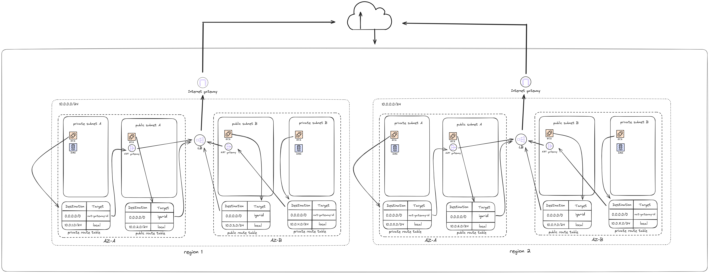

# Networking Assignment

## S.M. Hazrat Ali (ID: ICDB2_020)

## Assignment

### Requirements:

Design a network architecture for a platform that will serve as a real estate finder. People will come and search for houses, bid on them, chat with the buyer/seller. The platform will fetch data from many 3rd party services for different countries and cities. The networking architecture must support 2 regions and 2 availability zones. Developers will be using the network to do development work as well

#### Key checkpoints:

1. Design the diagram using any free online tools like draw.io, lucid chart, excalidraw. The diagram must be added as a picture in the readme file in the PR
2. ⁠List all assumptions you are making for the design
3. ⁠Write a detailed 200-500 word summary with the following 4 sections: project details, architecture decisions, reasoning and networking components used and their use case.
4. ⁠Make cost estimates for different number of users(concurrent 100, 10000, 100000 user, monthly 1 lacs, 10 lacs and 100 million user) and data component wise. There should be a table.

## Solution

### Diagram

### Assumptions

1. The platform will utilize a cloud provider(here we use AWS), for infrastructure.
2. Each region will have two availability zones for redundancy.
3. Third-party services will provide APIs for property data.
4. The platform will use microservices architecture for scalability and flexibility.
5. Real-time chat functionality will be implemented using WebSockets or a similar technology.
6. User authentication and authorization will be handled using a centralized service.
7. Data storage will use a combination of SQL and NoSQL databases.
8. Caching mechanisms will be in place to improve performance.

### Summary

#### Project Details

The platform aims to facilitate users in searching for houses, placing bids, and communicating with buyers or sellers. To ensure high availability, the platform will be deployed across two AWS regions with two availability zones each. It will integrate with third-party services to gather real estate data and support secure development access via VPN.

#### Architecture Decisions:

- Regions and Availability Zones: The platform will operate in two regions, each with two availability zones. This setup ensures high availability and disaster recovery capabilities.
- Microservices Architecture: Adopting microservices allows independent deployment, scaling, and maintenance of different parts of the platform, such as search, bidding, and chat.
- Data Storage: SQL databases (e.g., Amazon RDS) will store structured data like user information and property listings, while NoSQL databases (e.g., Amazon DynamoDB) will handle unstructured data such as chat messages and logs.
- Load Balancing: AWS Elastic Load Balancers (ELBs) will distribute traffic across multiple instances to ensure even load distribution and fault tolerance.
- Caching: AWS ElastiCache (using Redis or Memcached) will be used to cache frequently accessed data, reducing latency and improving response times.
- API Gateway: AWS API Gateway will manage API requests from clients, providing a single entry point for all microservices.
- Real-Time Communication: Amazon Simple Notification Service (SNS) and Simple Queue Service (SQS) will handle messaging, while WebSockets will enable real-time chat.
- Monitoring and Logging: AWS CloudWatch and AWS CloudTrail will monitor performance, log activities, and provide alerts for any anomalies.
- Developer Environment: A separate VPC with its own subnets will be created for development purposes, ensuring isolation from the production environment.

#### Reasoning

The decision of AWS administrations guarantees a powerful, versatile, and savvy arrangement. The engineering's overt repetitiveness across locales and accessibility zones ensures high accessibility. Microservices give adaptability and more straightforward support, while load adjusting and reserving further develop execution and dependability. The Programming interface Passage works on client cooperations with the backend, and the constant correspondence arrangement guarantees smooth client associations. Checking and logging are fundamental for keeping up with framework wellbeing and security.

#### Networking Components Used and Their Use Case

- VPC (Virtual Private Cloud): Provides an isolated network for the platform, ensuring secure communication between components.
- Subnets: Separate subnets for different tiers (e.g., public, private) to enhance security and management.
- Internet Gateway: Allows communication between the VPC and the internet.
- NAT Gateway: Enables instances in private subnets to access the internet for updates and maintenance.
- Elastic Load Balancer (ELB): Distributes incoming traffic across multiple instances to ensure high availability.
- Route 53: Manages DNS, providing high availability and low latency routing.
- API Gateway: Manages API requests from clients and routes them to appropriate microservices.
- ElastiCache: Caches frequently accessed data to reduce latency.
- RDS (Relational Database Service): Stores structured data like user information and property listings.
- DynamoDB: Handles unstructured data such as chat messages and logs.
- SNS/SQS: Manages messaging for real-time notifications and communication.
- CloudWatch: Monitors and logs system performance and activities.
- CloudTrail: Tracks user activity and API usage for security and compliance.

### Cost Estimates

| Component           | 100      | 10,000     | 100,000     | 1,000,000    | 10,000,000     | 100,000,000     |
| ------------------- | -------- | ---------- | ----------- | ------------ | -------------- | --------------- |
| EC2 (Web Server)    | $50      | $500       | $5,000      | $50,000      | $500,000       | $5,000,000      |
| EC2 (App Server)    | $50      | $500       | $5,000      | $50,000      | $500,000       | $5,000,000      |
| RDS                 | $100     | $1,000     | $10,000     | $100,000     | $1,000,000     | $10,000,000     |
| S3                  | $20      | $200       | $2,000      | $20,000      | $200,000       | $2,000,000      |
| CloudFront          | $50      | $500       | $5,000      | $50,000      | $500,000       | $5,000,000      |
| Load Balancer       | $20      | $200       | $2,000      | $20,000      | $200,000       | $2,000,000      |
| NAT Gateway         | $30      | $300       | $3,000      | $30,000      | $300,000       | $3,000,000      |
| VPN                 | $40      | $40        | $40         | $400         | $4,000         | $40,000         |
| Route 53            | $1       | $10        | $100        | $1,000       | $10,000        | $100,000        |
| Data Transfer       | $100     | $1,000     | $10,000     | $5,000       | $5,000         | $5,000          |
| **Total (Approx.)** | **$461** | **$4,250** | **$42,140** | **$331,400** | **$3,314,000** | **$33,140,000** |
