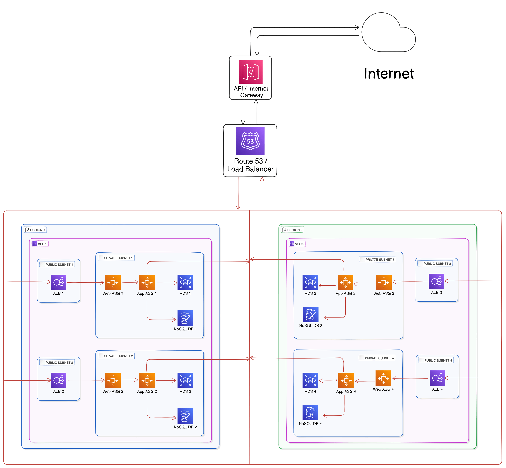

### **Assumptions**

Before we begin the design, let's list some key assumptions:

- **User Behavior**: Users will browse listings, place bids, and chat. The number of concurrent users can vary widely depending on demand.
- **Data Sources**: Data will be pulled from multiple 3rd party APIs, and the platform will handle different formats and structures of real estate data.
- **Security**: All communications and data exchanges must be secure, especially during bidding and payment processes.
- **Availability & Redundancy**: The system should be highly available, fault-tolerant, and capable of scaling automatically.
- **Regions & Availability Zones**: The architecture will span 2 regions and each region will include 2 availability zones (AZs).
- **Developer Access**: Developers need access to the environment for continuous development and deployment.
- **Cost Consideration**: Costs should be optimized while ensuring scalability, security, and performance.

### **Network Architecture Diagram**

[Network Architecture Diagram using Eraser.io](https://eraser.io/)

### **Summary**

#### a. **Project Details**

The platform is a real estate finder allowing users to search for homes, place bids, and communicate with sellers. The system must handle a global user base and fetch data from various 3rd-party services across different countries and cities. It must be secure, scalable, and highly available, with a reliable chat system, bidding system, and developer environment.

#### b. **Architecture Decisions**

- **Regions & Availability Zones**: Two regions with two AZs each ensure fault tolerance, geographic redundancy, and low latency. AWS is assumed as the cloud provider.
- **Load Balancing**: A global load balancer distributes traffic between regions and AZs.
- **Auto-scaling Groups**: To handle fluctuating loads, auto-scaling groups are deployed for the web and application tiers.
- **Microservices**: The application is divided into microservices (search, bidding, chat, etc.) hosted in containers using ECS or Kubernetes.
- **Data Storage**: Data is stored in a combination of RDS (for structured data) and NoSQL databases (for unstructured data). Data replication is set up between regions for high availability.
- **API Gateway**: An API Gateway handles requests to/from 3rd party services.
- **Developer Environment**: A dedicated VPC or subnets for development and staging environments, isolated from production.

#### c. **Reasoning**

- **Scalability**: Auto-scaling and multi-region architecture ensure that the system can handle from hundreds to millions of users.
- **Fault Tolerance**: Deploying across multiple AZs in two regions ensures the system remains available even during failures.
- **Cost-Effectiveness**: Resources are provisioned dynamically, and storage options are chosen to balance cost and performance.
- **Security**: All communications are encrypted, and network security groups are configured to restrict access to sensitive resources.

#### d. **Networking Components Used and Their Use Cases**

- **VPC (Virtual Private Cloud)**: Isolated network environments for production and development.
- **Subnets**: Separate public, private, and isolated subnets for different components.
- **Internet Gateway**: Allows internet access for public-facing services.
- **NAT Gateway**: Allows private subnets to access the internet securely.
- **Load Balancer (ALB & NLB)**: Distributes incoming traffic across multiple instances in different AZs.
- **Security Groups & NACLs**: Protect resources by controlling inbound and outbound traffic.
- **VPN Gateway**: For secure developer access and cross-region communication.

### **Cost Estimates**

| **Users/Month** | **Concurrent Users** | **EC2 Instances** | **Load Balancer** | **RDS/NoSQL** | **API Gateway**   | **Total Estimate (USD)** |
| --------------- | -------------------- | ----------------- | ----------------- | ------------- | ----------------- | ------------------------ |
| 100,000         | 100                  | Small instances   | Light usage       | Small DB      | Low requests      | $500 - $1000             |
| 10,000,000      | 10,000               | Medium instances  | Moderate usage    | Medium DB     | Moderate requests | $10,000 - $20,000        |
| 100,000,000     | 100,000              | Large instances   | Heavy usage       | Large DB      | High requests     | $100,000 - $200,000      |
