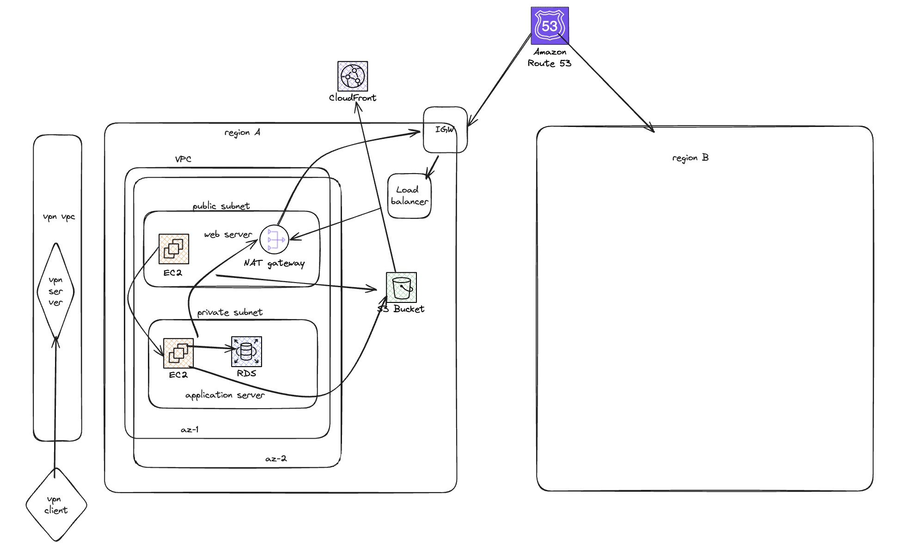

# Networking Assignment

## Samss Jubair (ID: ICDB2_109)

## Assignment

### Requirements:
Design a network architecture for a platform that will serve as a real estate finder. People will come and search for houses, bid on them, chat with the buyer/seller. The platform will fetch data from many 3rd party services for different countries and cities. The networking architecture must support 2 regions and 2 availability zones. Developers will be using the network to do development work as well

#### Key checkpoints:
1. Design the diagram using any free online tools like draw.io, lucid chart, excalidraw. The diagram must be added as a picture in the readme file in the PR
2. ⁠List all assumptions you are making for the design
3. ⁠Write a detailed 200-500 word summary with the following 4 sections: project details, architecture decisions, reasoning and networking components used and their use case.
4. ⁠Make cost estimates for different number of users(concurrent 100, 10000, 100000 user, monthly 1 lacs, 10 lacs and 100 million user) and data component wise. There should be a table.

## Solution

### Diagram

NB: region B is a replica of region A, that's why it's blank in the diagram.

### Assumptions

1. The platform will be hosted on AWS.
2. The platform will be hosted in 2 regions and 2 availability zones.
3. The platform will be accessed by users from different countries.
4. The platform will fetch data from 3rd party services for different countries and cities.
5. The platform will have a chat feature for users to communicate with each other.
6. The platform will have a bidding feature for users to bid on houses.
7. The platform will have a search feature for users to search for houses.
8. The platform will have a development environment(VPN) for developers to work on.
9. The platform will have a load balancer to distribute traffic across multiple instances.
10. The platform will have a database to store user data and house data.
11. The platform will have a caching layer to improve performance.
12. The platform will have a CDN to deliver content to users faster.
13. The platform will have a firewall to protect against security threats.
14. The platform will have monitoring and logging to track performance and troubleshoot issues.

### Summary

#### Project Details

The platform aims to facilitate users in searching for houses, placing bids, and communicating with buyers or sellers. To ensure high availability, the platform will be deployed across two AWS regions with two availability zones each. It will integrate with third-party services to gather real estate data and support secure development access via VPN.

#### Architecture Decisions:
- Regions and Availability Zones: Two AWS regions with two availability zones each will ensure high availability and disaster recovery.
- Load Balancing: Use of AWS Elastic Load Balancers (ELB) to distribute incoming traffic across multiple servers.
- Auto Scaling: Implementing AWS Auto Scaling groups to manage varying loads and ensure resource optimization.
- Data Storage: Utilize Amazon RDS for relational data, Amazon S3 for object storage, and Amazon DynamoDB for NoSQL data.
- Third-Party Data Integration: Use Amazon API Gateway and AWS Lambda for seamless integration with third-party services.
- Messaging and Notifications: Amazon SQS and Amazon SNS for handling chat messages and notifications.
- Security: VPN access for developers using AWS Client VPN and securing data with AWS KMS.
- Monitoring and Logging: AWS CloudWatch and AWS CloudTrail for monitoring and logging activities.

#### Reasoning
The architecture aims to ensure high availability, fault tolerance, and scalability. Deploying across two AWS regions with two availability zones mitigates the risk of downtime. Elastic Load Balancers and auto-scaling groups ensure optimal resource utilization and handling of traffic surges. Separating storage types based on data requirements optimizes performance and cost. Integrating third-party services via API Gateway and Lambda provides flexibility and ease of maintenance. Security is ensured through VPN access and data encryption. Monitoring and logging services help in proactive management and troubleshooting.

#### Networking Components Used and Their Use Case
- VPC (Virtual Private Cloud): Isolates the network for the platform, ensuring security and management of resources.
- Subnets: Divides the VPC into public and private subnets across two availability zones in each region for better resource organization and security.
- Internet Gateway: Allows access to the internet for public-facing components.
- NAT Gateway: Enables private subnet instances to access the internet securely.
- Elastic Load Balancer (ELB): Distributes incoming traffic across multiple instances for high availability and fault tolerance.
- Auto Scaling Groups: Automatically adjusts the number of EC2 instances based on traffic demand.
- Amazon RDS: Provides a managed relational database for transactional data.
- Amazon S3: Offers scalable object storage for user-generated content and media files.
- Amazon DynamoDB: Supports NoSQL database needs for high-speed data access.
- Amazon API Gateway: Manages API calls to third-party services.
- AWS Lambda: Runs code in response to events for third-party data processing.
- Amazon SQS and SNS: Handles messaging and notifications between users.
- AWS Client VPN: Provides secure VPN access for developers.
- AWS CloudWatch and CloudTrail: Monitors and logs system activities for management and compliance.

### Cost Estimates

| Component | 100 Concurrent Users | 10,000 Concurrent Users | 100,000 Concurrent Users |
|-----------|----------------------|-------------------------|---------------------------|
| EC2 (Web Server) | $50 | $500 | $5,000 |
| EC2 (App Server) | $50 | $500 | $5,000 |
| RDS | $100 | $1,000 | $10,000 |
| S3 | $20 | $200 | $2,000 |
| CloudFront | $50 | $500 | $5,000 |
| Load Balancer | $20 | $200 | $2,000 |
| NAT Gateway | $30 | $300 | $3,000 |
| VPN | $40 | $40 | $40 |
| Route 53 | $1 | $10 | $100 |
| Data Transfer | $100 | $1,000 | $10,000 |
| **Total (Approx.)** | **$461** | **$4,250** | **$42,140** |

| Monthly Active Users | Estimated Cost Range |
|----------------------|----------------------|
| 100,000 | $1,000 - $5,000 |
| 1,000,000 | $5,000 - $20,000 |
| 100,000,000 | $50,000 - $200,000 |

### References
1. Amazon Web Services. (n.d.). AWS Architecture Center. https://aws.amazon.com/architecture/

2. Amazon Web Services. (n.d.). AWS Pricing. https://aws.amazon.com/pricing/

3. Amazon Web Services. (n.d.). AWS Documentation. https://docs.aws.amazon.com/

4. Amazon Web Services. (n.d.). AWS Well-Architected Framework. https://aws.amazon.com/architecture/well-architected/
